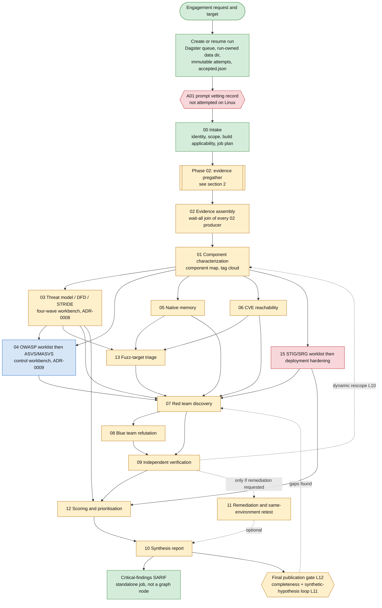
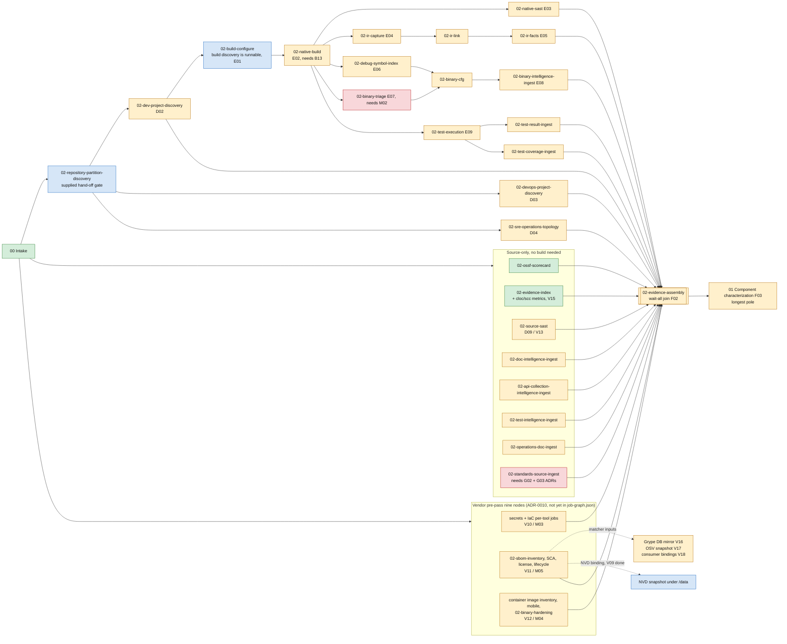
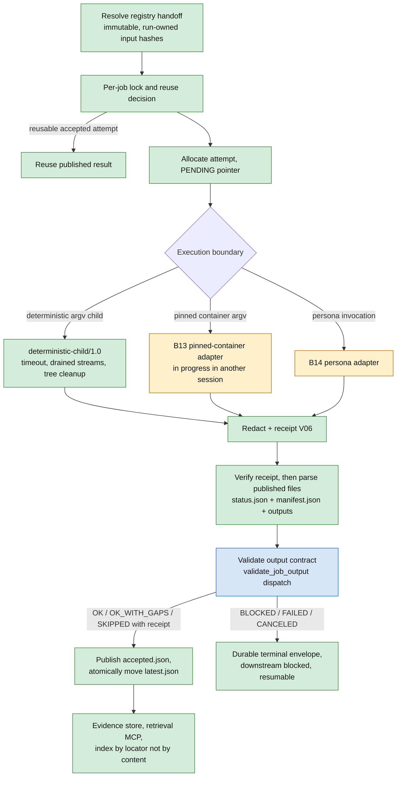
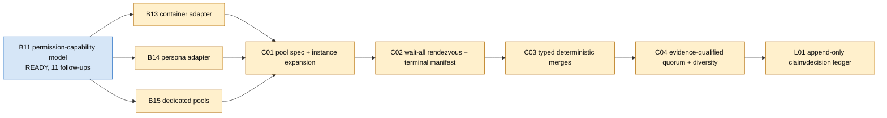
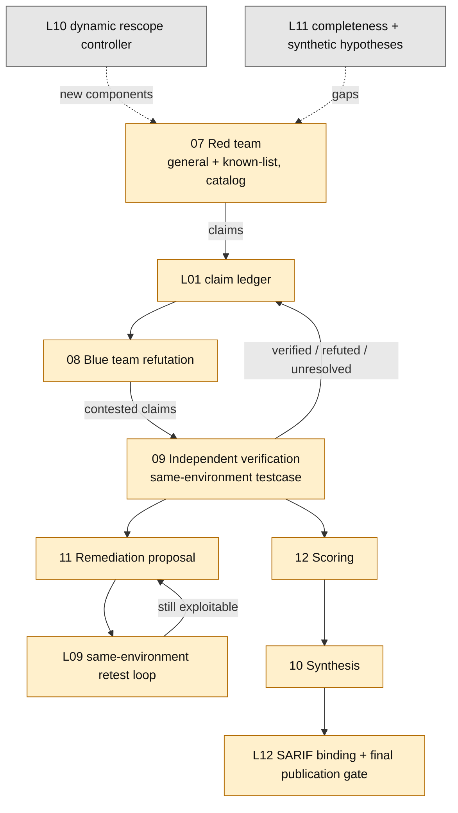
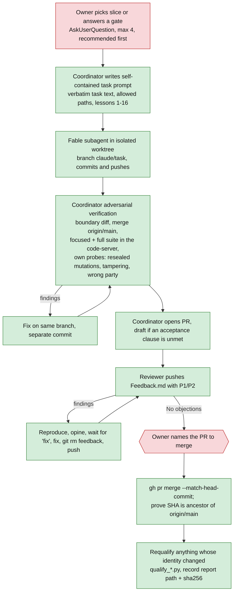

# AppSec review — end-to-end process flow and construction status

Snapshot: 2026-09-21, `main` = `ec7b2d0`. Built from `job-graph.json` (42 jobs), `TODO.md`
batch statuses, ADR-0008/0009/0010, the three task series and the 2026-09-21 continuation prompt.
Regenerate or re-verify before relying on a status: `TODO.md` is the authority, and a few of its
lines are stale (called out in section 6).

## Legend

| Colour | Meaning |
|---|---|
| Green | **Built and qualified** — runs today (graph `implemented: true`, or qualified runtime) |
| Blue | **Foundation only** — contracts, schemas, validators or prompts exist; the worker/runner does not |
| Amber | **Designed, not built** — accepted ADR or registry/prompt text; no code, waiting on a prerequisite |
| Red | **Open decision or gate** — needs the owner, or is undecided |
| Grey | **Not designed** — named in the plan, no design record found |

## 1. Lifecycle: from engagement request to final report



Notes on the diagram

- Every arrow above is a `required` edge in `job-graph.json` unless dashed. A skipped upstream job
  only unblocks its consumer for the skip reasons written on that edge.
- Only `00-intake`, `02-ossf-scorecard` and `02-evidence-index` are `implemented: true`. Every
  other lifecycle node blocks with `WORKER_NOT_IMPLEMENTED`.
- `02-repository-partition-discovery` is a supplied hand-off gate and is correctly
  `implemented: false`.
- The 04 box is blue because ADR-0009's lane-in, applicability, batching, validator hand-off,
  validator output, intercom and dynamic-test-request modules exist (OWASP T02A–T09). Dispatch,
  join and lifecycle wiring (T10–T14) do not.
- `03`'s graph node depends only on `01`; ADR-0008 replaces that single step with the four-wave
  workbench and needs `S02`/`T10` to land.

## 2. Phase 02 — evidence pregather in detail



Fan-out rules that the graph already enforces

- Non-native targets skip the whole build-gated branch with `not-applicable-non-native`.
- Partition review can skip a node with `not-applicable-after-partition-review`.
- ADR-0010 adds `not-applicable-no-matching-inputs` (G5) — registered by V02, not yet present.
- `02-license-scan` depends on `02-sbom-inventory` (PR #23 review, option A).
- Every scanner producer redacts with a receipt (V06, done) and verifies it before parsing
  anything it published.

## 3. What every worker does (the common runtime)



The dispatch box (J) is blue because validators for the nine ADR-0010 contracts exist as modules
(V04 ×2, V07 ×3, V05 ×4) but are not yet dispatched from `validate_job_output.py`.

## 4. Persona pool runtime (feeds every persona-driven node)



Registry content (`registry/personas`, `roles`, `domains`, `tooling-profiles`, `output-contracts`,
`job-templates`, `permission-capabilities`) is largely authored; the runtime that instantiates
them is what is missing.

## 5. Adversarial claim lifecycle (07 → 10)



Prompt text for 07–12 exists under `appsec-review-process/0x-*/`; none of the nodes has a worker.
L10, L11 and L12 are named in `TODO.md` but no design record beyond one-paragraph entries was found.

## 6. Status by area — what is built and what is left

### 6.1 Built and qualified

| Area | Evidence |
|---|---|
| Dagster stack, run queue, run-owned data, immutable attempts, `accepted.json` | live stack; Linux baseline 857 tests OK |
| Common worker envelope, lifecycle coordinator, deterministic child boundary | Batch 7/8, qualified Windows + Linux |
| `00-intake` (Phase 1 acceptance A02–A16) | `phase-1-acceptance.md`; A01 not attempted on Linux |
| `02-ossf-scorecard`, `02-evidence-index` (+ V15 metrics) | requalified on Linux, `metrics_sha256` identical |
| Critical-findings SARIF (B09, standalone) | QUALIFIED |
| Build discovery, source evidence retrieval | runnable |
| Evidence redaction + receipt (V06), evidence store, retrieval MCP | done |
| Shared shapes V03; NVD snapshot binding V09; secrets/IaC contracts V04; SBOM-family contracts V05; container/mobile/binary contracts V07 | merged |
| OWASP foundations T02A–T09 (snapshots, NVD 2.0 publisher, lane-in, applicability, batching, validator hand-off, output, intercom, dynamic requests) | merged, unit-tested |
| Decisions: ADR-0008 (threat workbench), ADR-0010 (vendor pre-pass) | accepted 2026-09-20 |

### 6.2 To be constructed — in dependency order

| # | Item | IDs | Blocked by | Notes |
|---|---|---|---|---|
| 1 | **Integrator: declare nine vendor-prepass nodes, skip reason, licence→SBOM edge, validator dispatch** | V02 | none — READY | Unblocks V08, T03, V10–V13. Recommended next slice. |
| 2 | Status hygiene | — | none | task-series still says V04/V07 "in review", V05/V15 `READY`; TODO closures for G01, M01, F01/V15 |
| 3 | Permission-capability wiring | B11 | none — READY | Opens B14, B15, V16, V17 |
| 4 | Pinned-container adapter | B13 | B11 | **Another session is mid-flight** (`claude/b13-pinned-container-adapter`, no PR). Unblocks all container-run workers. |
| 5 | Persona adapter, resource pools | B14, B15 | B11 | |
| 6 | Pool specification, wait-all, merges, quorum | C01–C04 | B13–B15 | Owner chose B13→B14→B15→C01→C02 before OWASP T10 |
| 7 | Operator status/resume detail; supplied-discovery envelope | B12, B10 | B10/B12 lines say `BLOCKED(B09)` but B09 is QUALIFIED — likely stale, confirm | |
| 8 | Vendor mirrors: Grype DB publisher, OSV publisher, consumer bindings | V16, V17, V18 | B11 wiring | |
| 9 | Vendor pre-pass workers | V10 secrets+IaC, V11 SBOM family, V12 container/mobile/binary, V13 = D09 source SAST | V02 + B13 (+V16–18 for V11, M02 for V12) | |
| 10 | Discovery dispatch | D01–D04 | B14, C01–C03 | |
| 11 | Ingest jobs | D05–D08 | B09 done, D05 for D08 | Independent of pools; could be built in parallel once graph declares them |
| 12 | Build/compiled evidence | E01–E10 (native build, SAST, IR capture/link/facts, debug symbols, binary triage/CFG, test execution/ingest) | B13, D02, M02, B11 | `qualify_tooling` needs `audit-buildenv-*` images built on this host |
| 13 | Evidence enrichment, assembly rendezvous, characterization | F01, F02, **F03** | most of 10–12 | F03 is the longest pole; F02 has ~14 pregather batches behind it |
| 14 | Standards ingest and workbenches | S01 standards, S02 threat model, S03 OWASP/ASVS/MASVS, S04 STIG/deployment | G02, G03 ADRs, F03, B14 | T02–T10 (threat) and T10–T14 (OWASP) sit here |
| 15 | Claim ledger and analysis lanes | L01–L04 | C04, F03 | native memory, CVE reachability, fuzz triage |
| 16 | Adversarial lifecycle | L05 red, L06 blue, L07 verify, L08 scoring | 14, 15, B14, C04 | |
| 17 | Remediation loop, rescope, completeness, synthesis | L09–L12 | L07, L08 | L10–L12 least designed |
| 18 | Retire legacy runners | V14 / M07 | V10–V13, V15, M06, V15 verified on Windows | deletes `scripts/` prepass runners |
| 19 | Release | Q01–Q05, design-parity gate, R01 | all applicable batches | |

### 6.3 Open decisions and gates (owner-owned)

| Gate | State | What is needed |
|---|---|---|
| **A01** prompt-vetting record | not attempted on Linux | Line-by-line review of `phase-1-implementation-prompt.md` approved by the owner, or accept A02–A16 as the Linux baseline |
| **G02** OWASP applicability/evidence ADR | ADR-0009 header still says *Proposed* | Owner approval; blocks S01, S03 |
| **G03** DISA/NSA hardening ADR | `HUMAN_GATE`, packet only | Owner approval; blocks S01, S04, and node 15 |
| **M02** binary/mobile/container image pinning and split | READY (decision) | Blocks E07, V12 |
| **M06** semantic-index disposition | READY (decision) | Blocks V14 |
| V15 metrics location | undecided | Keep in `manifest.json` `member_schemas`, or sibling `metrics.json` (identity change) |
| `first-party` label for Freeciv21 `dependencies/` | undecided | Metrics rules bump = identity change |
| Inert pip pin | undecided | Real upgrade needs Dockerfile step + version check; batch with next stack change (6 Dependabot alerts) |
| `nvd_feed.py` has no authenticity anchor; stale-but-valid NVD wording vs M4; V03 `header-mismatch` errors quote document values | undecided | Raise before V11 |
| Q04 skill-installation docs | READY | Small, independent |

### 6.4 Not yet verified anywhere

- **Nothing has run on Windows** since the Linux-first switch: V15 `GOLDEN_SHA256`, focused suites
  for V03–V09/V05/V15, and the stack on Docker Desktop with the new compose file. V14 requires
  this.
- End-to-end run of any lifecycle beyond intake plus the three built `02-*` jobs has never
  happened; `qualify_phase1.py` gates A02–A16 cover intake only.

## 7. How work moves through the build process (the delivery loop)



Integrator-only surfaces (graph, parity manifest, worker-result contract, `dagster_workflow.py`,
`launch_job.py`, `orchestrator/dagster/*`, validators, `TODO.md`, accepted ADRs) are touched only
when the owner assigns an integrator task. That serialises V02, the validator dispatch, and every
later node-flip, so they, not the workers, set the pace.

## 8. Critical path summary

```text
B11 wiring ──► B13 ──┬─► B14 ─► B15 ─► C01 ─► C02 ─► C03 ─► C04 ─► L01
                     │
V02 (independent) ───┼─► V08, T03; V10 ─ V13 (with B13) ─► V14 delete runners
                     │
                     └─► E01 ─► E02 ─► E03–E10 ─► F01 ─► F02 ─► F03 ─► S02/S03/S04, L02–L04
                                                                      └─► L05 ─► L06 ─► L07 ─► L08 ─► L12
```

Owner decisions that gate that path: G02, G03, M02, M06, A01. V02 and the B11 wiring are the only
two large slices with no unmet prerequisite today.
