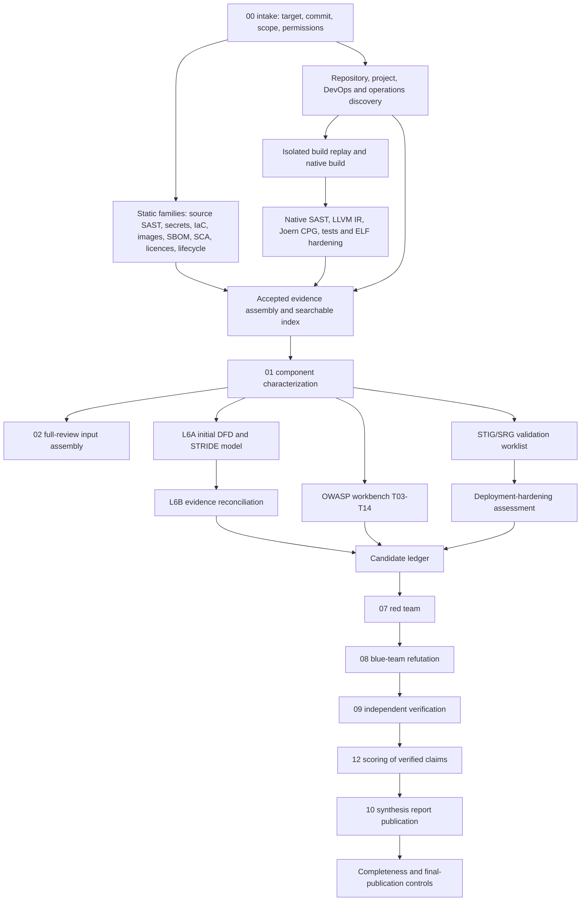

# AppSec review - implemented process flow

Snapshot: 2026-09-27. The machine-readable authorities are
[`job-graph.json`](../appsec-review-process/job-graph.json),
[`design-parity-manifest.json`](../appsec-review-process/design-parity-manifest.json), and the
registry contracts. The generated [job and artifact catalog](processes/job-catalog.md) is the exact
inventory. This document explains how work and evidence move through the system.

## End-to-end flow

```mermaid
flowchart TD
  I[00 intake: target, commit, scope, permissions] --> D[Repository, project, DevOps and operations discovery]
  I --> S[Static families: source SAST, secrets, IaC, images, SBOM, SCA, licences, lifecycle]
  D --> B[Isolated build replay and native build]
  B --> N[Native SAST, LLVM IR, Joern CPG, tests and ELF hardening]
  S & N & D --> E[Accepted evidence assembly and searchable index]
  E --> C[01 component characterization]
  C --> P[02 full-review input assembly]
  C --> T1[L6A initial DFD and STRIDE model]
  T1 --> T2[L6B evidence reconciliation]
  C --> O[OWASP workbench T03-T14]
  C --> G[STIG/SRG validation worklist]
  G --> H[Deployment-hardening assessment]
  T2 & O & H --> L[Candidate ledger]
  L --> R[07 red team]
  R --> U[08 blue-team refutation]
  U --> V[09 independent verification]
  V --> Q[12 scoring of verified claims]
  Q --> X[10 synthesis report publication]
  X --> A[Completeness and final-publication controls]
```

An implemented or qualified worker is not evidence that it ran for a particular engagement. Each
engagement must retain a current accepted pointer, immutable attempt, hashes, permission receipt,
lineage, coverage and terminal status.

## Evidence and search

The review binds source, binary and reference data to one source snapshot and build identity.
Source search uses two complementary representations:

- full-text and semantic projections in the evidence index (including the LanceDB-backed semantic
  recall path) for literal names, configuration, prose and related concepts;
- Joern CPG/AST and LLVM IR projections for structural queries over calls, symbols, types, data
  flows and memory operations, with source locations and build identity preserved.

Cross-references connect repository partitions, components, files, symbols, build units, binaries,
dependencies, controls, threat hypotheses, claims and citations. Consumers receive locators and
hashes, not copied conclusions, and revalidate the referenced artifact before use.

## Project partitioning and component scope

Repository discovery identifies independently buildable projects and operational surfaces.
Component characterization derives stable component IDs, ownership, trust boundaries, data flows,
languages, build units and evidence coverage from accepted discovery and evidence. The
`02-full-review-input-assembly` deterministically revalidates the current accepted component map,
staged target identity, source generation and any accepted dependency prerequisites. It derives a
closed plan, publishes bounded requests, records non-applicable input classes as explicit
`SKIPPED_NA`, and automatically dispatches the applicable first wave. Dependency families are
reinvoked in later waves after accepted SBOM, licence and SCA prerequisites become available; the
same derivation step revalidates every prerequisite before expanding the wave.

## Analysis families

Implemented families include native-memory analysis, CVE reachability, fuzz-target triage, secrets,
IaC, container-image inventory, SBOM generation, offline SCA matching, licence scanning, dependency
lifecycle, ELF binary hardening, mobile SAST, and Go/Java/PHP source SAST. Offline vulnerability
matching binds exact Grype/OSV snapshot bytes and records age; snapshot refresh is an out-of-band
maintenance job and a stale or missing snapshot becomes a coverage gap. Native binaries produced by
the build lane are routed to Checksec and retained with the build identity.

## Threat modeling and standards processes

Threat modeling is a two-stage process. L6A creates an initial DFD and STRIDE hypothesis set from
the component map. L6B reconciles it with accepted evidence, preserves conflicts and publishes model
coverage. This is now executable and qualified; a real target still requires an accepted run.

OWASP, STIG/SRG and deployment hardening are three distinct processes:

1. OWASP T03-T14 selects ASVS/MASVS work by component, performs bounded validation and publishes a
   paginated status matrix, gaps and candidate routes. The chain is qualified. Automatic derivation
   of all trusted dispatch facts remains open.
2. STIG/SRG tailoring selects platform controls and publishes its own validation worklist.
3. Deployment hardening consumes the tailored worklist plus deployment evidence and reports static
   configuration and exposure observations. It does not certify compliance and does not replace the
   standards worklist.

## Red, blue and verifier rendezvous

The orchestrator launches bounded persona/tool pool members with immutable handoffs. A deterministic
merge waits for each expected member to reach a durable terminal state, validates identity,
contracts, citations and ordering, and retains dissent. Evidence-qualified quorum applies evidence
and independence thresholds. Red team proposes attacks; blue team refutes or narrows them;
independent verification alone can verify a claim. Scoring consumes verified claims only.

## Reporting and remaining gates

The synthesis publication worker is executable and fixture-qualified. It produces a hash-bound
`DRAFT_EVIDENCE_BACKED` package plus LaTeX and HTML presentation inputs. The retained
qualification report is honest about unresolved coverage and sets `final=false` and
`human_signoff=false`.

Three integration gaps remain:

- automatic derivation of OWASP trusted dispatch facts;
- one retained run through the entire real accepted upstream chain; and
- human-authorized final publication.

Until those gates close, the system can produce a qualified nominal draft, not a final assessment.

Retained presentation artifacts are the
[happy-path demo PDF](report-examples/appsec-review-happy-path-demo.pdf) and
[HTML](report-examples/appsec-review-happy-path-demo.html). They are prominently marked DEMO and do
not represent a production target. The HTML currently uses external font and KaTeX references; use
the PDF when an offline retained rendering is required.
