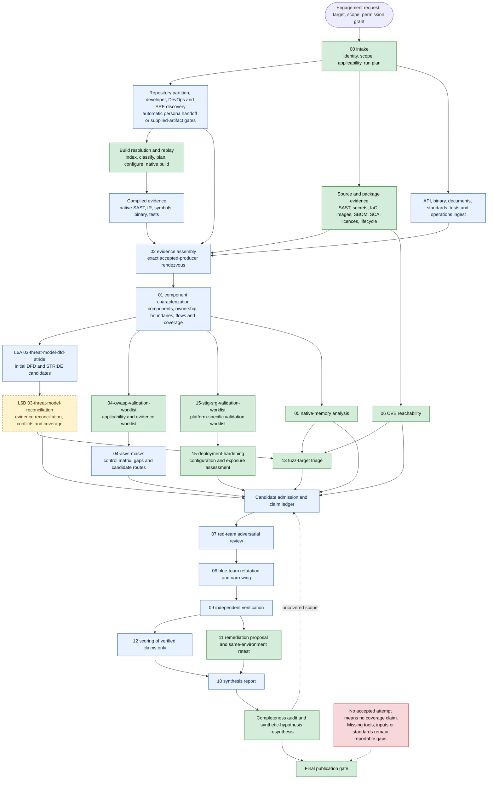
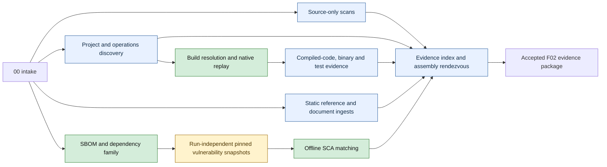
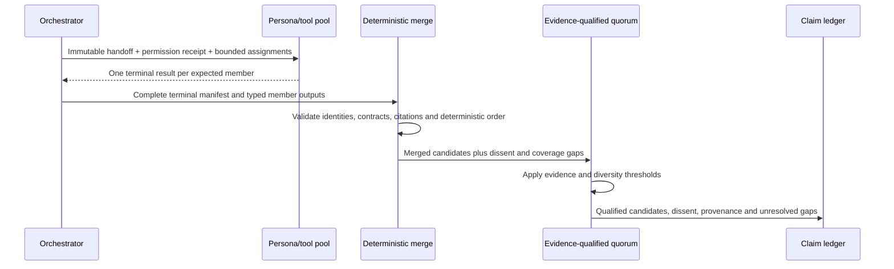

# AppSec review — implemented process flow

Snapshot: 2026-09-27. The machine-readable authorities are
[`job-graph.json`](../appsec-review-process/job-graph.json),
[`design-parity-manifest.json`](../appsec-review-process/design-parity-manifest.json), and the
registry contracts. The generated [job and artifact catalog](processes/job-catalog.md) is the
detailed inventory. This document explains how the jobs interact; it does not turn an implemented
worker into evidence that the worker has completed a live engagement.

## Status language

- **Graph enabled** means `job-graph.json` permits the lifecycle worker to run.
- **Executable core** means deterministic worker code and focused tests exist. A core can exist
  while its graph node remains disabled because input assembly or shared publication is unfinished.
- **Standalone only** means the core must be invoked with explicit run-owned inputs; the full-review
  Dagster binding is not complete.
- **Qualified** means a retained test or fixture run proves the stated path. It does not imply live
  target coverage.
- **Accepted evidence** means a run-owned immutable attempt passed contract and lineage validation.
  No documentation status substitutes for an accepted attempt.

## End-to-end lifecycle

```mermaid
flowchart TD
  classDef enabled fill:#d4edda,stroke:#2e7d32,color:#111
  classDef standalone fill:#e8f1ff,stroke:#245a9b,color:#102a43
  classDef active fill:#fff3cd,stroke:#9a6700,color:#4d3500,stroke-dasharray:5 4
  classDef gate fill:#f8d7da,stroke:#b71c1c,color:#111

  REQ([Engagement request, target, scope, permission grant]) --> INT[00 intake<br/>identity, scope, applicability, run plan]:::enabled
  INT --> DISC[Repository partition, developer, DevOps and SRE discovery<br/>automatic persona handoff or supplied-artifact gates]:::standalone
  INT --> STATIC[Source and package evidence<br/>SAST, secrets, IaC, images, SBOM, SCA, licences, lifecycle]:::enabled
  DISC --> BUILD[Build resolution and replay<br/>index, classify, plan, configure, native build]:::enabled
  BUILD --> COMPILED[Compiled evidence<br/>native SAST, IR, symbols, binary, tests]:::standalone
  INT --> INGEST[API, binary, documents, standards, tests and operations ingest]:::standalone

  STATIC --> ASM[02 evidence assembly<br/>exact accepted-producer rendezvous]:::standalone
  COMPILED --> ASM
  INGEST --> ASM
  DISC --> ASM
  ASM --> COMP[01 component characterization<br/>components, ownership, boundaries, flows and coverage]:::standalone

  COMP --> L6A[L6A 03-threat-model-dfd-stride<br/>initial DFD and STRIDE candidates]:::standalone
  L6A --> L6B[L6B 03-threat-model-reconciliation<br/>evidence reconciliation, conflicts and coverage]:::active

  COMP --> OW[04-owasp-validation-worklist<br/>applicability and evidence worklist]:::enabled
  OW --> ASVS[04-asvs-masvs<br/>control matrix, gaps and candidate routes]:::standalone

  COMP --> STIG[15-stig-srg-validation-worklist<br/>platform-specific validation worklist]:::enabled
  STIG --> DEPLOY[15-deployment-hardening<br/>configuration and exposure assessment]:::enabled

  COMP --> NM[05 native-memory analysis]:::enabled
  STATIC --> CVE[06 CVE reachability]:::enabled
  L6B --> FUZZ[13 fuzz-target triage]:::enabled
  NM --> FUZZ
  CVE --> FUZZ

  L6B --> ADMIT[Candidate admission and claim ledger]:::standalone
  ASVS --> ADMIT
  DEPLOY --> ADMIT
  NM --> ADMIT
  CVE --> ADMIT
  FUZZ --> ADMIT

  ADMIT --> RED[07 red-team adversarial review]:::standalone
  RED --> BLUE[08 blue-team refutation and narrowing]:::standalone
  BLUE --> VERIFY[09 independent verification]:::standalone
  VERIFY --> SCORE[12 scoring of verified claims only]:::standalone
  VERIFY --> REM[11 remediation proposal and same-environment retest]:::enabled
  SCORE --> SYNTH[10 synthesis report]:::standalone
  REM --> SYNTH
  SYNTH --> COMPLETE[Completeness audit and synthetic-hypothesis resynthesis]:::enabled
  COMPLETE --> FINAL[Final publication gate]:::enabled
  COMPLETE -. uncovered scope .-> ADMIT

  NOTE[No accepted attempt means no coverage claim.<br/>Missing tools, inputs or standards remain reportable gaps.]:::gate
  NOTE -.-> FINAL
```

L6A and L6B are deliberately separate. L6A proposes a deterministic first-pass DFD and STRIDE
hypothesis set from characterized components and flows. L6B consumes the accepted L6A model plus
accepted evidence, preserves disagreements, reconciles stable identities, and emits explicit model
coverage and unresolved conflicts. At this snapshot the L6A core exists but is not integrated into
the shared lifecycle; L6B is under active implementation and is not yet qualified. Downstream work
must not silently use an unreconciled model as if it were final.

OWASP validation, STIG/SRG validation, and deployment hardening are also separate. The two worklist
jobs select and tailor different standards evidence. Deployment hardening consumes the tailored
STIG/SRG worklist and deployment evidence; it does not stand in for either worklist and it does not
issue a compliance certification.

## Evidence acquisition and assembly

```mermaid
flowchart LR
  classDef source fill:#e8f1ff,stroke:#245a9b,color:#102a43
  classDef enabled fill:#d4edda,stroke:#2e7d32,color:#111
  classDef gap fill:#fff3cd,stroke:#9a6700,color:#4d3500

  I[00 intake] --> A[Source-only scans]:::source
  I --> D[Project and operations discovery]:::source
  D --> B[Build resolution and native replay]:::enabled
  B --> C[Compiled-code, binary and test evidence]:::source
  I --> R[Static reference and document ingests]:::source
  I --> V[SBOM and dependency family]:::enabled
  V --> DB[Run-independent pinned vulnerability snapshots]:::gap
  DB --> SCA[Offline SCA matching]:::enabled
  A & D & C & R & SCA --> E[Evidence index and assembly rendezvous]:::source
  E --> P[Accepted F02 evidence package]
```

The source-only family includes source SAST, secrets inventory, IaC/config scanning, container-image
inventory, SBOM generation, licence scanning, dependency lifecycle, binary hardening, mobile SAST,
and OSSF Scorecard. Those workers are implemented; live accepted attempts and some shared input
assemblers remain separate readiness questions. SCA additionally requires a resolved, sufficiently
fresh offline Grype or OSV snapshot. Snapshot refresh runs outside the engagement's main flow so an
engagement can bind exact database bytes and report their age.

Evidence assembly is a wait-all join over applicable producers. A skipped producer needs a permitted
skip receipt; a missing or failed applicable producer remains a coverage gap. The evidence index
stores locators, hashes, ranges, and relationships. Consumers dereference the run-owned source and
revalidate its hash instead of trusting copied prose.

## Persona pools and evidence-qualified rendezvous

```mermaid
sequenceDiagram
  participant O as Orchestrator
  participant P as Persona/tool pool
  participant M as Deterministic merge
  participant Q as Evidence-qualified quorum
  participant L as Claim ledger
  O->>P: Immutable handoff + permission receipt + bounded assignments
  P-->>O: One terminal result per expected member
  O->>M: Complete terminal manifest and typed member outputs
  M->>M: Validate identities, contracts, citations and deterministic order
  M->>Q: Merged candidates plus dissent and coverage gaps
  Q->>Q: Apply evidence and diversity thresholds
  Q->>L: Qualified candidates, dissent, provenance and unresolved gaps
```

The launcher, deterministic pool merge, and evidence-qualified quorum workers are graph enabled and
unit tested. This is not proof of a live multi-persona run. A rendezvous waits for every expected
member to reach a durable terminal state; timeout, cancellation, blocked members, and missing
diversity stay visible. Merge never votes away dissent or invents evidence. Quorum qualifies only
candidates whose citations resolve and whose independence requirements are met.

Red team, blue team, and independent verification operate on the same immutable candidate identity
but have different authority. Red team proposes adversarial hypotheses. Blue team may refute,
narrow, or request evidence; it cannot mark a claim verified. Independent verification records the
verification disposition. Scoring consumes verified claims only. Decisions append to the ledger so
the admission head and later decision head remain distinguishable.

## Feedback, completion, and publication

Dynamic rescope, completeness audit, synthetic-hypothesis resynthesis, remediation/retest feedback,
and the final-publication gate have executable deterministic workers. Their shared full-review
assembly and retained live qualification still need to be demonstrated. The completion loop must:

1. compare planned scope, applicable controls, tool dispatch, evidence and claim decisions;
2. return uncovered components, boundaries, controls or hypotheses to bounded work queues;
3. retain unresolvable items as explicit coverage gaps; and
4. publish only after exact accepted inputs, current ledger heads and report artifacts revalidate.

The evidence-backed report path and its remaining integration gates are documented in the
[happy-path operator guide](report-path/happy-path-operator-guide.md). The final gate must not
convert a draft, sample, or fixture run into a final assessment.

Presentation-only reference outputs are retained as
[PDF](report-examples/appsec-review-sample.pdf) and
[self-contained HTML](report-examples/appsec-review-sample.html). They are generated from synthetic
fixture data and are not evidence that any live check ran.

## Current readiness summary

| Area | What exists | What is not yet proved |
|---|---|---|
| Intake and build path | Graph-enabled intake, build planning, configure and native-build workers; retained happy-path fixture qualification for portions of the build lane | Full recovery and target-matrix qualification |
| Analysis families | Graph-enabled native-memory, CVE reachability, fuzz triage, secrets, IaC, image, SBOM, SCA, licence, lifecycle, binary-hardening, mobile-SAST, standards worklists and deployment-hardening workers | Live accepted runs; some upstream assemblers; offline vulnerability snapshot availability for SCA |
| Threat model | L6A deterministic core and contracts | Shared L6A lifecycle binding; L6B implementation and qualification |
| Adversarial decisions | Red, blue, verification and scoring cores plus pool/merge/quorum primitives | End-to-end shared publication, live rendezvous and accepted decision chain |
| Feedback and publication | Deterministic rescope, completeness, resynthesis, remediation/retest and final-gate workers | Complete accepted full-review flow and human-authorized final publication |

Use the catalog's per-job `Readiness`, `Execution`, `Gaps`, and `Next prerequisite` fields for exact
status. A worker being present is no reason to remove a report gap until the engagement retains an
accepted result from that worker.
