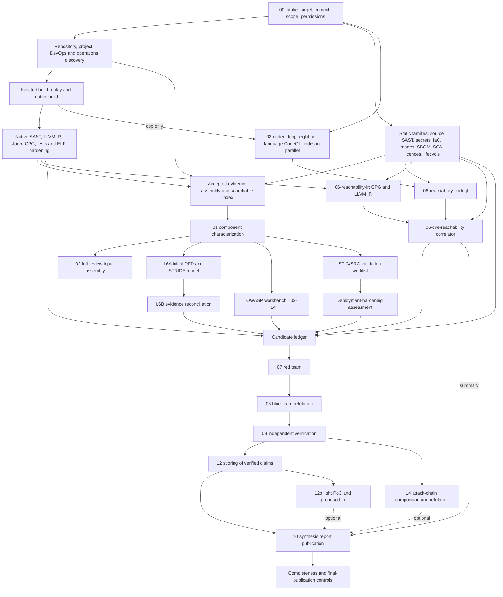

# AppSec review - implemented process flow

Snapshot: 2026-09-27 (diagram updated 2026-09-29 for ADR-0023). The machine-readable authorities are
[`job-graph.json`](../appsec-review-process/pipeline/job-graph.json),
[`design-parity-manifest.json`](../appsec-review-process/design-parity-manifest.json), and the
registry contracts. The generated [job and artifact catalog](processes/job-catalog.md) is the exact
inventory. This document explains how work and evidence move through the system.

## End-to-end flow

```mermaid
flowchart TD
  I[00 intake: target, commit, scope, permissions] --> D[Repository, project, DevOps and operations discovery]
  I --> S[Static families: source SAST, secrets, IaC, images, SBOM, SCA, licences, lifecycle]
  D --> B[Isolated build replay and native build]
  B --> N[Native SAST, LLVM IR, Joern CPG, tests and ELF hardening]
  S & N & D --> E[Accepted evidence assembly and searchable index]
  I --> CQ[02-codeql-lang: eight per-language CodeQL nodes in parallel]
  B -->|cpp only| CQ
  CQ --> RC[06-reachability-codeql]
  N --> RI[06-reachability-ir: CPG and LLVM IR]
  S --> RC & RI
  RC & RI --> CR[06-cve-reachability correlator]
  S --> CR
  CR --> L
  CR -->|summary| X
  E --> C[01 component characterization]
  C --> P[02 full-review input assembly]
  C --> T1[L6A initial DFD and STRIDE model]
  T1 --> T2[L6B evidence reconciliation]
  C --> O[OWASP workbench T03-T14]
  C --> G[STIG/SRG validation worklist]
  G --> H[Deployment-hardening assessment]
  T2 & O & H --> L[Candidate ledger]
  S & N --> L
  L --> R[07 red team]
  R --> U[08 blue-team refutation]
  U --> V[09 independent verification]
  V --> Q[12 scoring of verified claims]
  V --> K[14 attack-chain composition and refutation]
  Q --> X[10 synthesis report publication]
  K -.->|optional| X
  Q --> PF[12b light PoC and proposed fix]
  PF -.->|optional| X
  X --> A[Completeness and final-publication controls]
```

An implemented or qualified worker is not evidence that it ran for a particular engagement. Each
engagement must retain a current accepted pointer, immutable attempt, hashes, permission receipt,
lineage, coverage and terminal status.

## Evidence and search

The review binds source, binary and reference data to one source snapshot and build identity.
Source search uses two complementary representations:

- full-text and semantic projections in the evidence index (including the LanceDB-backed semantic
  recall path) for literal names, configuration, prose and related concepts;
- Joern CPG/AST and LLVM IR projections for structural queries over calls, symbols, types, data
  flows and memory operations, with source locations and build identity preserved.

Cross-references connect repository partitions, components, files, symbols, build units, binaries,
dependencies, controls, threat hypotheses, claims and citations. Consumers receive locators and
hashes, not copied conclusions, and revalidate the referenced artifact before use.

## Project partitioning and component scope

Repository discovery identifies independently buildable projects and operational surfaces.
Component characterization derives stable component IDs, ownership, trust boundaries, data flows,
languages, build units and evidence coverage from accepted discovery and evidence. The
`02-full-review-input-assembly` deterministically revalidates the current accepted component map,
staged target identity, source generation and any accepted dependency prerequisites. It derives a
closed plan, publishes bounded requests, records non-applicable input classes as explicit
`SKIPPED_NA`, and automatically dispatches the applicable first wave. Dependency families are
reinvoked in later waves after accepted SBOM, licence and SCA prerequisites become available; the
same derivation step revalidates every prerequisite before expanding the wave.

## Analysis families

Implemented families include native-memory analysis, CVE reachability, fuzz-target triage, secrets,
IaC, container-image inventory, SBOM generation, offline SCA matching, licence scanning, dependency
lifecycle, ELF binary hardening, mobile SAST, and Go/Java/PHP source SAST. Offline vulnerability
matching binds exact Grype/OSV snapshot bytes and records age; snapshot refresh is an out-of-band
maintenance job and a stale or missing snapshot becomes a coverage gap. Native binaries produced by
the build lane are routed to Checksec and retained with the build identity.

CodeQL runs as eight per-language nodes `02-codeql-<lang>` in parallel
([ADR-0023](decisions/ADR-0023-per-language-codeql-reachability.md)): interpreted languages after
intake, Java and C# in build-mode none, C/C++ after the native build (traced rows per unit); Go and
Rust are recorded gaps and an absent language is SKIPPED, never a failure. Each node publishes P1
leads and a hash-bound pointer to its retained database. Dependency reachability then runs two
engines that write one table (`06-reachability-codeql` over those databases, `06-reachability-ir`
over the CPG and LLVM IR), and `06-cve-reachability` correlates them per SCA match into
`reachable`, `unreachable`, `unknown` or `conflict`; its summary feeds the claim ledger, lanes
07/08/09/12 and the report. Details: [`dependency-reachability.md`](dependency-reachability.md).

## Threat modeling and standards processes

Threat modeling is a two-stage process. L6A creates an initial DFD and STRIDE hypothesis set from
the component map. L6B reconciles it with accepted evidence, preserves conflicts and publishes model
coverage. This is now executable and qualified; a real target still requires an accepted run.

OWASP, STIG/SRG and deployment hardening are three distinct processes:

1. OWASP T03-T14 selects ASVS/MASVS work by component, performs bounded validation and publishes a
   paginated status matrix, gaps and candidate routes. The chain is qualified. Automatic derivation
   of all trusted dispatch facts remains open.
2. STIG/SRG tailoring selects platform controls and publishes its own validation worklist.
3. Deployment hardening consumes the tailored worklist plus deployment evidence and reports static
   configuration and exposure observations. It does not certify compliance and does not replace the
   standards worklist.

## Red, blue and verifier rendezvous

The orchestrator launches bounded persona/tool pool members with immutable handoffs. A deterministic
merge waits for each expected member to reach a durable terminal state, validates identity,
contracts, citations and ordering, and retains dissent. Evidence-qualified quorum applies evidence
and independence thresholds. Red team proposes attacks; blue team refutes or narrows them;
independent verification alone can verify a claim. Scoring consumes verified claims only.

The candidate ledger has three sources ([ADR-0015](decisions/ADR-0015-tool-leads-are-ledger-candidates.md)):
threat-model STRIDE hypotheses, OWASP candidate routes, and every accepted tool lead (source and
native SAST, secrets, SCA matches, IaC and mobile rule hits). Leads at one path and line merge across
tools, carry a P1/P2/P3 review tier, and stay `candidate_only` until the 07 → 08 → 09 chain decides
them. Each 07/08/09/12 reviewer also receives a hash-bound supporting-evidence menu (component map,
build and compile databases, IR, code property graph, debug symbols, binary, SBOM and test evidence)
with every listed file pinned as a readable input, and a task guide for the `input_jq` and
`evidence_*` lookup tools.

## Attack chains (lane 14)

[ADR-0016](decisions/ADR-0016-attack-chain-composition.md) adds a lane after 09 that runs in
parallel with 12. `14-attack-chain-composition` seeds clusters from the reviewed claims (verified,
narrowed or open; refuted excluded), entry facts (CPG input calls and `argv`/`envp` in `main`, IR
reads in `main`, threat-model actors and external systems, public-ingress and client-device
components) and adjacency (CPG/IR function membership and call records, threat-model flows,
component relationships), then runs one `attack-chain-composer` persona cell per cluster. The model
chooses links, stages, prerequisites and the fact ref for each hop; Python derives chain ids, edge
bases (an unjoined hop is `synthetic`), link states and the chain state. `14-attack-chain-refutation`
runs `attack-chain-refuter` cells that try to break each chain's weakest link, drops refuted chains
with their reason and publishes the hash-linked `attack-chain-ledger.json`. A chain is at most
`supported` and never a verified finding. The lane is an optional input of 10: a SKIPPED lane
(`not-applicable-no-chain-seeds`) or a lane failure is a recorded gap, not a report failure. The
report's "Attack chains" section is the next slice.

## Light PoC and proposed fix (lane 12b)

Agent brief F adds `12b-poc-and-fix` after 12. It runs only for findings that are independently
verified (12 records `verification_status` VERIFIED), scored CRITICAL by 12, and REACHABLE by the
ADR-0020 call-graph analyser; `poc_fix_select.py` uses the report's own enrichment code
(`finding_enrichment`) for reachability and the Critical cap, so 12b and 10 agree on eligibility.
Python builds one request workspace per eligible finding (at most `poc_findings_max`): finding
locations, the reachability witness, the citable files with pinned `source_sha256` and line windows
(`poc_citation_window_lines` around each location and witness call site) and hash-verified,
redacted snippets. One `poc-fix-author` persona cell per finding writes a light static PoC (a
minimal input, call or short test that triggers the crash or overflow, or shows the faulty control
flow), a source-to-sink explanation, the cited ranges and a proposed fix as a unified diff.

`poc_fix_derive.py` keeps the books (ADR-0013): ids, hashes and labels are derived; a citation
outside the workspace windows, a fix touching another file or an oversize PoC goes back through the
invoker repair loop. `poc_fix_denylist.py` scans the PoC, trigger, the lines the fix adds and (for
material only) the prose: process spawn or exec, network, file writes outside a temp name,
destructive actions, encoded blobs, pipes into interpreters and `eval`, credentials, persistence,
code injection and obfuscation. A hit withholds the text, keeps only rule ids, lines and a hash, and
records a gap; it is never re-asked. The pipeline never executes a PoC or applies a fix: every PoC is
`UNVALIDATED` and every fix `PATCH_PROPOSED_UNVALIDATED`.

10 reads the accepted 12b result as an optional input (`poc_fix_report.py` -> `poc-fix-section.json`)
and renders the block under each Critical REACHABLE finding after Remediation, labelled as
unvalidated static text that was never executed. An absent, failed or stale lane, an eligible
finding without a record, and every withheld text are report limitations and a note under the
finding. With no eligible finding the lane is SKIPPED `not-applicable-no-eligible-findings`.

## Reporting and remaining gates

The synthesis publication worker is executable and fixture-qualified. It produces a hash-bound
`DRAFT_EVIDENCE_BACKED` package plus LaTeX and HTML presentation inputs. The retained
qualification report is honest about unresolved coverage and sets `final=false` and
`human_signoff=false`. Its appendix lists the tool-lead claims that were not independently
verified, by tier, so the static-tool coverage stays visible.

Three integration gaps remain:

- automatic derivation of OWASP trusted dispatch facts;
- one retained run through the entire real accepted upstream chain; and
- human-authorized final publication.

Until those gates close, the system can produce a qualified nominal draft, not a final assessment.

Retained presentation artifacts are the
[happy-path demo PDF](report-examples/appsec-review-happy-path-demo.pdf) and
[HTML](report-examples/appsec-review-happy-path-demo.html). They are prominently marked DEMO and do
not represent a production target. The HTML currently uses external font and KaTeX references; use
the PDF when an offline retained rendering is required.
