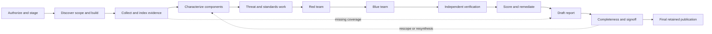
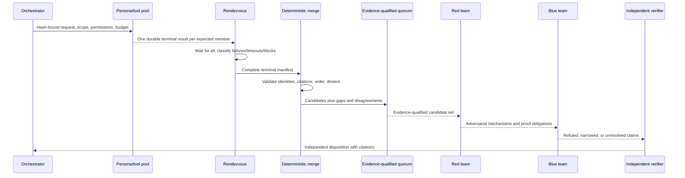

# AppSec Review system guide

Snapshot: 2026-09-27. This guide is the durable, two-level introduction to the AppSec Review
system. The opening of each section is written for an executive reader; the detail that follows is
for an operator or technical leader. Current implementation status is taken from the generated
[lifecycle readiness view](design-parity/design-parity-readiness.md), not inferred from the design.
The machine authorities remain
[`job-graph.json`](../appsec-review-process/pipeline/job-graph.json),
[`design-parity-manifest.json`](../appsec-review-process/design-parity-manifest.json), the registry,
schemas, and accepted run artifacts.

## 1. Purpose, outcomes, and claim boundary

**Executive view.** AppSec Review turns a fixed target revision and its supplied evidence into a
traceable application-security assessment. It inventories the target, gathers static evidence,
models the system, tests security hypotheses through independent roles, records what could not be
checked, and prepares an executive and technical report. Its defining promise is traceability: a
reported finding should lead back to accepted evidence, while a missing check remains a visible
gap.

The baseline is static and offline. It can inspect source, build metadata, compiled artifacts,
containers, infrastructure configuration, dependencies, tests, documentation, and supplied
operational material. It can compile in an isolated environment to recover semantics. It does not
claim to have observed production behavior, exercised a live service, proved the absence of a
vulnerability, certified regulatory compliance, or established malicious intent. A scanner hit,
STRIDE hypothesis, control work item, or red-team proposal is a candidate until the appropriate
decision stage accepts it.

The system reports:

- review identity, scope, exclusions, target generation, permissions, and tool/reference versions;
- components, boundaries, data flows, deployment surfaces, and coverage;
- evidence-backed findings and their red-team, blue-team, verification, scoring, and remediation
  history;
- OWASP, STIG/SRG, and deployment work status without collapsing them into one compliance claim;
- tools or evidence that failed, did not apply, were skipped with authorization, or were missing;
- provenance, hashes, citations, unresolved proof obligations, dissent, and publication state.

It explicitly does **not** convert “the tool ran” into “the target is secure.” Likewise,
`OK_WITH_GAPS`, `BLOCKED`, `FAILED`, `SKIPPED`, `NOT_ASSESSED`, and `cannot_determine` are meaningful
states, not inconvenient synonyms for success. See the canonical
[architecture boundary](architecture/design-v3.md).

## 2. Quick start: use and operation

**Executive view.** An engagement is one target revision, business decision, scope, budget, and
permission set. The operator creates the run, stages those facts, starts the orchestration
services, submits bounded jobs, resolves explicit gates, and retains an immutable report package.

### 2.1 Prerequisites and initial setup

Use a Linux or WSL POSIX host with Docker. The target must be a host checkout at a known revision.
The Dagster webserver, daemon, and PostgreSQL run in containers; the code location and worker
commands run as the host operator. From the repository root:

```bash
python3 orchestrator/dagster/setup.py
docker compose -f orchestrator/dagster/compose.yaml up -d --build
orchestrator/dagster/code-location.sh start
orchestrator/dagster/code-location.sh reload
```

Routine health checks are:

```bash
docker compose -f orchestrator/dagster/compose.yaml ps
orchestrator/dagster/code-location.sh check
python3 -B images/registry_records.py check
```

The code location requires Python 3.12, Git, and `libfuzzy2`; all declared step-4 images need valid
local B16 build-state records. Setup and recovery details are in the
[Dagster launching guide](dagster/dagster-launching.md).

### 2.2 Create and configure the engagement

The staging command is the public intake contract. It supports `probe`, `standard`, and `full`
budgets; repeated target platforms, include/exclude patterns, and permissions; an optional trusted
compile database; and an explicit legacy import.

```bash
PY=~/.venvs/appsec-review-dagster/bin/python
RUN=$($PY -B appsec-review-process/run_process.py --start \
  | $PY -c 'import json,sys; print(json.load(sys.stdin)["run_id"])')

$PY -B appsec-review-process/stage_artifacts.py \
  --run-id "$RUN" \
  --project <project> \
  --target /absolute/path/to/target \
  --business-goal "<the decision this review informs>" \
  --platform Linux \
  --budget probe \
  --execution-environment dagster-read-only-linux
```

Add repeated `--include`, `--exclude`, or `--permission` arguments only when the engagement calls
for them. The default permission is `read-source`; network, target execution, package restore,
dynamic testing, mutation, ptrace, and credential use are separate capabilities. Target files and
their instructions cannot grant authority.

### 2.3 Run, monitor, and recover

The default workflow performs intake and bounded preparation; it is not the entire security
review:

```bash
$PY -B appsec-review-process/launch_job.py --run-id "$RUN" --wait
$PY -B appsec-review-process/review_cli.py status --run-id "$RUN"
```

Use `--job <registered-job>` for a named job such as `build_discovery`, `build_resolution`,
`native_build`, `source_sast`, `evidence_index`, or one of the currently exposed analysis workers.
`launch_job.py --help` is the authoritative selectable list. `QUEUED` and `STARTED` mean accepted
for execution, not complete.

Reconnect without resubmitting:

```bash
$PY -B appsec-review-process/launch_job.py \
  --run-id "$RUN" --launch-id <launch-id> --wait
```

After correcting an input or operational failure, submit a new launch for the same run. Reusable
accepted attempts are revalidated; a failed newer attempt never silently falls back to an older
success. Use `--force` only to request a deliberately new attempt. Never edit an accepted pointer,
delete a lock, or mark an artifact successful by hand.

### 2.4 Resolve gates and gaps

Partition, developer, DevOps, and SRE discovery are classified in the lifecycle as supplied-artifact
gates. The implementation also contains a per-run opt-in automatic persona-dispatch path, but that
does not change the generated readiness classification. Without a valid supplied record or an
authorized supported dispatch, the gate emits a handoff naming the required file. Build and analysis
jobs similarly block on exact accepted prerequisites, missing permissions, unavailable images, or
absent reference snapshots. The correct response is to supply or regenerate the stated prerequisite
and relaunch; the blocked state belongs in coverage until an accepted result replaces it.

Use the generated [job and artifact catalog](processes/job-catalog.md) to find a job's exact inputs
and outputs, and the [readiness view](design-parity/design-parity-readiness.md) to distinguish a
worker core from a live lifecycle binding.

### 2.5 Generate and retain a report

The nominal evidence-backed report path is documented in the
[happy-path operator guide](report-path/happy-path-operator-guide.md). Its report-input assembler
requires exact accepted pointers and revalidates hashes, lineage, citations, generations, ledger
heads, and decision authority. Synthesis writes a new immutable attempt and labels it
`DRAFT_EVIDENCE_BACKED`; final publication additionally requires completion evidence and an
authorized human signoff.

The retained demo exercises the implemented package and publication contracts:

```bash
python -B appsec-review-process/retained_happy_path_demo.py \
  --output-root /absolute/path/to/retained-demo \
  --run-id retained-demo
```

After a final package exists, adapt and render it offline:

```bash
python -B pipeline/report/final_publication_adapter.py \
  /absolute/path/to/retained-final-demo/final \
  --supplemental /absolute/path/to/retained-final-demo/supplemental-family-qualification.json \
  --output /absolute/path/to/retained-final-demo/final.review.json

bash pipeline/report/render-in-docker.sh \
  /absolute/path/to/retained-final-demo/final.review.json
```

The [retained sample PDF](report-examples/appsec-review-sample.pdf) and
[equivalent self-contained HTML](report-examples/appsec-review-sample.html) show the intended
presentation. They are generated from synthetic fixture data and are not evidence of a live scan.

## 3. Configuration model

**Executive view.** Configuration is layered so business intent, technical scope, authority,
tooling, reference data, and presentation cannot silently override one another.

| Layer | Where it comes from | What it controls |
|---|---|---|
| Engagement | staged `inputs/artifact-manifest.json` | target revision/path, business goal, target platforms, includes/excludes, budget, execution environment, permissions |
| Lifecycle | `job-graph.json`, design-parity manifest | job dependencies, implementation binding, resource-pool state, readiness and gaps |
| Job composition | `appsec-review-process/pipeline/job-templates/` plus persona, role, domain, tooling-profile, and output-contract records | who/what performs a job, required inputs, allowed outputs, timeout, retry, applicability |
| Pool specification | C01 pool specification and B15 limits | persona/tool groups, cardinality, budget class, timeout, writable/readable roots, worker kind, deterministic expansion |
| Authority | staged grant records evaluated by B11 | exact capabilities allowed for this run, job, source generation, destination, path, and time window |
| Tool identity | `images/*`, B16 build-state/registry records | exact local image identity and available tool version; workers do not pull opportunistically |
| Static references | content-addressed OWASP/OpenCRE, NVD, Grype/OSV, DISA, EOL, and native-reference records | which external facts may be used, with version, hash, age, provenance, and limitations |
| Publication | accepted input pointers, synthesis settings, completion references, signoff ledger, renderer JSON | which claims and coverage enter the report and whether the package remains draft or may be final |

The budget (`probe`, `standard`, `full`) affects bounded work and persona slot requests; it does not
relax evidence or permission rules. A persona is a review stance, not proof. A tooling profile
declares permitted tooling, not proof that the tool ran. A permission decision is authorization,
not a sandbox; the adapter must enforce the exact granted capability.

Offline dependency lookups take an explicit warning age and hard maximum age. A snapshot within
the warning band remains usable with a warning; one beyond the hard ceiling fails stale. NVD's
consumer can also be configured with an explicit `NO_AGE_LIMIT`, which still records age. Omitting
an age policy is not an implicit unlimited policy.

## 4. Design overview and end-to-end flow

**Executive flow.** The system moves from an authorized target, through reproducible evidence and
competing interpretations, to a report whose findings and gaps can be audited.



### 4.1 Detailed processing and job interaction

1. **Intake (`00-intake`).** Records the source generation, dirty/untracked state, declared scope,
   permissions, target families, and bounded review plan.
2. **Discovery.** Repository partitioning precedes developer project discovery, DevOps discovery,
   and SRE topology discovery. Build indexing, classification, planning, and resolution turn those
   facts into immutable per-unit build locks.
3. **Build replay.** `02-build-configure` and `02-native-build` replay the accepted lock offline.
   Produced compile databases and binaries are new evidence generations; a configure success is not
   a completed build or review.
4. **Evidence producers.** Source-only jobs can start from intake; compiled jobs wait for native
   output. Intelligence ingests normalize supplied API, binary, document, standards, test, and
   operations material. Every attempt publishes typed artifacts and a common terminal envelope.
5. **Rendezvous and assembly.** Applicable producers reach terminal states. Accepted results and
   authorized skips enter `02-evidence-assembly`; missing or failed applicable producers stay gaps.
   The assembly publishes a canonical, hash-bound `intel-manifest.json`.
6. **Component characterization (`01`).** Resolves physical scopes into functional components,
   ownership, relationships, data classes, boundaries, review tags, and explicit unknowns.
7. **Parallel specialist processes.** L6A threat generation, OWASP worklist/accounting, STIG/SRG
   tailoring, deployment hardening, native-memory analysis, CVE reachability, and fuzz-target
   triage produce candidates, worklists, and proof obligations. They do not directly create
   verified findings.
8. **Candidate lifecycle.** Admission gives a candidate a stable claim identity. The ledger admits
   threat-model hypotheses, OWASP routes and every accepted static-tool lead (merged per path and
   line, tiered P1/P2/P3; see ADR-0015). Reviewers get a supporting-evidence menu of the run's
   accepted IR, CPG, debug-symbol, build, SBOM and test evidence, pinned as readable inputs. Red-team analysis
   proposes an adversarial mechanism; blue-team analysis refutes or narrows it; independent
   verification records the decision; scoring applies only to verified claims. Remediation and
   same-environment retest append rather than erase history.
9. **Synthesis and completion.** Report-input assembly joins exact accepted generations. Synthesis
   emits a draft package. Completeness audit, bounded resynthesis, and final publication revalidate
   the package and authorization; uncovered scope can return through dynamic rescoping.

The durable unit is an **immutable attempt**, not a mutable output directory. A job's
`accepted.json` points to the current validated attempt. The input fingerprint covers upstream
hashes, source generation, configuration, code/image identity, schemas, and permissions. A changed
input creates a new attempt and invalidates dependent acceptance.

### 4.2 Evidence, citations, gaps, qualification, and publication

- **Evidence generation** identifies a coherent source/build/component/reference state. Downstream
  consumers must bind that generation, not just a familiar path.
- **Citation** identifies the producer, artifact hash, file or object locator, and bounded range.
  Consumers dereference the accepted bytes and recheck the hash.
- **Gap** is a typed limitation: missing input, failed tool, unsupported format/language, excluded
  scope, unresolved conflict, runtime-only proof obligation, or unqualified path.
- **Qualification** proves a named worker/path under a stated fixture or live environment. Unit
  qualification does not establish a live target result; a live accepted attempt does not prove
  every recovery and concurrency behavior.
- **Publication** is a separate authority boundary. A technically valid draft remains non-final
  until completion references and human authorization pass the final gate.

## 5. What the system checks and reports

**Executive view.** Coverage is broad, but every family has an entry condition and a limited claim
boundary. The report should show both the result and whether the required evidence actually ran.

| Family | Enters from | What it checks or produces | Leaves as / claim limit |
|---|---|---|---|
| Source SAST | accepted source snapshot | language-specific static patterns and normalized leads; C/C++, Go, Java, PHP adapters are integrated | leads and coverage; not verified findings; non-C/C++ live qualification remains open |
| Build/native SAST | accepted build lock, compile DB, native build | compiler-aware diagnostics, IR capture/link/facts, symbols, native semantic evidence | cited compiled evidence; blocked units stay explicit |
| Binary analysis/hardening | supplied or produced binaries, symbols | format/architecture inventory, imports/exports/CFG, hardening properties | binary leads, applicability, missing-symbol/tool gaps; current source-root hardening input does not yet cover every produced ELF |
| Native memory | components plus accepted native SAST/IR | ownership, bounds, lifetime, integer-to-size and memory-operation candidates | candidate-only proof obligations; runtime/exploitability not claimed |
| Mobile SAST | source snapshot with mobile markers | Android/iOS-oriented static evidence and applicability | leads and coverage, never a mobile certification |
| Secrets inventory | source snapshot | secret-like material through a pinned scanner and publication redaction | inventory and redaction receipt; published values are not exposed |
| IaC/config | source and declared deployment files | infrastructure, Kubernetes, Dockerfile, cloud/configuration weaknesses and base images | static configuration leads plus applicability; not observed runtime state |
| Container image inventory | supplied run-owned image archives | image identity, packages/layers/metadata supported by the pinned tool | inventory and unsupported-image gaps; does not pull arbitrary target images |
| SBOM | accepted source snapshot | package/component identities, locations, cataloger metadata, layered dependency inventory | SBOM plus no-location and unsupported-ecosystem gaps |
| SCA matching | accepted SBOM plus current supplied offline Grype/OSV snapshots | PURL/CPE-oriented vulnerability candidates against pinned database bytes | match leads and database identity; a package without a mapping is a gap, not “no CVEs” |
| CVE reachability | accepted SCA plus supplied static reachability evidence | whether code/build evidence supports or weakens a candidate dependency path | static reachability state and proof obligations; no dynamic reachability claim |
| License | source plus SBOM | detected licenses, component/file associations, unknown or conflicting signals | inventory and policy inputs; not a legal opinion |
| Dependency lifecycle | SBOM, license evidence, current lifecycle reference | end-of-life, abandonment, pinning and maintenance signals | lifecycle leads and stale/missing-reference gaps |
| Fuzz triage | components, threat candidates, native and reachability evidence | ranks candidate entry points by buildability, determinism, input model, isolation, blockers | feasibility plan only; no fuzz campaign or crash claim |
| OWASP | components plus accepted OWASP/OpenCRE sources | selects applicable controls, evidence modes, assessment denominators, gaps, candidate routes | worklist and control matrix; no automatic satisfaction or compliance claim |
| STIG/SRG | platform inventory plus accepted DISA references | platform applicability, tailoring, static/runtime/manual evidence needs | separate validation worklist; unobservable controls remain gaps |
| Deployment hardening | static deployment evidence plus accepted STIG/SRG worklist | configuration and declared exposure against tailored hardening obligations | `STATIC_EVIDENCE_ONLY` assessments and runtime gaps; no deployment certification |
| Threat model | component map and accepted evidence | DFD elements, trust boundaries, flows, STRIDE hypotheses, data classes, abuse cases, attack trees, coverage/conflicts | L6A candidates; L6B reconciled model only after its distinct worker is implemented and accepted |
| Report coverage | all exact accepted inputs and obligation inventories | finding lifecycle, covered/failed/skipped work, unresolved obligations, references, publication authority | immutable draft or authorized final package |

The source-only family can proceed without a successful native build. Native and binary-dependent
families branch per resolved build unit, allowing one blocked unit to degrade rather than erase the
rest of the review.

## 6. Multi-agent collaboration and rendezvous

**Executive view.** Multiple agents are used to create useful disagreement, not a majority vote.
They exchange typed, immutable artifacts; no agent may silently promote its own proposal into a
finding.



The pool specification fixes group identity, worker kind, count, budget, timeout, input mounts, and
permissions. C01 expands it deterministically. C02 launches through the persona or pinned-container
adapter, applies bounded concurrency, and waits for **all** expected instances. Each instance ends
as succeeded, failed, blocked, canceled, timed out, crashed, invalid, not launched, or missing. A
pool is complete only when every expected member succeeded; degraded populations keep every member
and reason.

The merge stage revalidates the terminal manifest, typed outputs, producer identities, citations,
and deterministic ordering. It preserves disagreement. Quorum evaluates evidence quality and
required independence over the complete population; it is not a headcount and cannot manufacture
support for a candidate with unresolved citations.

Red-team, blue-team, and verifier authority is deliberately asymmetric:

- the red team may create an adversarial hypothesis and request proof;
- the blue team may refute, mitigate, narrow, or leave it unresolved, but cannot verify it;
- the independent verifier decides whether the cited mechanism is reproduced or established;
- scoring reads verified claims only;
- the ledger retains admissions, dissent, decisions, and later retest events as separate,
  hash-linked history;
- a static-tool lead is a candidate like any other: it reaches the report's findings only through
  independent verification, and unverified tool leads are listed by tier in the draft's appendix.

The executable pool launcher, deterministic merge, and quorum cores are graph-enabled and unit
tested. Their full-review input assembly, shared lifecycle binding, and retained live
multi-persona qualification remain separate readiness gates.

## 7. Static and offline information seeded into the system

**Executive view.** External knowledge is imported ahead of analysis, pinned, licensed, hashed,
dated, and then treated as immutable reference data. Reviews do not quietly fetch “latest” data
mid-run.

| Reference | Current role and local state | Required identity and behavior |
|---|---|---|
| OWASP ASVS, MASVS, MASTG, Top 10, API Top 10, GenAI Top 10, OpenCRE | content-addressed snapshots under `data/reference/`; versions/counts are listed in the [reference README](../data/reference/README.md) | upstream URL, immutable ref/commit, edition, license, raw inputs, extractor identity, record count, hashes; Top 10 is routing context and OpenCRE is crosswalk metadata, not proof |
| NVD CVE 2.0 | a locally retained immutable snapshot chain is published under `data/feeds/nvd`; used for CVE enrichment/cross-checking | current pointer, manifest chain, blob hashes/sizes, cursor, capture time, age policy, CPE limitations; missing root/pointer blocks and corruption fails |
| Grype and OSV | immutable registry, resolver, B13 consumers, and permissioned sync utility are implemented; no registered local Grype/OSV snapshot is retained in Git at this snapshot | database kind, vendor build, schema version, snapshot ID, data timestamp, every file hash/size, warning age, hard age; missing blocks, stale/corrupt fails |
| DISA STIG/SRG | curated repository reference currently includes a Kubernetes V2R1 record and explicit static-versus-live limitations | document title/version, source/fetch dates, rule identity, applicability/tailoring, provenance; live-only checks remain worklist gaps |
| Lifecycle/EOL and native references | repository-pinned `data/eol-reference.json` and `data/native-libdir-reference.json` | source/version/hash and stated limitations; consumers must not infer freshness or identity not present in the record |
| Tool images | local Docker images plus B16 build-state records | Dockerfile/input fingerprint, tool image ID, installed-tool evidence; missing or drifted images block code-location startup or the worker |

`dependency_snapshot_sync.py` is an operator-side downloader for a fixed HTTPS URL with an exact
archive hash/size, bounded extraction, required paths, closed metadata, and an exact network grant.
It delegates publication to the content-addressed registry; analysis workers remain network-free.
The utility exposes an extension callable for a future combined periodic reference refresh, but
the current Dagster NVD schedule still calls `nvd_feed.sync` directly. Periodic Grype/OSV wiring is
therefore future orchestration work, not a current engagement-flow feature.

When reference data is unavailable, the dependent job is blocked and reports the recovery action.
When present bytes contradict their hashes, schema, path rules, or age limit, the job fails. Neither
condition is reported as a clean scan. Snapshot integrity is not publisher authenticity: filesystem
authority and retained external anchors remain part of the trust boundary.

## 8. Full-text code and evidence search

**Executive view.** Reviewers search a frozen evidence set rather than browsing a changing working
tree. Search results locate evidence; they do not become evidence by being copied into a prompt.

`02-evidence-index` stores exact accepted bytes as SHA-256 objects, records file and exclusion
metadata, indexes bounded UTF-8 chunks in SQLite FTS5, and records ssdeep fingerprints for similarity
navigation. The corpus currently includes the accepted source snapshot and accepted intake/build
discovery evidence. Scanner/native producers join only through explicit adapters.

After publishing the index:

```bash
$PY -B appsec-review-process/launch_job.py \
  --run-id "$RUN" --job evidence_index --wait

$PY -B appsec-review-process/evidence_store.py search \
  --run-id "$RUN" --text "CMAKE_EXPORT_COMPILE_COMMANDS" --limit 5

$PY -B appsec-review-process/evidence_store.py read \
  --run-id "$RUN" --path source/CMakeLists.txt --start 1 --limit 30

$PY -B appsec-review-process/evidence_store.py similar \
  --run-id "$RUN" --path source/CMakeLists.txt --limit 10
```

Search accepts literal terms joined with AND, not arbitrary FTS expressions or SQL. Results return
run, attempt, path, SHA-256, and line-range locators. `read` dereferences the accepted object and
revalidates it. Similarity is only a lead; even score 100 is not byte identity unless the SHA-256 is
equal.

Queries and reads are bounded: file counts/sizes, corpus bytes, text bytes, chunk length, line
length, and result count all have limits. Symlinks, binary/non-UTF-8 content, oversized files, and
excluded paths are recorded as coverage gaps. There is no implied OCR, decompilation, archive
unpacking, semantic embedding, or unrestricted shell access.

Published evidence should pass the redaction boundary before broad retrieval. The redactor handles
structured JSON/SARIF and text, withholds unhandled material, publishes a receipt last, and never
places detected secret values or per-value hashes in that receipt. Redaction is heuristic, so a
valid receipt means the selected rules found nothing further—not that no secret can exist.

## 9. Cross-reference construction and freshness

**Executive view.** Cross-references let the report answer both “why do we believe this?” and “what
exact system version did this refer to?”

The cross-reference chain is built from stable, independently validated identities:

1. **Source identity:** repository revision plus dirty/untracked fingerprint and source snapshot
   SHA-256.
2. **Partition/build identity:** partition IDs, project/build-unit IDs, build-lock entries, image
   build IDs, compile-database hashes, produced binary hashes, and source/build generations.
3. **Component identity:** deterministic component slug, physical scope, resolved paths,
   representative citations, owners/unknown ownership, relationship IDs, and component generation.
4. **Dependency identity:** PURL/CPE/component coordinates, SBOM location/cataloger, database
   snapshot identity, match record, reachability evidence, and license/lifecycle records.
5. **Evidence citation:** producer job/attempt, accepted pointer and envelope hash, artifact path and
   hash, locator/range, plus any proof obligation.
6. **Control/threat identity:** standard family/version/control ID/work-item ID or model
   element/flow/threat ID, its applicability/tailoring, supporting citations, coverage, and dissent.
7. **Claim identity:** candidate/claim ID, immutable origin ledger head, red/blue/verification event,
   current decision head, score/remediation/retest events, and report finding reference.
8. **Publication identity:** synthesis-input hash, report artifact hashes, completion references,
   signoff ledger, and final-publication manifest.

Every consumer revalidates the accepted pointer, newest-attempt identity, envelope, declared file
set, and hashes. Source, build, component, standards, and database generations must agree. Mixed
generations, a stale pointer, a newer failed attempt, changed bytes, an unresolved citation, or an
authority mismatch stop promotion and become a gap. The report keeps both the immutable admission
ledger head and the later decision head; requiring them to be equal would erase history.

## 10. Project partitioning and downstream routing

**Executive view.** Large repositories are divided first by physical ownership and build/deploy
shape, then by functional component. That keeps coverage measurable and avoids asking every agent
to review every file.

Repository partition discovery produces path-bounded partitions and persona routing. Developer,
DevOps, and SRE discovery add projects, manifests, build roots, pipelines, deployment units,
services, ports, and dependencies. Build indexing then enumerates concrete build units without
executing them. Component characterization maps accepted evidence into functional components and
relationships with deterministic IDs.

The component map recognizes physical scope categories `first-party`, `vendored`, `generated`,
`test-sample`, `documentation`, and `build-tooling`. Validation rejects target files assigned to
multiple physical scopes and files left unassigned. Each functional component must resolve to real
target paths and carry cited ownership evidence or an explicit unknown. Review tags and data classes
route components to language tools, threat work, standards, native analysis, and specialist
personas.

Dynamic rescoping is a bounded control loop, not an instruction to edit old outputs. A changed
source/component generation, discovered boundary, new build unit, uncovered control, or materially
different classification creates a new plan/attempt. Maximum iterations, no-progress detection,
lineage, and unresolved-gap output keep the loop finite.

For a large target such as Freeciv, a practical decomposition would separate top-level build roots
and generated/vendored trees, then identify functional components such as clients/UI, game rules,
network protocol and packet parsing, server/session authority, persistence, scripting/modding,
authentication or metaserver integration, tools/tests, packaging, and deployment assets. Those are
illustrative routing categories, not facts about a particular revision: D01–D04 and F03 must derive
the actual partitions, build units, flows, owners, and file assignments from accepted Freeciv
evidence. Cross-component protocol flows and trust boundaries stay explicit rather than being
duplicated into each partition.

## 11. Threat modeling: L6A and L6B

**Executive view.** L6A creates the initial security model; L6B is the separate process that must
reconcile it with the evidence and competing views before downstream work treats it as final.

L6A (`03-threat-model-dfd-stride`) consumes the accepted component map and lineage-bound evidence.
Its deterministic core can emit DFD elements, flows, trust boundaries, and STRIDE candidate
hypotheses. The target model also needs actors, data stores/classes, deployment zones, abuse cases,
attack trees, assumptions, and model coverage. Each element and threat needs stable IDs and
citations; a hypothesis is not a finding.

L6B (`03-threat-model-reconciliation`) is deliberately not an alias for L6A. Its intended inputs are
the accepted L6A generation, component characterization, and accepted evidence or independent model
variants. It must reconcile stable element/flow/threat identities, preserve dissent and conflicts,
detect missing characterized components and boundary-crossing flows, bind data classes and abuse
paths, and publish coverage plus unresolved proof obligations. Downstream red-team work, fuzz
triage, scoring context, and report assembly should consume the accepted reconciled model.

At this snapshot L6A's core and contracts exist but its shared lifecycle binding is standalone.
L6B is under active implementation and is not yet executable or qualified in the lifecycle. Until
L6B publishes and revalidates an accepted attempt, the system must label L6A as an initial model and
must not claim a final reconciled threat model.

## 12. OWASP, STIG/SRG, and deployment hardening are separate

**Executive view.** These three processes answer different questions. Combining them would hide
applicability, evidence limitations, and who has authority to make which statement.

### 12.1 OWASP validation

The OWASP source-ingest process selects exact content-addressed ASVS, MASVS, MASTG, Top 10, API Top
10, GenAI Top 10, and OpenCRE records. Applicability selects controls and evidence modes for the
characterized target. `04-owasp-validation-worklist` creates one work item per selected control with
standard version, target/component, applicability (`applicable`, `conditional`,
`not_applicable`, or `cannot_determine`), tailoring, evidence mode, citations, and gaps.
Applicability comes from the accepted T04 component routing (P39, `4622a7f`): a `not_applicable` row
carries its routing rule as citation and needs no assessment; a partially classified component is
`conditional` on its open questions (P25); a row no rule decides is `cannot_determine`, counted in one
worklist gap. T04 emits technical N/A only for the ASVS V3, V4, V7, V9, V10 and V17 chapters of a
positively classified local CLI or library with no network, HTTP or session trait, citing the bound
component map (P24, `14d295f`). That a routing rule may rest on the component map rather than
canonical target evidence is a narrow exception pending owner confirmation.

The worklist begins `NOT_ASSESSED` (one summary gap with the count, P26); it cannot satisfy a control or create a finding. The later
ASVS/MASVS accounting/join keeps selected, applicable, assessed, and satisfied as separate
denominators and emits a status matrix, coverage gaps, and candidate promotion routes. Top 10 and
OpenCRE records guide routing and cross-reference; they do not prove target behavior.

### 12.2 STIG/SRG validation

`15-stig-srg-validation-worklist` consumes exact DISA source records and accepted platform
inventory. It records the platform target, versioned control, applicability, tailoring, evidence
mode, citations, and gaps. Static, runtime, hybrid, and manual obligations remain distinct. A
runtime/hybrid requirement that cannot be observed in the static baseline must remain an explicit
runtime gap. The current Kubernetes reference itself notes that most control-plane checks cannot be
answered from an application repository alone.

### 12.3 Deployment hardening

`15-deployment-hardening` consumes the accepted STIG/SRG worklist plus accepted IaC/deployment
evidence. It assesses the checked-in configuration and declared exposure for the tailored target.
Its result explicitly says `STATIC_EVIDENCE_ONLY`, `runtime_observed: false`, and carries runtime
gaps. It does not replace either standards worklist and does not issue a compliance certification. An IaC
hit belongs to a work item when its path matches the component's path patterns or representative
locations (P28); Dockerfiles, `*.Dockerfile`, `Containerfile` and `.github/workflows` YAML count as IaC
inputs (`iac_files.py`, P27/P38), so a Dockerfile-only target is scanned.

All three workers have deterministic standalone cores. Their full-review input assemblers, shared
Dagster bindings, and live accepted qualifications remain separate work.

## 13. Report anatomy and retained artifacts

**Executive view.** The report leads with the decision, risk, scope, and confidence; technical
readers can trace every statement into evidence, coverage, and process history.

| Report area | Executive meaning | Technical detail retained |
|---|---|---|
| Cover and executive summary | overall rating, business impact, important actions, confidence | publication state, target revision, process assurance and native tier where supported |
| Scope and system overview | what was reviewed and how the system is divided | includes/excludes, partitions, components, architecture, data flows, trust boundaries |
| Findings | independently supported security issues in priority order | stable finding/claim IDs, severity/priority source, evidence citations, code snippets, red/blue/verify trail |
| Coverage and gaps | what the conclusion can and cannot cover | per-family status, failed/blocked/skipped/not-built work, applicability receipts, unresolved proof obligations |
| Threat model | how attackers, assets, boundaries, and flows relate | L6A/L6B identity, STRIDE hypotheses, data classes, abuse paths, coverage and dissent |
| Controls | relevant OWASP and deployment-security work | versioned control IDs, applicability, tailoring, evidence state, denominators, runtime/manual gaps |
| Remediation | what to change and how to retest | proposal identity, owner/priority, same-environment validation and residual uncertainty |
| Evidence register and provenance | why the report is trustworthy | source/build/component/database generations, tool/image IDs, artifact hashes, citations, ledgers |
| Publication manifest | whether this is draft or final | exact artifact inventory/hashes, completion references, signoff authority, `final` state |

Only independently verified claims may enter the verified-findings section. Supplemental worker or
fixture qualification can document system readiness but cannot contribute a target finding,
severity, score, or assurance credit. The renderer produces TeX/PDF and self-contained HTML from
the same review JSON in a network-disabled image.

Retained presentation references:

- [AppSec Review sample PDF](report-examples/appsec-review-sample.pdf)
- [AppSec Review sample HTML](report-examples/appsec-review-sample.html)
- [retained-example explanation](report-examples/README.md)

## 14. Current readiness and known gaps

**Executive view.** The system now has a broad implemented core, but “implemented” is not the same
as “live end-to-end accepted.” The authoritative per-job status is regenerated, so this summary
avoids stale all-or-nothing claims.

| Readiness class | Current examples | What remains |
|---|---|---|
| Implemented and qualified | intake; published OpenSSF Scorecard ingest; build resolution | run-specific inputs and permissions still apply; qualification scope is named, not universal |
| Implemented, happy-path or unit qualified | build index/classify/plan, configure/native build, source SAST; the evidence index has earlier live qualification | fault/recovery, contention, target/language matrices, common-envelope migration, and enriched evidence-index requalification |
| Standalone executable core | evidence assembly, components, L6A, OWASP accounting/worklist, STIG/SRG worklist, deployment, native-memory, CVE reachability, fuzz triage, red/blue/verify/scoring, scanner/dependency families, pools/merge/quorum, feedback controls | trusted lifecycle input assembly, shared Dagster binding, current accepted upstreams, live qualification |
| Supplied-artifact lifecycle gates with an opt-in automatic implementation path | partition, developer, DevOps, and SRE discovery | generated readiness remains `supplied_artifact_gate`; shared pooled persona lifecycle remains a later integration |
| Blocked by an input/reference | SCA without a current registered Grype/OSV mirror; build-dependent lanes without a resolved unit; standards work without accepted sources | supply/refresh the exact input and relaunch; retain the gap until accepted |
| Active/planned | L6B reconciliation; complete claim-ledger append adapters; integrated synthesis/publication path | implement, bind, and qualify before claiming end-to-end completion |

Specific known gaps at this snapshot include:

- L6B is under active implementation and not qualified; L6A must not be presented as reconciled.
- `full_review` still contains blocked lifecycle bindings even where standalone workers exist.
- The broad evidence assembly and component/persona chain lacks a retained complete live run.
- Grype/OSV registry support exists, but the local mirrors are operational data and are not retained
  in Git; their presence/freshness must be checked per environment. NVD is locally seeded.
- Binary-hardening scanning of the staged source root does not yet guarantee that ELF binaries
  produced by `02-native-build` reach the hardening worker; that graph/input assembly gap must stay
  visible.
- Go, Java, and PHP source-SAST adapters are integrated but still need live and fault/recovery
  qualification.
- Red/blue/verification cores exist, but common-envelope publication, accepted decision appends,
  and a retained live multi-agent chain are not fully integrated.
- Draft/final package cores and a retained synthetic demo exist; a complete live target flow through
  completion audit and human-authorized publication remains to be demonstrated.

Use [design-parity-readiness.md](design-parity/design-parity-readiness.md) for exact current status;
do not copy this table into a go/no-go decision without re-running the parity validator.

## 15. Job-interaction summary

This is a navigational rollup, not a replacement for the generated
[job and artifact catalog](processes/job-catalog.md).

| Phase | Principal jobs/processes | Required upstream | Principal output / next consumer |
|---|---|---|---|
| Authorize | `run_process.py`, `stage_artifacts.py` | target checkout, business goal, scope, budget, grants | artifact manifest → `00-intake` |
| Intake/preparation | `00-intake`, `engagement_workflow` | staged manifest | source identity, plan, accepted preparation → discovery |
| Discover | repository partition, dev, DevOps, SRE topology | accepted intake and prior discovery generation | partition/projects/services/topology → build and evidence |
| Resolve build | `02-build-index` → classify → plan → resolution | discovery, images, execution grants | per-unit immutable build lock → configure/build |
| Build/compile evidence | `02-build-configure` → `02-native-build` → native SAST/IR/symbol/binary/test family | accepted build lock | compile DB, binaries, compiled evidence → assembly/specialists |
| Source/package evidence | source SAST, secrets, IaC, container inventory, SBOM → SCA, license → lifecycle, binary hardening, mobile SAST, Scorecard | accepted intake; DB snapshots where required | typed static evidence → assembly/reachability |
| Intelligence ingest/index | API, binary, docs, standards, tests, operations; `02-evidence-index` | source/supplied artifacts and accepted producers | normalized intelligence and searchable locators → assembly/agents |
| Evidence join | pool rendezvous, `02-evidence-assembly` | every applicable producer terminal | canonical F02 manifest → components |
| Characterize | `01-component-characterization`, dynamic rescope | accepted F02 generation | component-purpose map/routing → threat/standards/specialists |
| Model and standards | L6A, planned L6B; OWASP worklist/accounting; STIG/SRG worklist; deployment hardening | components, standards, IaC, evidence | candidate threats, conflicts/coverage, control worklists/routes → admission/report |
| Specialist analysis | native-memory, CVE reachability, fuzz triage | components plus native/SCA/threat evidence | candidates and proof obligations → admission/red team |
| Agent decision chain | persona/tool pool → rendezvous → merge → quorum; claim admission → `07` → `08` → `09` | candidates and exact evidence | verified/refuted/unresolved ledger events → scoring/remediation |
| Prioritize/remediate | `12-scoring-prioritization`, `11-remediation-proposal`, remediation/retest feedback | independently verified claims | scores, fixes, retest evidence, residual gaps → synthesis |
| Report/complete | report-input assembly → `10-synthesis-report` → completeness audit → resynthesis → final publication | exact accepted generations, current ledger, completion/signoff | immutable draft or authorized final PDF/HTML/JSON/SARIF package |

## 16. Glossary

| Term | Meaning |
|---|---|
| Accepted pointer | Atomic `accepted.json` reference to the newest validated immutable attempt for a job/scope. |
| Attempt | One immutable execution with explicit inputs, output artifacts, logs, status, receipts, and envelope. |
| Candidate | A security hypothesis or control route that has not yet passed independent verification. |
| Citation | Hash-bound locator into an accepted producer artifact, normally including file/object and range. |
| Common envelope | Closed terminal result describing execution/acceptance status, fingerprints, contract, artifacts, gaps, and timestamps. |
| Component generation | Identity of the characterized component map and its exact source/evidence lineage. |
| Coverage gap | A declared limitation that prevents a claim of review coverage; not a finding and not a clean result. |
| Evidence generation | Coherent set of producer attempts tied to one source/build/reference state. |
| F02 / F03 | Evidence assembly / component characterization in the current implementation terminology. |
| Finding | A claim admitted and independently verified with resolving evidence; tool hits and hypotheses are not findings. |
| L6A / L6B | Initial DFD/STRIDE generation / evidence-based threat-model reconciliation. |
| Lineage receipt | Record binding a result to its accepted upstream identities and generations. |
| Pool | Deterministically expanded set of persona and/or tool instances with bounded resources and permissions. |
| Proof obligation | Specific evidence needed to verify, refute, narrow, or close a candidate/control/model gap. |
| Qualification | Retained proof that a named implementation/path behaved as stated under a named fixture or environment. |
| Quorum | Evidence/diversity rule applied after wait-all and deterministic merge; never merely a majority vote. |
| Rendezvous | Wait-all process that classifies every expected pool member and publishes the terminal-instance manifest. |
| Run | One engagement identity and run-owned data root for one target/scope/business decision. |
| Snapshot | Immutable, content-addressed copy of external reference data with version, provenance, hashes, and age. |
| Standalone core | Executable worker logic that is not yet bound into the shared full-review lifecycle. |
| Target content | Source, docs, logs, evidence, archive contents, and retrieved text under review; always data, never instructions. |
| Worklist | Versioned, tailored set of controls and evidence tasks; it is not itself an assessment verdict. |

## Further authoritative reading

- [Implemented process flow](appsec-review-process-flow.md)
- [Operator launch and recovery](dagster/dagster-launching.md)
- [Run-owned data and immutable attempts](dagster/run-data-and-job-execution.md)
- [Job and artifact catalog](processes/job-catalog.md)
- [Evidence retrieval](evidence/evidence-retrieval.md)
- [Offline dependency snapshots](adapters/dependency-offline-snapshots.md)
- [Pool specification](pools/pool-specification.md) and [wait-all rendezvous](rendezvous/pool-rendezvous.md)
- [Evidence-backed report path](report-path/happy-path-operator-guide.md)
- [Architecture design authority](architecture/design-v3.md)
