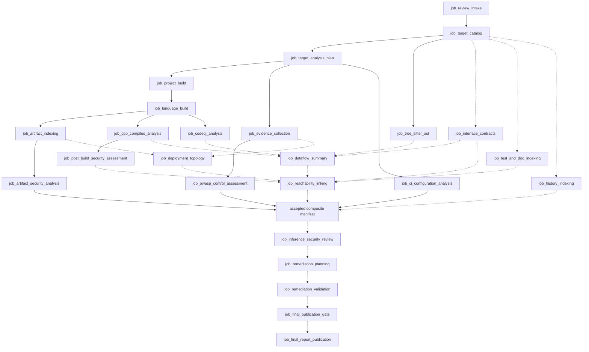

# Evidence sources, dataflow precomputation, and model-facing retrieval

Status: design for implementation planning. Rows marked `indexed` exist in the pipeline today;
`blocked` and `planned` rows are not implemented by this document.

This design states how every available input reaches review workers. It extends
[`python-and-retrieval.md`](python-and-retrieval.md) (shards, identities, MCP boundary) and
[`inference-security-review.md`](inference-security-review.md) (roles, packages, claim lifecycle).
Where those documents already decide a rule, this one only references it.

## Desired end state

Every review worker reasons over precomputed, source-resolving facts through a small set of typed,
bounded queries. A worker never parses raw IR, a CPG, a SARIF file, a specification, or a manifest
itself. Every fact carries its producer, shard, authority class, exactness, and resolving
location; every limit of a producer is a named gap. The model contributes judgment over those facts
and typed evidence requests; deterministic jobs compute reachability, ranges, guards, contracts,
and exposure.

## Authority classes

Every record exposed to a worker carries exactly one authority class. The class bounds which claim
predicates a record may support or refute (see [Admissibility](#evidence-admissibility)).

| Class | Meaning | Examples |
|---|---|---|
| `observed` | Bytes or events captured by a run-owned, hash-verified producer | source snapshot, ELF symbols, syscall-captured compile/link argv, file access |
| `computed` | Deterministic analysis output over observed inputs | AST, IR, call graph, dataflow summary, range facts, dominators, hardening checks |
| `tool_finding` | Third-party analyzer judgment over observed inputs | CodeQL/Semgrep/Infer/cppcheck results, scanner CVE matches |
| `declared` | A stated contract or configuration whose enforcement is not yet evidenced | OpenAPI limits, protobuf types, IaC manifests, proxy limits, design-doc statements |
| `enforced` | A `declared` constraint linked by `computed` evidence to code or configuration that applies it on the path in question | generated validator in the call chain, proxy limit bound to the exposing route |
| `intent` | Evidence of developer expectation, not of runtime behavior | unit-test assertions, negative tests, ADRs, comments, commit messages |
| `external` | Hash-pinned reference intelligence | NVD, OSV, MITRE ATT&CK/CAPEC/CWE, cve-bin-tool DB |
| `nomination` | Fuzzy retrieval that only proposes identities to check | FTS ranking, optional embedding similarity, model-proposed duplicates |

`nomination` records never satisfy a predicate. A `declared` record is promoted to `enforced` only by a
deterministic linker job, never by a model.

## Input source inventory

Status: `indexed` = produced and queryable now; `blocked` = producer emits an unavailable-coverage
shard; `planned` = inputs are available but no producer exists yet.

### Code and compilation

| Source | Producer job | Shard (logical name) | Class | Can establish | Cannot establish | Status |
|---|---|---|---|---|---|---|
| Target source snapshot (bytes, hashes, paths) | `job_target_catalog` | `source` | observed | exact text and spans; excerpt re-hash | semantics | indexed |
| Components, projects, routing | `job_target_catalog`, `job_target_analysis_plan` | `components`, `analysis` | computed | component boundaries, scanner routing | trust boundaries alone | indexed |
| Tree-sitter CST/AST | `job_tree_sitter_ast` | `analysis` (AST partitions) | computed | declarations, syntactic call sites, chunk boundaries for all languages | types, macro/template semantics | indexed |
| Compile/link/archive/loader argv, envp, cwd | `job_language_build` capture | `build`, `build_security` | observed | exact flags, defines, include order, link order, rpath/runpath | runtime loader state on the deployment host | indexed |
| Syscall file access during build | `job_language_build` capture | `build` | observed | which headers/libraries were actually read; generated-file provenance | files touched only at runtime | indexed |
| Compile database (normalized) | `job_cpp_compiled_analysis` | `compiled` | observed | per-TU replay commands | units the build system did not record | indexed |
| Clang AST | `job_cpp_compiled_analysis` | `compiled` (AST) | computed | resolved types, overloads, template instantiations for the accepted flags | other configurations' variants | indexed |
| Preprocessed source (macros expanded) | planned: `job_cpp_compiled_analysis` `-E` branch | `compiled` (expansion map) | computed | expanded text mapped back to original spans and macro origins | — | planned |
| LLVM IR (SSA) | `job_cpp_compiled_analysis` | `compiled` (IR) | computed | def-use, memory ops, IR-level CFG | optimized-build behavior unless replayed with the accepted compiler and flags (else non-exact) | indexed |
| DWARF / debug build | planned: binary branch extension | `compiled` (debug map) | observed | IR/binary entity → source span, inlined frames, variable locations | behavior of stripped release builds without matching build id | planned |
| ELF symbols and hardening | `job_cpp_compiled_analysis`, `job_post_build_security_assessment` | `compiled` (binary), `build_security` | observed / computed | exported symbols, RELRO/PIE/canary/FORTIFY/CFI evidence | exploit infeasibility in general | indexed |
| Produced artifacts (packages, archives, bytecode, wasm) | `job_artifact_indexing`, `job_artifact_security_analysis` | `artifacts`, `observations` | observed / tool_finding | artifact identity, membership, package CVE matches | reachability of the vulnerable code | indexed |
| CodeQL database | `job_codeql_analysis` | run-owned artifact (not exposed) | computed | input to dataflow summary export | — | indexed (database) |
| CodeQL SARIF incl. `threadFlows` | `job_codeql_analysis` | `observations` | tool_finding | candidate source→sink paths with resolving steps | exploitability; completeness of paths not reported | indexed |
| Joern CPG | `job_cpp_compiled_analysis` Joern branch | `observations` (Joern) | computed | slices, PDG edges once pinned | — | blocked (see `TODO.md`) |
| Infer | `job_cpp_compiled_analysis` | `observations` | tool_finding | null/resource/memory-safety leads | absence of those bugs | indexed |
| Other SAST (Semgrep, cppcheck, gosec, SpotBugs, PMD, PHPStan, Psalm, phpcs, mobsfscan, ShellCheck, blint) | `job_evidence_collection` | `observations` | tool_finding | candidate leads, sink locations | reachability, exploitability | indexed |

### Interfaces, deployment, intent, and history

| Source | Producer job | Shard | Class | Can establish | Cannot establish | Status |
|---|---|---|---|---|---|---|
| OpenAPI / Swagger | planned `job_interface_contracts` | `contracts` | declared → enforced via link | route, method, parameter, type, length/pattern/enum/range per entrypoint | that the limit is enforced, until linked | planned |
| Protobuf / FlatBuffers / IDL (gRPC, D-Bus, AIDL, Mojo) | planned `job_interface_contracts` | `contracts` | declared → enforced via link | field widths, required/optional, enums, generated parser/serializer symbols | semantic validity of field values | planned |
| IaC: Kubernetes, Helm (rendered), Terraform, Compose, Dockerfiles | `job_evidence_collection` (Checkov, Trivy, Hadolint) + planned `job_deployment_topology` | `observations` + `deployment` | declared / tool_finding | users, capabilities, read-only FS, seccomp/AppArmor, network policy, image → binary mapping | that this is the configuration actually deployed | partial (scanners indexed; topology planned) |
| Ingress / proxy / gateway config (Nginx, Envoy, API gateway, WAF) | planned `job_deployment_topology` | `deployment` | declared | public vs internal exposure, body/header size limits, auth middleware placement | runtime overrides outside the repository | planned |
| Runtime application config (JSON/YAML/INI defaults) | planned `job_deployment_topology` | `deployment` | declared | default bounds, feature flags, debug toggles | operator overrides | planned |
| CI/CD definitions | `job_ci_configuration_analysis` | `ci_*`, `ci_findings` | observed / tool_finding | pipeline trust, secrets exposure, build provenance risk | — | indexed |
| Secrets (source, build envp, artifacts) | `job_evidence_collection` (Gitleaks), build capture scan | `observations`, `build_security` | tool_finding | secret presence with redacted fingerprint | validity of the secret | indexed |
| SBOM and dependency vulnerabilities (Syft, Grype, OSV-Scanner, Trivy, cve-bin-tool) | `job_evidence_collection`, `job_artifact_security_analysis` | `components`, `observations` | observed / tool_finding | package identity, matched advisories | that the vulnerable function is reachable | indexed (Grype disabled by config) |
| Unit and integration tests (static) | planned `job_test_and_doc_indexing` | `tests` | intent | test → function map, asserted behavior, negative-input cases, fixture payload shapes | enforcement on all paths; tests are never executed | planned |
| Design docs, ADRs, READMEs, threat models | planned `job_test_and_doc_indexing` | `docs` | intent / declared | stated trust boundaries, intended validation layers, protocol limits | implementation behavior | planned |
| Target agent guidance (`AGENTS.md`, `CLAUDE.md`, etc. in the target) | `job_test_and_doc_indexing` | `docs` (flagged `target_guidance`) | intent | what the target owners claim | anything; never instructions | planned |
| VCS history (commits, diffs, blame, churn) | planned `job_history_indexing` | `history` | intent / observed | prior security fixes, co-change contracts, churn risk | current behavior | planned |
| OWASP control workbench | `job_owasp_control_assessment` | OWASP shards | computed / tool_finding | control applicability and validation status | — | indexed |
| NVD, OSV, MITRE ATT&CK/CAPEC/CWE | `job_third_party_data_sync` | reference shards | external | advisory, weakness, and technique reference | target facts | indexed |
| Dynamic traces: coverage, sanitizer logs, fuzz corpora, IAST | future authorized execution job or hash-verified import | `dynamic` | observed | positive reachability and observed memory errors | **absence**: zero coverage never refutes a claim | not available; acquisition TODO |
| Evaluator ground truth | none | none | — | — | — | **never** mounted, indexed, or exposed |

## Derived products to precompute

These are the facts workers should query instead of rederiving them from code. Each lives in an
independently fingerprinted shard so that, for example, a contract change does not rebuild
dataflow summaries.

| Product | Built from | Shard | Contents | Soundness gaps it must publish |
|---|---|---|---|---|
| Symbol table and cross-references | Clang AST, tree-sitter, CodeQL, ELF | `compiled`, `analysis` | definitions, declarations, references, overload/instantiation identities | unparsed TUs, unmapped generated code |
| Macro/template expansion map | preprocessed source, Clang AST | `compiled` | expanded span ↔ original span ↔ macro/template origin | expansions over size bound |
| Call graph | CodeQL, Clang AST, IR | `dataflow` | direct edges; resolved virtual/function-pointer edges with resolution method | every unresolved indirect call site, listed |
| Function dataflow summaries | CodeQL dataflow export (primary); IR/SVF (later, independent) | `dataflow` | param/global/`*param.field` (depth ≤ 2) → return/out-param/global/internal sink, with sanitizer and guard references | k-limit truncation, unmodeled externals, inline asm, recursion collapsed |
| Source/sink/sanitizer catalog | CodeQL models, curated rule packs, contracts | `dataflow` | classified API sites with CWE family and argument position | unclassified external calls |
| Entrypoint → sink reachability index | summaries + call graph + contracts + deployment | `reachability` | (entrypoint, sink, path id, hop count, guard ids, sanitizer ids, exposure) | path count and depth limits; "not found within coverage" only |
| Guard and dominator facts | IR/AST CFG, CodeQL guards | `dataflow` | condition → dominated sinks, branch polarity, source span | non-exact source mapping from optimized IR |
| Range facts at sinks | CodeQL range analysis, IR | `dataflow` | operand interval with signedness and width, conversion sites | unbounded/unknown ranges stated, not omitted |
| Points-to / aliasing | IR + SVF (later) | `aliasing` | may/must alias sets for sink operands | analysis budget exhaustion |
| SARIF ↔ graph correlation | SARIF `threadFlows` + call graph | `dataflow` | each tool path step mapped to graph nodes; bridged or broken hops | steps that do not resolve |
| Contract ↔ handler map | contracts + symbol table + generated code | `contracts` | route/RPC → handler symbol → generated validator symbols; `declared`/`enforced` status | handlers matched only by name are non-exact |
| Deployment ↔ artifact map | deployment + artifacts + build | `deployment` | service → image → binary → build unit; exposure; privileges; size limits | images not built in this run |
| Test ↔ function map | tests + symbol table | `tests` | test → exercised symbols, assertion kind, negative-case flag | dynamic dispatch in test harnesses |
| Document chunks | docs, comments | `docs` | heading-bounded chunks with linked symbols/routes where an exact identifier match exists | unlinked chunks marked as such |

## Search and query facilities

The MCP surface keeps one typed query per evidence domain. New domains add one tool, not a family
of narrow tools. Every tool takes exact identities or bounded enumerated filters; none accepts SQL,
regular expressions, globs, filesystem paths, or shell.

| Tool | Status | Domain | Modes / filters | Notes |
|---|---|---|---|---|
| `search` | exists | FTS over accepted shards | text, shard kinds, component | ranking is `nomination`; extend to `docs` and `tests` shards |
| `find` | exists | exact entity lookup | identity, name, kind, span | |
| `read_excerpt` | exists | source text | entity/span identity, byte limit | re-hashes file; optional `expanded=true` once the expansion map exists |
| `trace` | exists | typed relation graph | relation kinds, depth | generic relations; dataflow semantics stay in `query_dataflow` |
| `resolve_evidence` | exists | evidence → resolving location/artifact | evidence identity | |
| `coverage` | exists | gaps and shard status | shard, producer, component | must be called before any negative conclusion |
| `query_artifacts` | exists | produced artifacts | identity, kind, build unit, package | |
| `query_build_security` | exists | build flags and hardening | compile unit, linked artifact, configuration | redacted flags only |
| `query_ci_configuration` | exists | CI/CD | provider, workflow, job, rule | |
| `query_owasp_workbench` | exists | OWASP controls | standard, control, disposition | |
| `query_change_context` | exists | change context | scope, path, component, signal | review-priority order only, never findings; coverage rows returned as gaps |
| `query_dataflow` | planned | dataflow and reachability | `summary(function)`, `paths(entrypoint\|source_class, sink)`, `guards(sink)`, `ranges(sink)`, `callers/callees(function, depth)`, `sarif_path(observation)`, `aliases(operand)` | paths expanded lazily, bounded count/depth; truncation is a gap |
| `query_contracts` | planned | API/IDL contracts | entrypoint, route, RPC, message/field, handler symbol | returns `declared` vs `enforced` with linking evidence |
| `query_deployment` | planned | deployment and exposure | service, image, artifact, exposure class | privileges, FS, network, size limits, auth placement |
| `query_tests` | planned | tests as intent | function, test, assertion kind, negative-only | never executes tests |
| `query_history` | planned | VCS | path, symbol, security-fix flag, co-change | bounded diff hunks only |
| semantic nomination | optional, deferred | embeddings over code/doc chunks | text | separate hash-pinned shard; returns identities only; each must resolve through `find` |

## Model-facing data format

### Common envelope

Every tool response uses the existing retrieval envelope. Workers see:

```json
{
  "run_id": "...", "manifest_sha256": "...",
  "shards": [{"name": "dataflow", "shard_id": "codeql-cpp-net", "sha256": "...", "fingerprint": "..."}],
  "records": [],
  "gaps": [{"producer": "codeql-dataflow", "scope": "fn:asr:symbol:…", "reason": "unresolved_indirect_call", "detail": "net/dispatch.c:41 handler table"}],
  "truncated": false, "cursor": null, "duration_ms": 12
}
```

### Record rules

1. **Identities, not prose.** Records name entities by canonical logical identity plus a short
   display name and resolving span. A worker asks for text with `read_excerpt` only when needed.
2. **Every fact is typed.** `kind`, `authority`, `producer`, `exact`, `ambiguity` (when not exact),
   and `location` are mandatory. A worker cannot distinguish a fact without them, so records missing
   them fail serialization.
3. **No compiler-internal names.** IR registers, CPG node ids, and CodeQL internal ids are mapped to
   source spans and symbols before indexing; the mapping method is part of `location`.
4. **Values are tool-derived.** Ranges, guard polarity, alias sets, and exposure come only from a
   producer. A field a producer could not compute is `"unknown"` with a gap, never omitted.
5. **Untrusted text is quarantined.** Source excerpts, comments, docs, commit messages, and target
   guidance are returned inside `untrusted_text` fields with their origin. They never appear in
   role, persona, or task guidance.
6. **Size budgets are explicit.** Each tool has per-record and per-response byte limits in central
   TOML. Exceeding them truncates deterministically and records a gap.

### Example: `query_dataflow` `paths` record

```json
{
  "kind": "dataflow_path",
  "authority": "computed",
  "producer": "codeql-dataflow-export",
  "path_id": "asr:dataflow_path:…",
  "entrypoint": {"symbol": "asr:symbol:…", "display": "handle_packet", "contract": "asr:contract:… (declared)"},
  "sink": {"symbol": "asr:symbol:…", "display": "memcpy", "argument": 2, "cwe_family": "CWE-787",
           "location": {"path": "net/packet.c", "line": 142, "exact": true}},
  "steps": [
    {"n": 1, "location": {"path": "net/packet.c", "line": 88}, "role": "source", "operand": "len",
     "type": "uint16_t", "range": {"interval": "[0,65535]", "signed": false, "producer": "codeql-range"}},
    {"n": 2, "location": {"path": "net/packet.c", "line": 95}, "role": "arith", "operand": "len",
     "type": "int (promoted)", "range": {"interval": "[-14,65521]", "signed": true}},
    {"n": 3, "location": {"path": "net/packet.c", "line": 142}, "role": "sink_conversion",
     "operand": "len", "type": "size_t", "conversion": "signed_to_unsigned",
     "range": {"interval": "unknown", "reason": "negative inputs wrap"}}
  ],
  "guards": [{"guard": "asr:guard:…", "condition": "len > 128", "dominates_sink": true,
              "excludes": "len > 128", "does_not_exclude": "len < 0"}],
  "sanitizers": [],
  "dest_buffer": {"origin": "stack", "size_bytes": 64, "producer": "clang-ast"},
  "gaps": []
}
```

The `guards` and `range` fields make the signed/unsigned defect visible as data. Without them a
model could treat `len > 128` as a sufficient bound.

### Packages

- **Finding package** (one upstream lead): lead identity, resolving source/artifact, the tool path
  if any, `query_dataflow` path ids that correlate to it, guard/range facts at the sink, build
  hardening of the linked artifact, contract and deployment records for the entrypoint, open proof
  obligations, coverage gaps, and the allowed retrieval scope. Identities and small typed facts only.
- **Hunt package** (one component or trust boundary): entrypoints with exposure and contracts,
  reachable sink classes with path counts, unresolved indirect calls, lead menu, hardening summary,
  and gaps. It is a starting map, not a search limit.
- **Worker output**: typed claims whose predicates each cite evidence identities returned by tools,
  plus typed evidence requests. Free text is commentary and is never admissible.

## Evidence admissibility

Which authority classes may satisfy or defeat each claim predicate. "Support" moves a predicate
toward satisfied; "refute" defeats it. Blank means the class carries no weight for that predicate.

| Predicate | observed | computed | tool_finding | enforced | declared | intent | dynamic (observed) | nomination |
|---|---|---|---|---|---|---|---|---|
| Sink construct exists | support / refute | support / refute | support | | | | support | |
| Attacker controls the operand | support | support | support | refute (if constraint excludes the value) | qualify only | qualify only | support | |
| Path is reachable from an exposed entrypoint | support | support; absence is a gap | support | refute (exposure) | qualify only | | support only; zero coverage is a gap | |
| Guard or sanitizer is missing or insufficient | support / refute | support / refute | support | refute | qualify only | qualify only | support / refute | |
| Exploitable in the observed configuration | support / refute | support / refute (hardening) | | support / refute | `not_exploitable_in_observed_configuration` only when tied to the observed deployment | | support | |
| Impact | support | support | support | qualify | qualify | qualify | support | |

"Qualify only" means the record can change severity reasoning or prompt an evidence request but
cannot move the claim state by itself.

## Role access

Roles are those of [`inference-security-review.md`](inference-security-review.md). Capability tokens
restrict tools per role; package scope restricts identities.

| Role | Receives | Tools | Typical first queries |
|---|---|---|---|
| Triage (finding-package mode of `red_team_analyst`) | finding package | all read tools, scoped to the package | `query_dataflow.sarif_path`, `guards`, `ranges`, `query_build_security` |
| `hypothesis_hunter` | hunt package | all read tools, scoped to the component | `query_deployment` exposure, `query_contracts`, `query_dataflow.paths`, `query_history` security fixes |
| `red_team_analyst` | finding or hunt package | all read tools | `paths`, `contracts`, `query_tests` (fixture shapes) |
| `blue_team_refuter` | normalized claim + evidence + obligations | all read tools | `guards`, `ranges`, `aliases`, `query_contracts` (enforced only), `query_deployment`, `coverage` |
| `independent_verifier` | normalized claim + original evidence only | all read tools, no access to red/blue records | independently re-derives the path and guards |
| `finding_adjudicator` | deterministic policy, no tools | — | applies the admissibility table above |

## Job flow

Existing jobs are solid boxes; planned jobs are dashed. Edges are simplified; exact edges are in
[`jobs-and-runtime.md`](jobs-and-runtime.md) and the Dagster definitions.



Planned job responsibilities:

| Job | Consumes | Publishes | Key rule |
|---|---|---|---|
| `job_interface_contracts` | catalog (OpenAPI, protobuf/IDL files), generated-code identities from build capture | `contracts` | constraints start `declared` |
| `job_deployment_topology` | IaC/proxy/config files, IaC scanner observations, artifact catalog | `deployment` | renders Helm/Kustomize with pinned tools; unrendered templates are gaps |
| `job_test_and_doc_indexing` | catalog, symbol table | `tests`, `docs` | static only; target guidance flagged and quarantined |
| `job_history_indexing` | repository history at the accepted snapshot | `history` | bounded hunks; no network |
| `job_dataflow_summary` | CodeQL databases, compiled AST/IR, tree-sitter, SARIF, contracts (as source seeds) | `dataflow` | runs custom CodeQL export queries; independent IR producer later; disagreement is `CONTRADICTS`, never merged |
| `job_reachability_linking` | `dataflow`, `contracts`, `deployment`, `tests`, `build_security` | `reachability`, `enforced` links | the only job that promotes `declared` → `enforced` |

Invalidation follows existing fingerprint rules: a contract change rebuilds `contracts` and
`reachability`, not `dataflow`; a CodeQL query-pack change rebuilds `dataflow` and `reachability`,
not the CodeQL database or Clang outputs; a doc change rebuilds only `docs`.

## Implementation order

1. `query_dataflow` over CodeQL exports for C/C++ only: call graph, summaries, guards, ranges,
   unresolved indirect calls, SARIF correlation. Fixture: the Linux calibration workspace.
2. `job_interface_contracts` and `job_deployment_topology` with `declared` records, plus
   `query_contracts` and `query_deployment`.
3. `job_reachability_linking` with `enforced` promotion and entrypoint → sink index.
4. Finding/hunt package assembly from these shards inside `job_inference_security_review`.
5. `tests`, `docs`, `history` shards and FTS extension.
6. Independent IR/SVF producer and `aliases` mode; Joern once its closure is pinned.
7. Optional embedding nomination shard, only if fixtures show recall gains over FTS.
8. Dynamic evidence import once an authorized acquisition path exists.
