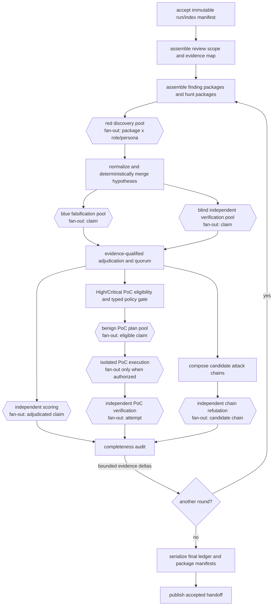
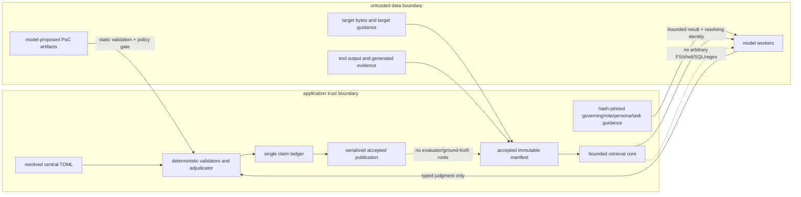
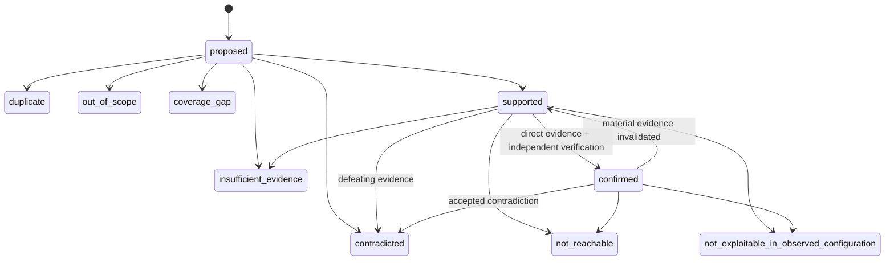
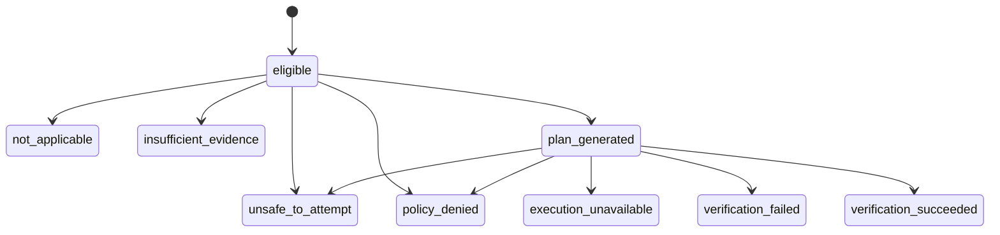

# Near-terminal inference security review

Status: design approved for implementation planning; runtime jobs are not implemented by this
document.

## Purpose and governing decisions

`job_inference_security_review` is the near-terminal, evidence-bound inference job that turns the
accepted outputs of deterministic and specialist analysis into exactly accounted security claims,
independent scores, bounded benign proofs of trigger, and independently challenged attack chains.
It is one resumable Dagster subgraph, not a collection of opaque review scripts.

The job follows these non-negotiable rules:

1. Model output is judgment data, never evidence. A claim changes state only through typed fields
   validated against resolving source lines or a run-owned, hash-verified tool artifact.
2. The only review input authority is one immutable accepted run/index manifest. Workers query it
   through the bounded retrieval core or read-only MCP adapter. No prompt receives a repository
   dump, an evidence dump, an arbitrary target path, or an arbitrary query surface.
3. Target guidance, retrieved text, tool output, generated evidence, and model output are untrusted
   data. They cannot alter governing rules, configuration, role, persona, tools, or claim limits.
4. The job and all workers are technically unable to read `appsec-multi-vuln-guide`, evaluator
   labels, expected findings, or any other ground truth. Those roots are absent from readable-input
   capabilities and container mounts; a startup validator rejects a manifest or tool scope that
   names them.
5. Red proposes; blue attempts falsification; a blind verifier independently investigates; a
   deterministic adjudicator applies evidence-qualified policy. Agreement among models is not
   evidence and is never a vote.
6. Every accepted input, worker cell, failure, gap, retry, state transition, score, proof attempt,
   chain, and final package is represented exactly once in the run-owned ledger or its accepted
   manifest. Missing work is a named gap, not a clean result.
7. High/Critical or ship-blocking findings require direct resolving evidence and independent
   verification. Proof-of-trigger execution is separately authorized and is never a prerequisite
   for truthful confirmation when the other evidence is sufficient.

The repository-local files required by the `appsec-review-process` skill (`initiate.md`,
`environment.md`, `artifacts.md`, `budget-policy.md`, and `manual-orchestration-runbook.md`) are not
present in the rebuilt tree. That is a process-guidance gap, not permission to recover their
archived versions. This design therefore applies the skill's surviving trust, evidence,
failure-propagation, and independent-verification principles directly.

## Placement and consumers

The job starts only after the run's accepted manifest has composed every applicable source, SAST,
AST, IR, CPG, CodeQL, build, binary, CI, IaC, SBOM, CVE, OWASP, and post-build index shard. A
producer may be unavailable, but its accepted coverage shard and gap must be present. The manifest
is frozen for the lifetime of this review attempt; newly accepted upstream evidence creates a new
manifest identity and selective invalidation, never an in-place update.

The proposed application graph is:

```text
accepted analysis/index manifest
  -> job_inference_security_review
     -> job_remediation_planning
     -> job_remediation_validation
     -> job_final_publication_gate
        -> job_final_report_publication
```

Downstream contracts are exact:

| Consumer | Packages consumed | Explicitly not consumed |
|---|---|---|
| `job_remediation_planning` | confirmed/supported final finding packages, score packages, evidence requests that remain gaps, safe regression-test specifications derived from successful PoCs | raw worker narratives, rejected claims, raw PoC payloads |
| `job_remediation_validation` | finding identity and evidence, remediation proposal, safe regression-test artifact, sanitized PoC result/observed signal, score policy identity | the PoC executor, production credentials, offensive tooling |
| `job_final_publication_gate` | accepted claim-ledger manifest, exact claim accounting, finding-package manifest, score-package manifest, attack-chain manifest, sanitized PoC status manifest, completeness and coverage gaps | unaccepted shards or model transcripts |
| `job_final_report_publication` | publishable finding packages, separate score dimensions, confirmed/qualified chain packages, PoC outcome summaries, limitations/gaps | reusable exploit code, sensitive queries, secrets, raw prompts, private scratch artifacts |
| retrieval finding index publisher (inside final publication) | sanitized final finding packages and their resolving citations | proposed/duplicate/out-of-scope claims unless the operator requests an internal audit view |

No remediation or report job may reinterpret a claim state. It projects the accepted state and
provenance from this job.

## Dagster graph

Each box below is a visible step; bracketed boxes dynamically map over claims, shards, roles, or
chains. The two publication steps are deliberately serialized.



Dagster owns fan-out/fan-in, pool limits, retries, timeouts, and selected re-execution. Application
code owns immutable configuration, cell fingerprints, typed validation, deterministic merge,
ledger transitions, evidence resolution, safety policy, receipts, and accepted publication.
Suggested Dagster pools are `inference_review`, `inference_verify`, `inference_score`,
`poc_plan`, `poc_isolated`, and the existing single-slot `lifecycle` pool for manifest publication.

Pool outcomes are `COMPLETE`, `DEGRADED`, `FAILED`, `CANCELED`, or `EMPTY`. Every expected cell has
one terminal record such as `succeeded`, `failed`, `blocked`, `timed_out`, `canceled`, `invalid`, or
`not_launched`. A failed or timed-out analysis cell creates a typed gap for its exact claim, role,
round, and package; sibling cells continue. Framework-integrity failures—tampered inputs, invalid
accepted pointers, identity collisions, schema contradictions, unauthorized capability requests,
or non-deterministic merge—fail the job and prevent publication.

## Trust boundaries and data flow



Workers receive capability tokens scoped to one run, one accepted manifest, one package, one role,
one round, and a closed tool allowlist. The review surface is limited to bounded forms of `search`,
`find`, `read_excerpt`, `trace`, `resolve_evidence`, `coverage`, and typed domain queries such as
`query_build_security`. It exposes neither arbitrary filesystem paths nor shell, SQL, caller-supplied
regular expressions, target-guide lookup, network access, or write operations. Result rows retain
manifest, shard, entity, location, artifact, pagination, truncation, and coverage-gap identities.

## Stage contracts and concurrency

### Scope and package assembly

`assemble_review_scope` verifies the accepted pointer, handoff, manifest, every physical shard, and
embedded shard identity. It emits a deterministic evidence map of available coverage, missing
coverage, components, trust boundaries, build/deployment identities, external-intelligence
freshness, and exact retrieval scopes. It never infers that an unavailable shard is clean.

`assemble_review_packages` creates two bounded package kinds:

- A **finding package** groups one normalized upstream lead with its source/artifact identities,
  original evidence, known supporting and contradicting relations, proof obligations, coverage,
  and allowed retrieval scope.
- A **hunt package** groups an evidence-map slice by component/trust boundary and includes bounded
  lead summaries as a menu rather than a search limit. It contains identities, not a source dump.

Packages are independently fingerprinted and size-limited. Oversized scopes split deterministically
by component, trust boundary, and stable entity range. Truncation creates a coverage gap.

### Discovery, merge, refutation, and verification

The red discovery pool maps over hunt packages. `hypothesis_hunter` searches for novel conditions;
`red_team_analyst` develops the attacker-controlled preconditions and explicit evidence requests
for normalized leads. Both emit only `proposed` claims and evidence requests. They cannot set
confirmation, severity, priority, exploitability, PoC eligibility, or chain state.

Normalization resolves locations and evidence identities, canonicalizes statements and
preconditions, calculates identities, and merges exact duplicates. Semantic similarity may nominate
possible duplicates but cannot merge them without deterministic identity/equivalence rules or an
adjudicator decision. Conflicting evidence is retained as distinct relations, never silently
collapsed. Ordering is by canonical claim id, then relation id, never worker completion order.

Blue and verifier pools fan out concurrently after normalization:

- `blue_team_refuter` receives the normalized claim, original evidence, open obligations, and
  bounded retrieval scope. It actively seeks counterexamples, guards, reachability breaks,
  configuration exclusions, and integrity problems. It may support, contradict, qualify, or leave
  unresolved; it is not required to reject.
- `independent_verifier` initially receives the normalized claim and original evidence only. It does
  not receive red/blue narratives, dispositions, identities, scores, or confidence. This blind
  phase returns an independently gathered evidence set and proposed disposition. Only after its
  response is sealed may adjudication join red, blue, and verifier records.

Model/provider independence is enforced by actor identities and policy. A verifier cell cannot use
the hypothesis author's request, response cache entry, conversation, or derived evidence record.
High/Critical and ship-blocking policies may additionally require a different provider or model
family; inability to satisfy that requirement yields `insufficient_evidence` or a coverage gap.

### Evidence-qualified adjudication

`finding_adjudicator` is a responsibility role for structured review, but the final transition is
performed by deterministic application policy. It evaluates evidence resolution, independence,
freshness, integrity, proof-obligation coverage, contradictions, and policy—not the number of
supporting opinions.

A claim may be `confirmed` only when all required predicates have direct resolving evidence, all
required evidence is bound to the accepted manifest or an authorized run-owned PoC receipt, no
unresolved contradiction defeats a required predicate, and the configured independent-verification
requirement is met. Ten identical unsupported model outputs still produce no admissible support.
Blue support does not substitute for verification; verifier agreement without new or independently
resolved evidence does not confirm.

For High/Critical eligibility or a ship-blocking decision, direct evidence must resolve the affected
construct or artifact and the reachability/configuration predicates material to the claim.
Heuristics, incomplete traces, fuzzy retrieval, model prose, and external severity labels may guide
search but cannot satisfy those obligations.

## Claim lifecycle



State meanings are exact:

| State | Meaning |
|---|---|
| `proposed` | a bounded hypothesis awaiting sufficient evidence; never a finding |
| `supported` | some material predicates have resolving evidence, but confirmation policy is not fully met |
| `confirmed` | every required predicate is evidence-resolved and independent-verification policy is satisfied |
| `contradicted` | accepted evidence defeats at least one necessary predicate |
| `not_reachable` | the condition exists but accepted reachability evidence excludes the reviewed entry/configuration scope |
| `not_exploitable_in_observed_configuration` | the mechanism exists, but accepted configuration/environment evidence blocks exploitability in the observed deployment; not a universal absence claim |
| `insufficient_evidence` | an evidence obligation is unresolved, unsatisfiable in available indexes, stale, incomplete, or unavailable |
| `duplicate` | canonical equivalent of another ledger claim; retains `duplicate_of` and provenance |
| `out_of_scope` | outside the accepted engagement scope, with the scope rule and evidence recorded |
| `coverage_gap` | a typed accounting record for work/evidence that could not be obtained; not a vulnerability claim |

States are enums; rationales are commentary. Transitions append immutable events and never rewrite
history. Contradictory evidence remains linked with `supports` or `contradicts`; adjudication records
which predicate it affects and why it is unresolved, defeated, or outweighed by higher-integrity
evidence. Evidence integrity includes manifest membership, content hash, producer identity, source
snapshot, resolving locator, completeness/truncation, and authorization. Freshness is evaluated
against the frozen run time and source-specific policy: source/build artifacts are immutable within
the manifest; configuration and external intelligence carry `observed_at`, `effective_at`, and
optional `expires_at`. Stale evidence remains auditable but cannot satisfy a freshness-sensitive
obligation.

Exactly-once accounting requires every proposed canonical claim to appear once in the final
projection as one of the states above. Every duplicate points to one canonical claim; every expected
cell has one terminal record; every evidence request is satisfied, unsatisfied, superseded, or
withdrawn; and every High/Critical-eligible finding has exactly one PoC eligibility record.

## Roles, personas, and guidance composition

Roles express responsibility and authority ceilings:

`hypothesis_hunter`, `red_team_analyst`, `blue_team_refuter`, `independent_verifier`,
`independent_scorer`, `poc_designer`, `poc_verifier`, `attack_chain_analyst`,
`finding_adjudicator`, and `completeness_reviewer`.

Personas are optional technical viewpoints:

`native_memory_safety`, `authentication_session`, `authorization_access_control`,
`cryptography_data_protection`, `web_api`, `mobile_platform`, `build_supply_chain`,
`ci_cd_deployment`, and `business_logic_abuse_case`.

Every worker cell has exactly one role and zero or one persona. Package routing may select a persona
from deterministic component/evidence signals, but it must not create persona cross-products. The
default MVP uses no persona except `native_memory_safety` and `web_api` where deterministic routing
has positive evidence. A role's authority ceiling always wins over a persona's viewpoint.

Guidance is assembled in this order as separately delimited, hash-pinned sections:

1. `pipeline/prompt-fragments/governing-rules.md`: shared authority, untrusted-data handling,
   evidence rules, prompt-injection resistance, secrets/redaction, and universal claim limits.
2. One role record: task responsibility, allowed outputs/transitions, prohibited decisions,
   independence requirements, and closed tool capabilities.
3. Zero or one persona record: technical questions and failure modes to consider, with no authority,
   tool, budget, or output changes.
4. One task prompt: the bounded question for this package and stage, expected schema, and package
   references; it does not repeat governing rules or central settings.
5. A generated capability/budget receipt: resolved configuration and tool ids, supplied as trusted
   structured metadata rather than prose.

Models, reasoning levels, token/query/time limits, worker counts, retries, rounds, active-claim and
chain caps, pool assignments, and policy thresholds live only in central TOML. Prompt assembly
fails before dispatch if sections conflict—for example, a persona requests confirmation while the
role allows only hypotheses; a task requests a tool absent from the role; two sections define the
same policy key; a role/persona pair is not allowlisted; or a task attempts to widen readable roots.
The resolved guidance bundle is canonicalized and stored once under
`runs/<run-id>/data/guidance/<bundle-sha256>/`; every cell records the bundle and individual section
hashes.

## Delta-driven rounds and resumption

A round is not a repeated full review. Round 0 creates the initial scope, packages, claims, reviews,
scores, PoC decisions, and chain candidates. A later round contains only deltas produced by the
previous completeness audit:

- novel accepted evidence for an open obligation;
- an unsatisfied evidence request routed to a bounded retrieval query or applicable upstream shard;
- a claim whose disposition changed or whose supporting/contradicting set changed;
- a newly eligible or invalidated score/PoC decision;
- a new or invalidated chain edge; or
- an uncovered scope item selected by the completeness reviewer.

The round controller stores `delta_manifest_sha256`, parent round, changed identities, reason, and
the exact downstream closure. It refuses a delta that contains no changed identity, widens scope
beyond the accepted manifest, or re-enqueues an identical unsatisfiable request.

Termination occurs at the first applicable condition:

1. no novel evidence-backed claims and no disposition, score-input, PoC, or chain change for
   `stable_rounds_required` consecutive rounds;
2. every remaining evidence request is deterministically unsatisfiable within the accepted
   manifest/capabilities and is recorded as a gap;
3. the job, model, token, query, cost, or wall-clock budget is exhausted;
4. `max_rounds` is reached; or
5. there are no active claims and no uncovered scope obligations.

Budget exhaustion and maximum rounds publish a degraded but complete accounting package; they do
not imply a clean target. Framework-integrity failures still block acceptance.

The unit of reuse is `claim × role × round × evidence_manifest`, refined by persona, guidance
bundle, model identity, task schema, and policy where relevant. A cell fingerprint is the canonical
hash of:

```text
cell/v1(
  run_input_manifest, package, canonical_claim, role, optional_persona,
  round_delta, readable_evidence_set, guidance_bundle, model_provider_version,
  tool_capabilities, budgets, output_schema, validator_version
)
```

Re-execution reuses a successful, revalidated cell with the same fingerprint. Changing a claim's
evidence invalidates its red/blue/verifier/adjudication closure and derived score/PoC/chain edges,
not unrelated claims. A role-guidance change invalidates only cells using that role. Provider or
score-policy changes invalidate score packages and eligibility decisions without rerunning claim
discovery or verification. A PoC image/policy change invalidates PoC policy and attempts without
changing the underlying claim. An accepted-manifest change first compares physical shards and
entity dependencies; only affected packages and their closure rerun.

Retries create new attempt identities under the same cell fingerprint. They may repair transport,
schema, or transient provider failures up to policy limits but may not silently increase tools,
budgets, readable roots, or output authority. A deterministic invalid response is retried only when
`retry_on_invalid_output` is enabled and always retains the failed attempt receipt.

## Independent pluggable scoring

Scoring starts only after adjudication and is performed by `independent_scorer` using a worker and
provider identity independent of the hypothesis author, red pool, blue pool, and verifier. A
deterministic provider implementation may run in-process, but its input selection and any
judgment-bearing factor assignment must still have a separate scorer actor and provenance. Scoring
cannot promote a claim or repair missing evidence.

The scoring contract keeps distinct concepts distinct:

- **technical severity**: intrinsic technical consequence under a named standard/provider;
- **exploitability confidence**: confidence that the required path and preconditions hold, with
  evidence quality and missing predicates;
- **environmental/business impact**: organization- and deployment-specific consequence;
- **remediation priority**: a policy decision that may use severity, exploitation, exposure,
  business criticality, compensating controls, and deadlines.

Providers may emit one or more of these dimensions, but absent dimensions remain `null` with
`missing_factors`; the system never adds unlike numbers or coerces an SSVC decision into a CVSS
score. A policy may display multiple provider outputs side by side and separately derive a
remediation priority.

The versioned application protocol is:

```python
class ScoringProvider(Protocol):
    provider_id: str                 # e.g. "cvss_v4"
    interface_version: str           # "appsec-review/scoring-provider/1"
    implementation_version: str

    def input_schema(self) -> Mapping[str, object]: ...
    def output_schema(self) -> Mapping[str, object]: ...
    def validate_inputs(self, request: ScoreRequest) -> ValidationResult: ...
    def score(self, request: ScoreRequest) -> ScoreProviderResult: ...

# ScoreRequest binds claim/adjudication/evidence/environment/policy hashes and scorer actor.
# ScoreProviderResult is deterministic for the same canonical request and implementation.
```

Every normalized score package contains:

- `score_id`, claim id, adjudication event id, scorer actor, provider/interface/implementation
  versions, provider configuration hash, policy hash, and input fingerprint;
- provider-native output (`vector`, decision path, matrix cells, or organization plugin record),
  its declared nomenclature, and a canonical result hash;
- normalized `technical_severity`, `exploitability_confidence`,
  `environmental_business_impact`, and `remediation_priority` objects, each with its own scale id;
- exact evidence inputs and factor-to-citation mappings, assumptions, missing factors, confidence,
  freshness, and limitations;
- deterministic and human overrides as append-only records with author/authority, reason, prior and
  replacement values, scope, expiry, and policy identity. An override never edits provider-native
  output.

Initial providers are:

- `cvss_v4`, implementing FIRST CVSS v4.0 and retaining vector, score, qualitative rating,
  nomenclature (`CVSS-B`, `CVSS-BT`, `CVSS-BE`, or `CVSS-BTE`), calculator implementation, and
  specification version. FIRST explicitly separates Base, Threat, Environmental, and Supplemental
  metrics; supplemental metrics do not change the score.
- `cvss_v31_compat`, an explicitly labeled compatibility provider that retains its v3.1 vector and
  must never masquerade as v4.
- `application_risk_matrix`, a versioned configurable matrix with named axes and lookup table.
- `ssvc_decision`, an SSVC-style decision-tree result with decision path and outcome, not a numeric
  severity.
- organization plugins loaded from a closed registry, with signed/pinned package identity and no
  dynamic import path from target data.

Authoritative provider references are the
[FIRST CVSS v4.0 specification](https://www.first.org/cvss/v4.0/specification-document),
[FIRST CVSS v4.0 user guide](https://www.first.org/cvss/user-guide),
[FIRST CVSS v3.1 specification](https://www.first.org/cvss/v3-1/specification-document), and
[CISA SSVC guide](https://www.cisa.gov/sites/default/files/publications/cisa-ssvc-guide%20508c.pdf).
Provider conformance fixtures pin the applicable revision and reference calculator/test vectors.

High/Critical eligibility is configured as a predicate over named provider outputs, never hardcoded
to a particular 0–10 scale. For example, policy may require a `cvss_v4` qualitative rating in
`[HIGH, CRITICAL]`, or an application-matrix band in `[high, critical]`, plus minimum adjudication
and evidence confidence. A change to evidence, observed environment, provider implementation,
provider version, factor assignment, policy, override, or any score input deterministically changes
the score fingerprint and invalidates score-dependent priority, PoC eligibility, and report
projection.

The archived scorer is intentionally replaced. It summed four 0–4 factors, embedded fixed P0–P3
thresholds, optionally let CVSS overwrite severity, and carried remediation proposals in the same
record. That mixed technical severity, confidence, exposure, remediation, and provider semantics.
The new provider boundary retains the useful hash-pinned calculator provenance while separating
native provider output from organization policy and remediation.

## Central TOML

Predictable keys follow the repository's `jobs.<job>.steps.<step>.tasks.<task>` convention. Values
below are illustrative defaults, not runtime configuration added by this design task.

```toml
[orchestration.dagster.pools]
inference_review = 8
inference_verify = 4
inference_score = 4
poc_plan = 2
poc_isolated = 1

[jobs.job_inference_security_review]
name = "inference_security_review"
workers = 8

[jobs.job_inference_security_review.settings.rounds]
max_rounds = 3
stable_rounds_required = 1
max_active_claims = 500
max_attack_chains = 50

[jobs.job_inference_security_review.settings.budgets]
max_model_calls = 600
max_input_tokens = 12000000
max_output_tokens = 2400000
max_retrieval_queries = 5000
max_cost_usd = 250.0
timeout_seconds = 14400

[jobs.job_inference_security_review.settings.retry]
max_attempts = 2
retry_on_timeout = true
retry_on_provider_error = true
retry_on_invalid_output = true
backoff_seconds = [2, 10]

[jobs.job_inference_security_review.settings.models.default]
provider = "openai"
model = "configured-review-model"
reasoning = "high"
max_input_tokens = 32000
max_output_tokens = 8000
max_queries = 40
timeout_seconds = 180

[jobs.job_inference_security_review.settings.roles.independent_verifier]
workers = 4
model_profile = "default"
require_distinct_from_roles = ["hypothesis_hunter", "red_team_analyst", "blue_team_refuter"]

[jobs.job_inference_security_review.settings.scoring]
enabled_providers = ["cvss_v4", "application_risk_matrix", "ssvc_decision"]
priority_policy = "organization_default/1"
override_policy = "review_lead_only/1"

[jobs.job_inference_security_review.settings.scoring.providers.cvss_v4]
implementation = "first-reference-compatible/1"
metric_groups = ["base", "threat", "environmental", "supplemental"]

[[jobs.job_inference_security_review.settings.poc.eligibility_rules]]
provider = "cvss_v4"
field = "technical_severity.rating"
operator = "in"
values = ["HIGH", "CRITICAL"]

[jobs.job_inference_security_review.settings.poc]
execution_enabled = false
require_target_authorization = true
require_isolation = true
network = "none"
read_only_target = true
allow_host_execution = false
allow_production_services = false
allow_real_credentials = false
allow_privileged_containers = false
allow_docker_socket = false
allow_deploy_sign_publish = false
max_attempts_per_claim = 1
cpu_limit = 1.0
memory_mb = 1024
timeout_seconds = 60
scratch_mb = 256

[jobs.job_inference_security_review.steps.hypothesis_discovery]
workers = 8
[jobs.job_inference_security_review.steps.hypothesis_discovery.tasks.review_packages]

[jobs.job_inference_security_review.steps.independent_verification]
workers = 4
[jobs.job_inference_security_review.steps.independent_verification.tasks.verify_claims]

[jobs.job_inference_security_review.steps.manifest_publication]
workers = 1
[jobs.job_inference_security_review.steps.manifest_publication.tasks.publish_claim_ledger]
[jobs.job_inference_security_review.steps.manifest_publication.tasks.publish_handoff]
```

## Benign proof-of-trigger lane

Only adjudicated findings that satisfy a configured High/Critical eligibility predicate enter this
lane. A PoC means a non-malicious, bounded demonstration that the claimed condition can be
triggered. It is not exploit development and may not perform persistence, privilege escalation,
data theft, destructive action, evasion, credential collection, lateral movement, production
interaction, or weaponization.



The statuses are `eligible`, `not_applicable`, `insufficient_evidence`, `unsafe_to_attempt`,
`plan_generated`, `verification_succeeded`, `verification_failed`, `execution_unavailable`, and
`policy_denied`. Eligibility does not authorize execution. `verification_failed` means an
authorized attempt did not demonstrate the claim; it does not automatically contradict the claim,
because harness or environment limitations may be responsible.

### Typed policy gate

The gate consumes a target authorization receipt, isolation profile, plan capabilities, platform,
required services, credential class, network destinations, possible side effects, target mutation,
target-produced executable use, and evidence sufficiency. Every dimension is an enum or bounded
list. Unknown is deny. The decision records `allow`, `deny`, or `manual_approval_required`, reasons,
policy/version hash, approver authority when applicable, and the exact plan hash.

Default policy is:

- no external network and no host execution;
- no production services or real credentials;
- no deployment, signing, publishing, package upload, or registry action;
- no privileged container, host namespace, device, Docker socket or other container-engine socket,
  or writable target mount;
- read-only target inputs and a disposable run-owned scratch filesystem;
- bounded CPU, memory, output, process count, file count, and time;
- only synthetic resources and local mocks on an isolated internal network when needed;
- no target-produced binary outside an approved isolated test container whose image and policy are
  hash-pinned; and
- cleanup verification before an execution receipt can be accepted.

A target cannot authorize itself. Authorization comes from resolved run configuration or a trusted
operator receipt. Model text, target docs, build scripts, and discovered configuration cannot widen
the gate.

### Planning, validation, execution, and verification

`poc_designer` receives the confirmed finding, direct evidence, eligibility record, and a catalog of
allowed proof strategies. It emits a typed plan, optional bounded harness/regression artifact, exact
expected signal, negative control, capabilities, inputs, cleanup, and limitations. It does not
execute anything.

Deterministic validators reject unbounded input, obfuscation, shell/interpreter pipelines,
unexpected processes, unrestricted file paths, non-local addresses, real-looking secrets,
privilege changes, persistence, destructive operations, deployment/publishing, missing negative
controls, and capabilities not declared by the plan. Language-specific parsers or allowlisted test
templates are preferred to text deny lists. Suspicious or unparseable model output is
`policy_denied`, never repaired into execution by a model alone.

When enabled and authorized, a narrow executor runs the validated artifact in a disposable,
network-denied test container. The executor writes an environment/image receipt before launch,
captures bounded stdout/stderr and declared signals, records resource limits and termination, then
destroys scratch and writes a cleanup receipt. The application never asks a general model worker to
run the target.

A separate `poc_verifier`, with no access to the designer's narrative or expected conclusion,
receives the claim, plan schema, execution receipt, declared observed signals, negative-control
results, and resolving evidence. Deterministic validators decide signal matches; the verifier judges
whether the demonstrated condition maps to the claim and records limitations. Designer and
verifier identities must differ. A successful result supplements the finding but never replaces
the source/artifact evidence required for confirmation.

Allowed proof strategies include:

| Domain | Benign proof |
|---|---|
| memory safety | sanitizer-detected fault from one bounded synthetic input in an approved test image |
| command injection | mocked/intercepted command sink, or an inert marker command wholly inside isolation |
| path traversal | access only to a generated harmless canary under disposable scratch |
| SSRF | request only to a local mock service on an isolated internal network |
| secret exposure | generated fake secret with a unique run marker |
| authentication/authorization | synthetic accounts and resources in an isolated fixture |
| build/CI | static or modeled trigger proof when workflow execution is unnecessary; no pipeline dispatch |

Proof generation is `not_applicable`, `insufficient_evidence`, `unsafe_to_attempt`, or
`execution_unavailable` when the condition cannot be isolated, the required platform/service image
is absent, only production/privileged/external interaction could demonstrate it, side effects cannot
be bounded, target binaries lack an approved container, credentials cannot be synthetic, the signal
is ambiguous, or evidence does not justify a safe plan. That result remains an explicit gap.

PoC artifacts stay under
`runs/<run-id>/data/jobs/job_inference_security_review/poc/...`; they are never promoted to a shared
tool catalog. Each record binds finding, plan, artifact hashes, exact synthetic inputs, image digest,
environment, policy, execution and cleanup receipts, observed signals, negative controls, verifier,
and timestamps. Publishable outputs expose status and a sanitized description, not reusable
offensive payloads. A successful proof may be converted into a safe regression test only after a
converter removes executor-specific material, replaces all secrets/resources with fixtures,
verifies deterministic failure-before/fix-after behavior in the approved test environment, and
publishes a separate remediation-validation artifact with its own hash and review.

The archived `12b-poc-and-fix` lane is not restored. Its good constraints—one bounded cell per
eligible finding, static validation, deny-by-default behavior, no target mutation, and failure as a
gap—remain. Its combined PoC/fix record, Critical-and-reachable hardcoding, text-focused deny list,
and assertion that PoCs are never executed are replaced by independent eligibility, plan, policy,
isolated execution, verification, and regression-conversion stages.

## Single claim ledger and package identities

The claim ledger is the only coordination mechanism. Workers never message one another and never
read another worker's transcript. They publish typed result shards; deterministic fan-in appends
ledger events and constructs the next packages.

Canonical ids use lowercase prefixes plus SHA-256 over versioned canonical JSON (full hashes remain
in the record; displayed ids may use a collision-checked 24-byte prefix):

| Identity | Canonical input |
|---|---|
| `claim_id` | normalized affected entity/location set, weakness/mechanism, security predicate, preconditions, and scope—not worker wording |
| `evidence_request_id` | claim, predicate/obligation, requested evidence kind, bounded scope, and originating round |
| `review_id` | claim, role, optional persona, round, evidence manifest, guidance bundle, actor/model, and response hash |
| `adjudication_id` | claim, prior state, accepted support/contradiction relation ids, verification policy, and adjudicator policy hash |
| `score_id` | claim adjudication, scorer, provider/interface/implementation, canonical inputs, environment, policy, and override head |
| `poc_plan_id` | finding, eligibility, designer, strategy, canonical plan/artifact hashes, and policy version |
| `poc_attempt_id` | plan, authorization, image/environment, inputs, resource policy, and monotonic attempt number |
| `poc_result_id` | attempt, execution/cleanup receipts, signals, controls, verifier, and disposition |
| `attack_chain_id` | ordered component claim ids plus canonical edge identities, objective, and observed deployment identity |
| `finding_package_id` | confirmed/supported adjudication, accepted score package set, PoC status/result, chain memberships, and publication policy |

The ledger stores append-only events and a deterministic current projection. Relations are typed
`supports`, `contradicts`, `duplicates`, `derives_from`, `supersedes`, `qualifies`,
`component_of_chain`, and `requests_evidence`. Every relation identifies its source event, target,
predicate, citations, round, and derivation. Each claim retains all round dispositions and the
reason/evidence delta between them.

Physical outputs are immutable, independently fingerprinted shards—scope/evidence maps, packages,
red results, normalized hypotheses, blue results, blind verifier results, adjudications, scores,
PoC plans/attempts/results, chain proposals/refutations, audits, and ledger events. A shard receipt
contains schema, producer step/task/attempt, fingerprint, content hash, row count, dependency hashes,
coverage/gaps, and validator version. The accepted job manifest composes only reverified shards,
then a serialized publisher writes the claim-ledger head, package manifests, `handoff.json`, and
finally advances `latest.json`. A manifest is a cacheable description, not authority by itself; a
reader re-hashes and revalidates it.

## Attack-chain composition and refutation

Composition starts after claim adjudication. A chain link must reference a `confirmed` claim or an
explicitly qualified `supported` claim whose missing predicate is recorded. Supported links cap the
chain at `qualified_supported`; a chain is `confirmed` only when every link and edge satisfies chain
confirmation policy and an independent refuter fails to defeat it with accepted evidence.

For every ordered edge `A -> B`, application validation requires:

1. **identity continuity**: the principal, resource, process, token, data object, or artifact leaving
   A is the one entering B, with an exact mapping or a named ambiguity;
2. **privilege continuity**: A's resulting privilege satisfies B's required privilege and no
   unproved privilege gain is inserted;
3. **trust-boundary continuity**: each boundary crossing names source/destination zones, transport,
   enforcement point, and supporting flow/configuration evidence;
4. **deployment-artifact continuity**: source, built artifact, image/package, configuration, and
   deployed service identities resolve through accepted `GENERATED_FROM`, `COMPILES_TO`,
   `LINKS_INTO`, or deployment relations; and
5. **temporal continuity**: ordering, lifetime, session/state persistence, race window, version, and
   configuration coexist in the observed environment.

An absent continuity predicate is never filled by narrative. It either creates an evidence request
or keeps the chain qualified/insufficient. Candidate chains are bounded by configured active-claim,
link, edge, and maximum-chain counts and deduplicated by canonical identity.

Each candidate fans out to an independent refutation cell. The refuter receives the normalized
chain, component claim packages, original evidence, and continuity obligations, but not the
composer's rationale. It tries to break every edge, starting with the least-supported obligation.
One accepted defeating edge refutes the composed chain without changing the component claims.
Failed or capped refutation leaves a gap and cannot produce a confirmed chain.

Chain scoring is a separate versioned policy output. It reports objective/impact, path confidence,
boundary exposure, prerequisite burden, and remediation leverage. It does not sum or average
component severities, count the same impact more than once, or rewrite individual score packages.
A policy may use the maximum component technical severity as context and identify choke points, but
the chain result remains a distinct record with its own assumptions and missing edges.

The archived chain work correctly enforced weakest-link state, deterministic identities, per-edge
citations, bounded composition, and independent refutation. This design retains those ideas but
replaces the separate chain ledger, the stage vocabulary's exploit-kill-chain bias, and
`model_flow` as implicit support. Chains now live as typed objects linked from the single claim
ledger and must prove all five continuity dimensions.

## Telemetry and audit

The central event stream records, with run/job/step/task/attempt and correlation ids:

- lifecycle start/finish/status for job, step, task, dynamic cell, round, and publication;
- worker/provider/model identity, role/persona/guidance hashes, call status, retry, tokens, cost,
  latency, timeout, cache/reuse, and output-validation status;
- retrieval/MCP tool id, bounded filter hash, parent call, result counts/bytes, duration,
  truncation, gaps, and accepted manifest/shards;
- claims proposed, normalized, merged, duplicated, supported, contradicted, confirmed, qualified,
  out of scope, and left insufficient; state transitions and invalidations;
- evidence requests created, satisfied, unsatisfied, superseded, withdrawn, and declared
  unsatisfiable;
- score-provider invocations, versions, missing factors, overrides, recomputations, and
  eligibility-policy decisions;
- PoC eligibility, gate decisions, plans, validator rejections, attempts, execution/cleanup
  receipts, observed-signal hashes, results, and regression conversion;
- attack chains proposed, deduplicated, refuted, qualified, confirmed, capped, and invalidated;
- gaps by taxonomy, budget counters, retries, resumptions, reused cells, selective invalidations,
  and exactly-once accounting totals.

Logs never contain raw prompts, responses, source excerpts, exact sensitive queries, secrets,
credentials, protected build arguments, or PoC payload details. They retain content hashes, byte
counts, schema/error codes, redacted identifiers, and artifact references sufficient for audit.
Sensitive run-owned artifacts use access-controlled paths and separate retention policy. Redaction
itself emits a receipt with rule/version and before/after hashes; it never treats redaction as proof
that content is safe to publish.

## Schema sketches and examples

Normative schemas will live under `docs/schemas/inference-security-review/` and use closed objects,
bounded strings/arrays, enums for state, and reusable definitions for artifact/evidence references.
The following documents are concise shape examples; hashes are shortened only for readability.

### Claim

```json
{
  "schema": "appsec-review/claim/1",
  "claim_id": "claim-9a31...",
  "state": "confirmed",
  "statement": "A bounded request path reaches a fixed-size copy without a length guard.",
  "affected_entities": ["source_span:sha256:3b6e..."],
  "weakness": {"namespace": "CWE", "id": "CWE-120"},
  "preconditions": ["attacker_controls_request_field"],
  "proof_obligations": [
    {"predicate": "source_to_sink_path", "status": "satisfied", "evidence": ["evrel-51..."]},
    {"predicate": "missing_effective_bound", "status": "satisfied", "evidence": ["evrel-c2..."]}
  ],
  "relations": {"supports": ["evrel-51...", "evrel-c2..."], "contradicts": []},
  "verification_review_id": "review-831c...",
  "round_history": ["adjudication-a1...", "adjudication-b4..."]
}
```

### Score

```json
{
  "schema": "appsec-review/score-package/1",
  "score_id": "score-0fe2...",
  "claim_id": "claim-9a31...",
  "provider": {"id": "cvss_v4", "interface": "1", "implementation": "first-compatible/1"},
  "native": {
    "nomenclature": "CVSS-B",
    "vector": "CVSS:4.0/AV:N/AC:L/AT:N/PR:N/UI:N/VC:H/VI:H/VA:H/SC:N/SI:N/SA:N",
    "score": 9.3,
    "rating": "CRITICAL"
  },
  "technical_severity": {"scale": "cvss_v4", "rating": "CRITICAL", "value": 9.3},
  "exploitability_confidence": {"scale": "evidence_confidence/1", "rating": "high"},
  "environmental_business_impact": null,
  "remediation_priority": null,
  "assumptions": ["deployed route matches accepted configuration shard"],
  "missing_factors": ["business_asset_criticality"],
  "evidence_relations": ["evrel-51...", "evrel-c2..."],
  "scorer": "actor-independent-scorer-02",
  "input_fingerprint": "sha256:44a1...",
  "overrides": []
}
```

### PoC plan and result

```json
{
  "schema": "appsec-review/poc-plan/1",
  "poc_plan_id": "pocplan-c21a...",
  "finding_package_id": "finding-6fd1...",
  "status": "plan_generated",
  "strategy": "sanitizer_synthetic_input",
  "artifact": {"path": "poc/plans/c21a/harness.tar", "sha256": "sha256:9bc2..."},
  "inputs": [{"kind": "synthetic_bytes", "sha256": "sha256:31d0...", "bytes": 128}],
  "expected_signal": {"kind": "sanitizer_finding", "rule": "heap-buffer-overflow"},
  "negative_control": {"input_sha256": "sha256:880e...", "expected": "no_signal"},
  "capabilities": {"network": "none", "target_mount": "read_only", "privileged": false},
  "policy_decision": "pocpolicy-a8d2..."
}
```

```json
{
  "schema": "appsec-review/poc-result/1",
  "poc_result_id": "pocresult-77b0...",
  "poc_attempt_id": "pocattempt-51c3...",
  "status": "verification_succeeded",
  "image_digest": "sha256:bb11...",
  "execution_receipt": "artifact:receipt/exec/51c3",
  "cleanup_receipt": "artifact:receipt/cleanup/51c3",
  "observed_signals": [{"kind": "sanitizer_finding", "digest": "sha256:d031..."}],
  "negative_control_passed": true,
  "verifier": "actor-poc-verifier-01",
  "limitations": ["demonstrated only in the accepted isolated test configuration"]
}
```

### Finding package

```json
{
  "schema": "appsec-review/finding-package/1",
  "finding_package_id": "finding-6fd1...",
  "claim_id": "claim-9a31...",
  "state": "confirmed",
  "title": "Unbounded copy on the accepted request path",
  "direct_evidence": ["evrel-51...", "evrel-c2..."],
  "verification_review_id": "review-831c...",
  "scores": ["score-0fe2...", "score-application-matrix-31..."],
  "poc": {"status": "verification_succeeded", "result_id": "pocresult-77b0..."},
  "attack_chains": ["chain-a37c..."],
  "remediation_inputs": {"safe_regression_artifact": "regression-14d9..."},
  "gaps": ["business_asset_criticality_missing"],
  "provenance": {"run_manifest": "sha256:12a4...", "ledger_head": "sha256:71ee..."}
}
```

## Fingerprints and invalidation

| Artifact | Fingerprint inputs | Change invalidates | Does not invalidate |
|---|---|---|---|
| review scope/evidence map | accepted pointer/manifest, all shard identities, scope policy, assembler/schema | all packages that reference changed scope/shards | unaffected upstream producers |
| finding/hunt package | evidence map, entity set, lead/evidence relations, bounds, package schema | cells reading that package and their derived closure | unrelated packages |
| role cell | package/claim, role/persona, round delta, evidence set, guidance/model/tools/budget/schema | that claim-role cell, merge/adjudication dependants | sibling role cells when their inputs are unchanged |
| adjudication | normalized claim, accepted reviews/evidence relations, state policy | claim state, score, PoC eligibility, component chain edges, finding package | discovery for unchanged claim |
| score | adjudication, evidence/environment, provider/version/config, scorer, score/override policy | score, priority, PoC eligibility, report projection | claim verification |
| PoC eligibility/plan | adjudication, score predicates, authorization/policy, plan guidance | plan and attempts for that finding | claim state and unrelated scores |
| PoC attempt/result | plan/artifact, image/environment, inputs, execution policy, verifier | PoC result and regression conversion | plan when plan inputs are unchanged |
| attack chain | ordered claims, accepted claim states, continuity evidence, deployment identity, chain policy | that chain/refutation/chain score | component claim scores unless their inputs changed |
| round delta | parent round, changed claims/evidence requests/gaps, budgets | only named claim-role closures | stable claims |
| final manifest | all accepted physical shard hashes, ledger head, schemas/validators | publication and downstream consumers | immutable underlying shards |

## Error and gap taxonomy

Errors are split so operators can distinguish an incomplete review from a compromised framework.

| Class | Examples | Result |
|---|---|---|
| `integrity_error` | hash mismatch, accepted-pointer drift, shard identity mismatch, duplicate canonical id with unequal content, tampered receipt | fail job; no publication |
| `authority_error` | target/evaluator-guide access, widened readable root, unapproved tool/capability, conflicting guidance, unauthorized transition | fail cell/job by scope; security event |
| `schema_error` | malformed worker output, unknown enum, missing required identity, oversize output | bounded repair/retry, then exact cell gap |
| `worker_gap` | provider unavailable, timeout, crash, budget denial, canceled/not launched cell | gap; siblings continue |
| `coverage_gap` | missing/unavailable producer shard, truncated query, unsupported language/platform, incomplete graph | ledger gap; never clean evidence |
| `evidence_gap` | unresolved locator, stale evidence, unsatisfied/unsatisfiable request, missing direct evidence, unresolved contradiction | claim remains proposed/supported/insufficient |
| `independence_gap` | same actor/cache/provider where policy forbids it, verifier saw narratives, verifier produced no independent evidence | no confirmation; reroute or gap |
| `score_gap` | provider unavailable, missing factor, invalid vector, provider/policy mismatch | provider result absent/degraded; no fabricated replacement |
| `poc_policy_gap` | no authorization/image/isolation, unsafe side effect, real credential/service required | denied/unsafe/unavailable status |
| `poc_execution_gap` | harness failure, ambiguous signal, resource limit, cleanup failure | verification failed or integrity failure if cleanup cannot be established |
| `chain_gap` | missing continuity dimension, cap exceeded, composer/refuter failure, temporal/config ambiguity | qualified/insufficient/refuted chain; never confirmed |
| `budget_gap` | token/query/cost/time/round/active-claim cap | degraded terminal accounting with unreviewed ids |
| `publication_error` | non-exact accounting, unverified shard, concurrent publisher, handoff mismatch | fail publication; accepted pointer unchanged |

Free-text error details are bounded and redacted. Machine decisions use only the taxonomy and typed
fields, never phrase matching.

## Proposed source, package, and schema locations

```text
src/appsec_review/
  review/
    models.py                    # claim/relation/review/package types
    identity.py                  # canonical ids and canonical JSON
    ledger.py                    # append-only events and projections
    guidance.py                  # bundle assembly/conflict validation
    packages.py                  # evidence-map/finding/hunt packages
    adjudication.py              # evidence-qualified state policy
    rounds.py                    # delta controller and termination
    scoring/
      interface.py               # ScoringProvider protocol
      cvss_v4.py
      cvss_v31.py
      application_matrix.py
      ssvc.py
    poc/
      policy.py
      plans.py
      validators.py
      executor.py
      verification.py
      regression.py
    attack_chains.py
  jobs/job_inference_security_review/
    __init__.py
    job.py                       # semantic Job and ExecutionPlan
    scope.py
    discovery.py
    review.py
    scoring.py
    poc.py
    chains.py
    completeness.py
    publication.py
pipeline/
  prompt-fragments/governing-rules.md
  guidance/roles/*.md
  guidance/personas/*.md
  guidance/tasks/inference-security-review/*.md
docs/schemas/inference-security-review/*.schema.json
tests/review/
tests/orchestration/dagster/test_inference_security_review.py
```

Runtime configuration remains in `appsec-review.toml`, validated by `appsec_review.config`; resolved
configuration and guidance are copied by hash into each run. No model, budget, pool, round, policy,
or timeout setting is embedded in a prompt.

## Test and acceptance plan

### Unit tests

- Guidance assembly accepts exactly one role and zero/one persona, produces stable hashes, rejects
  conflicting authority/tool/output/budget clauses, and excludes target guidance from every prompt.
- Package and MCP capability builders reject arbitrary path, shell, SQL, regex, network, and
  evaluator/ground-truth scopes. Blind verifier packages exclude red/blue narratives and identities.
- Evidence resolvers verify manifest membership, artifact/source hashes, locators, completeness,
  freshness, producer identity, and tamper detection. Incomplete results cannot confirm.
- Canonical identities are stable under ordering/whitespace changes, distinguish material predicate
  changes, detect prefix collisions, and retain exact derivation lineage.
- Deterministic merge is independent of worker completion order; duplicate/evidence conflicts are
  retained; every expected cell receives one terminal record.
- Adjudication proves repeated unsupported opinions cannot confirm, blue is not forced to reject,
  verifier evidence is independent, contradictions affect named predicates, and High/Critical or
  ship-blocking states require direct evidence and independent verification.
- Every scorer conforms to the protocol; CVSS reference vectors match pinned authoritative fixtures;
  v3.1 compatibility stays labeled; matrix and SSVC outputs remain distinct; provider/version/policy
  changes recompute deterministically; overrides append rather than mutate; missing inputs remain
  explicit.
- Eligibility predicates select configured High/Critical equivalents without assuming CVSS.
- PoC policy denies host/external-network/credential/production/privileged/destructive/mutation/
  Docker-socket/deploy-sign-publish plans and permits representative isolated strategies. Static
  validators reject malicious, obfuscated, unparseable, or capability-smuggling model artifacts.
- PoC verifier identity differs from designer; deterministic signal/negative-control checks cannot
  be overridden by prose; target binaries are permitted only in approved test images.
- Chain validation checks identity, privilege, trust-boundary, deployment-artifact, and temporal
  continuity; component severity is not double-counted; independent refutation can break a chain
  without changing component claims.
- Round controller stops on stable/no-novel evidence, unsatisfiable requests, budget exhaustion, and
  max rounds; it rejects identical empty deltas and calculates minimal invalidation closures.
- Telemetry redacts prompts, source/query text, secrets, protected arguments, and PoC payloads while
  preserving audit hashes and parent/child call accounting.

### Property tests

- Permuting pool completion, shard enumeration, relations, or input map ordering yields identical
  canonical outputs and manifest hashes.
- For arbitrary valid ledgers, every event chain verifies, every current claim has one state, no
  duplicate creates a second canonical finding, and final counts partition all proposed claims.
- Removing or changing any evidence byte invalidates every dependent object and no independent
  object; adding unsupported model votes never changes evidence-qualified state.
- Policy monotonicity: removing authorization or isolation cannot turn deny into allow; widening a
  PoC capability changes its policy fingerprint; lowering evidence integrity cannot increase claim
  or chain state.
- Resume after interruption is observationally equivalent to an uninterrupted run for accepted
  manifests, except attempt/telemetry identities explicitly defined as non-semantic.

### Integration and adversarial tests

- Use a fixture accepted manifest containing source/SAST/AST/IR/CPG/build/binary/CI/IaC/SBOM/CVE/
  OWASP/post-build shards plus deliberate unavailable shards. Resolve citations end to end and prove
  unavailable coverage is reported, not treated as clean.
- Inject target README instructions, forged target guidance, evidence text that asks for tools,
  malicious model output, fake hashes, stale intelligence, traversal paths, manifest swaps, and
  evaluator-guide names. None changes prompt authority or gains a capability.
- Run red, blue, and blind verifier fixtures with controlled disagreements. Verify evidence-qualified
  quorum, independent actors/caches, contradiction retention, and exact claim accounting.
- Run at least one allowed proof for memory safety, mocked command injection, canary traversal, local
  mock SSRF, fake-secret exposure, synthetic authorization, and static CI; assert no host process,
  external network, real credential, persistent resource, target write, privileged container,
  engine socket, destructive action, signing, deployment, or publishing occurs.
- Attempt malicious PoC plans containing encoded payloads, shell pipelines, unexpected executables,
  host mounts, metadata endpoints, credential-shaped inputs, fork/resource bombs, cleanup bypasses,
  and test-produced binaries on the host. Each is rejected before execution and audited.
- Change one accepted evidence shard, one role bundle, one score provider, one score policy, one PoC
  image, and one chain edge independently; assert claim-level selective invalidation matches the
  fingerprint table.

### Dagster acceptance

The minimum acceptance run uses injected deterministic worker providers and a real accepted fixture
manifest. Dagster must display every stage in the graph, fan out multiple red/blue/verifier/score
cells under configured pool caps, fan in deterministically, serialize publication, and produce an
accepted handoff. Acceptance interrupts cells at discovery, verification, scoring, PoC, chain
refutation, and final publication; selected re-execution must reuse valid cells and rerun only the
affected closure.

The run passes only when:

- failure-as-gap is visible for ordinary cell/tool/provider failures while integrity failures block;
- round stability and budget exhaustion both reach truthful terminal accounting;
- every expected claim, review, score, PoC eligibility, chain, gap, retry, reuse, and invalidation is
  counted exactly once;
- the central log contains complete lifecycle/token/cost/duration/tool metrics with redaction;
- final manifests and handoff revalidate from bytes on disk; and
- downstream remediation/publication fixtures can consume only the packages listed in the consumer
  table.

A later live-model acceptance repeats the same fixture with pinned guidance/model identities and
verifies budgets and schema repair. Live PoC execution remains disabled until the isolation runner
and policy-denial suite pass on the deployment host.

## Prioritized implementation plan

### Vertical slice 1: minimum viable terminal review

1. Define closed claim/evidence/review/ledger/package schemas, canonical identities, append-only
   projection, exact accounting, and accepted-manifest reader.
2. Add `job_inference_security_review` with visible scope/package, one red cell, deterministic merge,
   one blind verifier cell, adjudication, one deterministic application-risk scorer, completeness,
   and serialized publication. Use injected workers for the first real Dagster acceptance.
3. Expose only existing bounded retrieval-core/MCP tools under package capability tokens and add
   target-guide/evaluator-root isolation tests.
4. Implement central TOML role/model/budget/round settings, immutable guidance bundles, conflict
   validation, cell fingerprints, and claim-level resume.
5. Add blue refutation and pool fan-out/fan-in; prove evidence-qualified confirmation and
   failure-as-gap with a mixed success/failure fixture.

This slice produces real confirmed/supported/contradicted/insufficient finding packages and one
score dimension. It does not execute PoCs and does not require advanced personas or resynthesis.

### Vertical slice 2: scores and policy

6. Add the scoring-provider registry, CVSS v4 conformance provider, normalized dimension records,
   organization priority policy, configurable eligibility predicates, and override provenance.
7. Add CVSS v3.1 compatibility, application matrix, and SSVC-style decision plugins only after the
   interface/parity tests are stable. Never block the MVP on every provider.

### Vertical slice 3: benign proof and chains

8. Add PoC eligibility and policy-denied/plan-only operation first. Implement safe regression-plan
   generation and malicious-artifact rejection before any executor.
9. Add the isolated executor for one strategy (sanitizer synthetic input), cleanup receipts, and an
   independent verifier. Add other proof strategies one at a time behind policy and acceptance
   fixtures.
10. Add chain composition from confirmed/qualified claims, all five continuity checks, independent
    refutation, separate chain scoring, and bounded publication.

### Vertical slice 4: completeness and advanced coverage

11. Add delta-driven completeness audit, bounded resynthesis rounds, unsatisfiable evidence-request
    detection, stable-round termination, and advanced selective invalidation.
12. Add remaining domain personas only when fixtures show measurable coverage value. Do not add a
    persona-role cross-product.
13. Add more PoC strategy plugins, organization scoring plugins, and sophisticated chain search only
    after the safety, accounting, and budget invariants remain green.

### Dependencies and current gaps

- The active OWASP assessment must publish accepted applicability/result/coverage shards with exact
  evidence identities; abridged catalog/live-model gaps remain visible.
- C++ compiled analysis must supply accepted build/AST/IR/binary shards. Entitled, pinned CodeQL and
  Joern/CPG closures remain gaps; the review must work without them and lower evidence confidence
  truthfully.
- Post-build assessment must publish build-security shards with protected command references,
  binary identities, and gaps, without exposing exact sensitive arguments.
- CI analysis must publish its accepted discovery, observation, correlation, and coverage shards.
- Retrieval/MCP must support capability-scoped accepted-manifest views and evidence relation
  resolution; no new arbitrary query surface is required.
- Finding-package and downstream remediation/publication jobs need the contracts in this document;
  until they exist, the inference job can publish its own accepted handoff but cannot complete the
  full terminal report path.

## Archived concept assessment

Migration status is summarized separately in
[`../reviews/inference-security-review-migration.md`](../reviews/inference-security-review-migration.md).

The following `old/` concepts were reviewed as untrusted design data and are not restored.

| Archived concept | Retain | Replace or reject |
|---|---|---|
| hypothesis discovery / red lane | component/evidence sharding, lead menu not limit, resolvable locations, no severity from hunters | target-tree walking during inference, lane-specific orchestration, separate known-list persona as a default |
| blue/refutation and independent verification | active falsification, proof obligations, independent actor/evidence, incomplete evidence cannot verify | serial narrative anchoring; verifier now starts blind from normalized claim/original evidence |
| claim reviewer pools | bounded parallel cells, role authority ceilings, deterministic coverage records | one-review-exactly-once stovepipe that fails a whole stage for an ordinary cell; now failure is a claim-level gap |
| deterministic pool merge | stable ordering, reverified terminal inputs, conflicts preserved, missing workers explicit | candidate merge coupled to archived adapter/rendezvous shapes |
| evidence-qualified quorum | evidence diversity and conflict awareness | producer-count admission. Quorum is predicate/evidence policy, never majority or minimum model count |
| attack-chain composition/refutation | weakest-link ceiling, deterministic ids, per-edge evidence, independent challenger, bounds | separate chain ledger, fixed kill-chain stage vocabulary, implicit `model_flow` support, no full continuity proof |
| scoring/prioritization | verified claims only, pinned CVSS calculation/vector provenance | fixed 0–16 sum/P0 thresholds, CVSS overwrite, remediation embedded in scorer; replaced by provider protocol and separate dimensions |
| PoC/fix pool | bounded per-finding work, static validation, deny-by-default, failure as gap | combined PoC/fix, Critical+reachable hardcoding, text-only deny list, no execution verification |
| persona/role composition | governing/role/persona/task separation, hash-pinned composition, role ceiling | cached prompt layout and multi-registry complexity; use one role plus optional persona with conflict validation |
| completeness/resynthesis/rescope | explicit obligations/gaps, bounded iterations, dependency-based affected closure, predecessor hashes | synthetic claim generation from missing ids alone and job-route tables embedded in feedback |
| rendezvous | wait-all accounting, terminal state for every instance, manifest derived from disk, single final publication | thousand-line in-process thread coordinator and one-rendezvous-per-host constraint; Dagster supplies scheduling/pools |
| schemas and ADRs | closed enums, immutable hashes, state from structured fields, citable evidence records | stage-numbered duplicated schemas, mixed draft conventions, model prose carried as quasi-authority |

Intentional rejections are therefore: worker intercom, voting by model count, prompt-order authority,
full repository/evidence dumps, target-guide access, evaluator ground truth, persona explosion,
separate lifecycle/chain ledgers, fixed scoring arithmetic, combined score/remediation/PoC/fix records,
host execution of target outputs, production proofs, and text parsing to infer state.

## Open questions

1. Which organization policy is authoritative for ship-blocking when CVSS, application risk, and
   SSVC-style outputs disagree? The design requires an explicit policy but does not choose it.
2. Must every High/Critical verifier use a different model provider/family, or is a different actor,
   fresh context, blind input, and independently gathered evidence sufficient when provider choice
   is constrained?
3. What trusted operator workflow issues and revokes target-specific PoC authorization receipts,
   and what environments will initially host the isolated executor?
4. Which finding states (`confirmed` only, or narrowly qualified `supported`) may enter remediation
   planning, and how should internal reports label the latter?
5. What freshness windows apply to CVE/exploitation intelligence, deployment configuration, and
   business-impact data?
6. Should chain confirmation require a second verifier beyond the independent refuter for
   ship-blocking chains?
7. Which exact downstream job names become stable when remediation and final publication are built?
