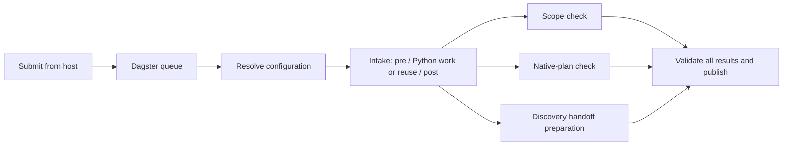

# Submit jobs to Dagster

This is the operator entry point for the current process. Run commands from the repository root
on the host. The launcher connects to the repo-local Dagster service at http://127.0.0.1:3000;
job execution occurs in its Linux code-server. Do not run the host launcher inside the code-server.

The default job is **`engagement_workflow`**: configuration, atomic intake, three parallel
preparation branches, then a validated final join. Dagster allows two runs globally and one per
engagement; up to three preparation steps can run within each workflow.



The branches prepare validated views and work requests. They do not execute partition discovery,
specialist reviews, scanners, target builds or LLMs. See [workflow internals and evidence](dagster-workflow.md)
for dependencies, locking and qualification.

## 1. Check the service

```powershell
docker compose -f orchestrator/dagster/compose.yaml ps
```

For initial setup, or to rebuild after dependency/image changes:

```powershell
python orchestrator/dagster/setup.py
docker compose -f orchestrator/dagster/compose.yaml up -d --build
```

The PostgreSQL, code-server, webserver and daemon services should be healthy. An already-running
stack does not need a rebuild for each submission. Preserve its volumes and the stopped legacy stack.

## 2. Create and stage an engagement

Create the run **inside the code-server** so its execution platform and paths are Linux-owned.
This PowerShell example captures the returned engagement ID:

```powershell
$created = docker compose -f orchestrator/dagster/compose.yaml exec -T code-server python -B /opt/process/run_process.py --start | ConvertFrom-Json
if ($LASTEXITCODE -ne 0) { throw "Run creation failed" }
$runId = $created.run_id

docker compose -f orchestrator/dagster/compose.yaml exec -T code-server python -B /opt/process/stage_artifacts.py --run-id $runId --project freeciv21 --target /targets/freeciv21 --business-goal "Bounded intake and preparation" --platform Linux --platform Windows --budget probe --execution-environment dagster-read-only-linux
if ($LASTEXITCODE -ne 0) { throw "Input staging failed" }
```

For Bash, run the same Docker commands, copy the returned `run_id`, and substitute it for `$runId`
in later examples. `--platform` describes the target platforms; it does not choose the execution OS.
Add repeated `--include`, `--exclude` or `--permission` options when needed. The default permission
is `read-source`; initial intake does not require scanner output or a compile database.

Freeciv21 is already mounted read-only at `/targets/freeciv21`. For another target, first add an
explicit read-only target bind mount to the shared runtime in
[compose.yaml](../orchestrator/dagster/compose.yaml), apply the Compose change when jobs are idle,
and stage its **container path**. A host path such as `F:\targets\project` is not a container path.
Do not repurpose a Windows-owned run for Dagster; create a Linux-owned run and explicitly import
legacy evidence when needed. See [legacy imports](phase-1-operations.md#legacy-compatibility).

## 3. Submit the workflow

Submit and wait for the terminal result:

```powershell
python -B appsec-review-process/launch_job.py --run-id $runId --wait
```

Submit and return immediately after Dagster accepts the request:

```powershell
python -B appsec-review-process/launch_job.py --run-id $runId
```

The JSON response includes `launch_id`, `dagster_run_id`, `status` and a browser `url`. Save the
engagement ID and launch ID. A submission response such as `QUEUED` or `STARTED` is not completion.
With `--wait`, `SUCCESS` exits zero and failure/cancellation exits nonzero. The default monitoring
limit is 600 seconds; change it with `--timeout 1200`. A timeout or interrupted terminal stops
monitoring but leaves server execution running.

| Job | How to select it | Scope |
|---|---|---|
| `engagement_workflow` | Default, or `--job engagement_workflow` | Intake plus parallel preparation and final join |
| `phase1_intake` | `--job phase1_intake` | Intake only, with four visible config/pre/work/post ops |

`python -B appsec-review-process/review_cli.py intake --run-id $runId` selects the intake-only
job and waits. Direct `phase1.py intake` remains an explicit host adapter diagnostic, not the normal
workflow submission path. The launcher accepts these two registered jobs; it does not accept
arbitrary scripts or currently unimplemented downstream job templates.

## 4. Check status and results

```powershell
python -B appsec-review-process/review_cli.py status --run-id $runId
```

For an engagement with workflow state, this reports workflow status and the Dagster URL. Non-OK
workflow states return nonzero. It validates recorded artifact integrity and upstream acceptance,
but does not perform a new source-freshness scan. Before workflow state exists, or for intake-only
runs, use the launch response/reattachment and Dagster UI to inspect queued or active execution.

| Identifier | Meaning |
|---|---|
| `run_id` / engagement ID | The staged target, scope and run-owned data |
| `launch_id` | One submission request; use it to reconnect without submitting again |
| `dagster_run_id` | The server execution shown in the Dagster UI |
| `attempt_id` | One immutable intake or branch work attempt; reuse can preserve it across launches |

All engagement files live under `appsec-review-process/runs/<run_id>/`:

| Relative path | Contents |
|---|---|
| `inputs/artifact-manifest.json` | Staged scope, permissions and source configuration |
| `data/orchestration/launches/<launch_id>/request.json` | Submission state, server ID, URL and reconnect argv |
| `data/workflows/engagement/status.json` | Current workflow generation and outcome |
| `data/workflows/engagement/accepted.json` | Aggregate acceptance after the final join |
| `data/jobs/00-intake/whole/attempts/<attempt_id>/` | Intake evidence, validation and separate stdout/stderr |
| `data/jobs/00-workflow-preparation/<branch>/attempts/<attempt_id>/` | Branch inputs, result, validation and separate stdout/stderr |

`run-status.json` retains the intake/lane view; it is not proof that the whole workflow succeeded.
Workflow `OK` means bounded intake and preparation passed, not that a full security review finished.

## 5. Reconnect, recover or cancel

Reconnect to an existing launch without creating another execution:

```powershell
python -B appsec-review-process/launch_job.py --run-id $runId --launch-id <launch_id> --wait
```

Reattachment preserves the original job selection, including older intake-only requests. It does
not retry a failed or canceled terminal job. After correcting a failure, submit a **new launch**:

```powershell
python -B appsec-review-process/launch_job.py --run-id $runId --wait
```

The workflow rechecks freshness, reuses unchanged successful attempts, and reruns missing or invalid
work. Independent branches may finish after a sibling fails; the join remains blocked until every
required branch passes. Automatic retries are disabled. To deliberately replace otherwise reusable
work, append `--force`. Repeat `--force` when reconnecting to a launch originally created with it.
For a clean engagement, create and stage a new run ID.

Cancel queued or running execution in the Dagster UI using the returned run URL. Canceling a queued
duplicate does not cancel the active engagement. Failure/cancellation sensors reconcile workflow
state after worker loss; this is eventual, so consult Dagster as well as local status after a crash.

If a submission response was lost, reconnect using the recorded launch ID. The client searches
Dagster history for that request. If its outcome remains uncertain, inspect history before making
another launch; the client does not blindly resubmit. Never delete locks or reset volumes to recover.

## Submit through the Dagster UI

Open http://127.0.0.1:3000, select **`engagement_workflow`**, and use this run configuration:

```yaml
resources:
  workflow_settings:
    config:
      engagement_run_id: <linux_run_id>
      force: false
```

Add a run tag named **`engagement_run_id`** with the same ID. This tag enforces per-engagement
queue serialization; a missing or mismatched tag fails before work. The engagement must already
be created and staged. For `phase1_intake`, use `session` instead of `workflow_settings` and keep
the matching tag. Prefer a new full workflow launch for recovery, which validates and reuses work;
do not bypass generation setup with isolated step selection.

## Further reading

- [Workflow architecture, parallelism and qualification](dagster-workflow.md)
- [Runtime limits, imports and adapter diagnostics](phase-1-operations.md)
- [Service lifecycle and preserved smoke job](../orchestrator/dagster/README.md)

## Historical intake-only launcher verification

Verified on 2026-09-19 in run `20260919T113744Z-fe2cdc`: 40 host tests and 44 Linux tests
passed, including Dagster config/work/post failure transitions. Actual service API submissions
qualified Freeciv21 intake, reattachment to the same Dagster run, a second run reusing immutable
accepted output, and missing-permission failure before work. The live GraphQL graph matched all
three dependency edges. The stopped legacy stack was unchanged.

See [service qualification evidence](../appsec-review-process/runs/20260919T113744Z-fe2cdc/data/verification/launcher-qualification.json)
for exact tested file hashes, run IDs and command results, and
[verification summary](../appsec-review-process/runs/20260919T113744Z-fe2cdc/data/verification/summary.json)
for test and documentation hashes. These are ignored local evidence files. Initial interrupted
test batches are preserved separately; the passing Linux result is `tests-linux-final`.
