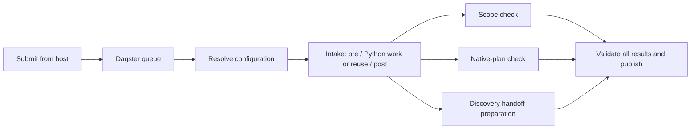

# Submit jobs to Dagster

This is the operator entry point for the current process. Since
[ADR-0011](../decisions/ADR-0011-orchestration-boundary.md), every operator command and every job's
execution run on one POSIX host: native Linux, or WSL on a Windows host. Dagster's webserver,
daemon and PostgreSQL run in containers and only orchestrate; ops run in the **host code
location** (`orchestrator/dagster/code-location.sh`), as the operator, with the host's own Docker.
Run every command below from the repository root on that host. The launcher connects to the
repo-local Dagster service at http://127.0.0.1:3000. There is no `code-server` container any more;
older instructions that `docker compose exec code-server ...` no longer work. A worked end-to-end
example on the `hello-autotools` fixture is in [flow bring-up](../processes/flow-bringup.md).

The default job is **`engagement_workflow`**: configuration, atomic intake, three parallel
preparation branches, then a validated final join. Dagster allows two runs globally and one per
engagement; up to three preparation steps can run within each workflow.



The branches prepare validated views and work requests. They do not execute partition discovery,
specialist reviews, scanners, target builds or LLMs. See [workflow internals and evidence](dagster-workflow.md)
for dependencies, locking and qualification.

## 1. Check the service

Initial setup, or after dependency/image changes (from the repository root):

```bash
python3 orchestrator/dagster/setup.py                      # once; also creates .host/ as you
docker compose -f orchestrator/dagster/compose.yaml up -d --build
orchestrator/dagster/code-location.sh start                # separate terminal; keep it running
orchestrator/dagster/code-location.sh reload               # after every code-location (re)start
```

Routine check:

```bash
docker compose -f orchestrator/dagster/compose.yaml ps     # postgres, webserver, daemon healthy
orchestrator/dagster/code-location.sh check                # "gRPC connection successful"
```

The code location needs a Python 3.12 venv matching `requirements.lock.txt` (the script builds it;
on Ubuntu install `python3.12-venv`), plus `git` and `libfuzzy2` on the host: intake reads Git
metadata and `evidence_index` loads `libfuzzy.so.2`. `start` warns if `libfuzzy.so.2` is missing.
Run `reload` after every start or restart of the code location: the webserver launches jobs from
the job list it last loaded, so until then a newly added job is rejected with
`PipelineNotFoundError`. `reload` refreshes only the webserver's view: the code location
(`dagster api grpc`) cannot reload its own code in place and logs "Reloading definitions ... is not
currently supported" when asked, which is harmless. To pick up changed job code, restart the code
location (Ctrl+C, `start`), then `reload`. Under WSL 2 NAT networking the containers reach the code location through
the distro's own IP, which changes when WSL restarts; `start` detects that, updates `.env` and
prints the `docker compose ... up -d webserver daemon` command to recreate the two containers.
An already-running stack does not need a rebuild for each submission. Preserve its volumes.

## 2. Create and stage an engagement

`PY` below is the code location's venv, so operator commands run with the same interpreter and
dependencies as the jobs:

```bash
PY=~/.venvs/appsec-review-dagster/bin/python
RUN=$($PY -B appsec-review-process/run_process.py --start | $PY -c 'import json,sys; print(json.load(sys.stdin)["run_id"])') \
&& echo "RUN=$RUN" \
&& $PY -B appsec-review-process/stage_artifacts.py --run-id $RUN --project <project> \
     --target <path/to/target/checkout> --business-goal "<the decision this review informs>" \
     --platform Linux --budget probe --execution-environment dagster-read-only-linux
```

Capture the run ID as above rather than typing it into a `RUN=<...>` line: if bash rejects such a
line, `$RUN` silently keeps whatever older run it held. `--platform` describes the target
platforms; it does not choose the execution OS. Add repeated `--include`, `--exclude` or
`--permission` options when needed. The default permission is `read-source`; initial intake does
not require scanner output or a compile database.

`--target` is a **host path** to the target's checkout (for the fixture,
`fixtures/targets/hello-autotools`, populated by `fixtures/populate-targets.sh`). No
`compose.yaml` mount or edit is needed per target. The run is created on this host and records its
platform (`posix`); Dagster refuses a run staged on another platform. Do not repurpose a
Windows-staged run: create a new run on the host and explicitly import legacy evidence when needed.
See [legacy imports](operations.md#legacy-compatibility).

## 3. Submit the workflow

Submit and wait for the terminal result:

```bash
$PY -B appsec-review-process/launch_job.py --run-id $RUN --wait
```

Submit and return immediately after Dagster accepts the request:

```bash
$PY -B appsec-review-process/launch_job.py --run-id $RUN
```

The JSON response includes `launch_id`, `dagster_run_id`, `status` and a browser `url`. Save the
engagement ID and launch ID. A submission response such as `QUEUED` or `STARTED` is not completion.
With `--wait`, `SUCCESS` exits zero and failure/cancellation exits nonzero. The default monitoring
limit is 600 seconds; change it with `--timeout 1200`. A timeout or interrupted terminal stops
monitoring but leaves server execution running.

| Job | How to select it | Scope |
|---|---|---|
| `engagement_workflow` | Default, or `--job engagement_workflow` | Intake plus parallel preparation and final join |
| `phase1_intake` | `--job phase1_intake` | Intake only, with four visible config/pre/work/post ops |
| `build_discovery` | `--job build_discovery` | Intake and cited discovery of build requirements/commands; no build execution |
| `build_execution` | `--job build_execution` | One sandboxed configure step after accepted build discovery; records compile database evidence when produced |
| `evidence_index` | `--job evidence_index` | Accepted searchable source/discovery evidence for LLM retrieval |
| `repository_partition_discovery` | `--job repository_partition_discovery` | Supplied-result gate: accepts a validated repository partition map from `data/jobs/02-repository-partition-discovery/supplied/result.json`, or fails with a hand-off naming that file |
| `dev_project_discovery` | `--job dev_project_discovery` | Supplied-result gate for developer project discovery; also requires the accepted partition map at the same source revision |
| `critical_findings_sarif` | `--job critical_findings_sarif` | Strict run-owned conversion of independently verified finding Markdown to accepted SARIF 2.1.0 |
| `full_review` | `--job full_review` | All lifecycle/registry jobs; currently stops at the first unimplemented worker |

`$PY -B appsec-review-process/review_cli.py intake --run-id $RUN` selects the intake-only
job and waits. Direct `phase1.py intake` remains an explicit host adapter diagnostic, not the normal
workflow submission path. The launcher accepts the registered jobs listed above; it does not accept
arbitrary scripts. See [build discovery and full-graph readiness](../build-discovery/build-discovery-integration.md)
before selecting `full_review`.

## 4. Check status and results

```bash
$PY -B appsec-review-process/review_cli.py status --run-id $RUN
```

For an engagement with workflow state, this reports workflow status and the Dagster URL. Non-OK
workflow states return nonzero. It validates recorded artifact integrity and upstream acceptance,
but does not perform a new source-freshness scan. Before workflow state exists, or for intake-only
runs, use the launch response/reattachment and Dagster UI to inspect queued or active execution.

| Identifier | Meaning |
|---|---|
| `run_id` / engagement ID | The staged target, scope and run-owned data |
| `launch_id` | One submission request; use it to reconnect without submitting again |
| `dagster_run_id` | The server execution shown in the Dagster UI |
| `attempt_id` | One immutable intake or branch work attempt; reuse can preserve it across launches |

All engagement files live under `appsec-review-process/runs/<run_id>/`:

| Relative path | Contents |
|---|---|
| `inputs/artifact-manifest.json` | Staged scope, permissions and source configuration |
| `data/orchestration/launches/<launch_id>/request.json` | Submission state, server ID, URL and reconnect argv |
| `data/workflows/engagement/status.json` | Current workflow generation and outcome |
| `data/workflows/engagement/accepted.json` | Aggregate acceptance after the final join |
| `data/jobs/00-intake/whole/attempts/<attempt_id>/` | Intake evidence, validation and separate stdout/stderr |
| `data/jobs/00-workflow-preparation/<branch>/attempts/<attempt_id>/` | Branch inputs, result, validation and separate stdout/stderr |
| `data/jobs/00-workflow-preparation/build_execution/attempts/<attempt_id>/build/discovery/compile_commands.json` | Compile database from `build_execution`, only when the configure step produced one |
| `data/jobs/02-evidence-index/whole/accepted.json` | Accepted evidence index pointer for retrieval |
| `data/jobs/10-critical-findings-sarif/whole/accepted.json` | Accepted SARIF pointer; immutable output is under its referenced attempt |

`run-status.json` retains the intake/lane view; it is not proof that the whole workflow succeeded.
Workflow `OK` means bounded intake and preparation passed, not that a full security review finished.

## 4.1 Job requirements and boundaries

Every Dagster job requires:

- a staged run manifest under `appsec-review-process/runs/<run_id>/inputs/artifact-manifest.json`
- an execution platform matching the run owner: create and stage runs on the POSIX host that runs
  the code location (ADR-0011)
- a matching `engagement_run_id` tag for service submissions
- immutable attempt output under the run's `data/jobs/.../attempts/<attempt_id>/`
- validation through the job's declared output contract before publication

Do not use old `scratch/<project>-engagement/` directories as implicit inputs for new workflows.
Import legacy evidence explicitly into a new run if it is needed. Do not delete locks, reset Dagster
volumes, or mark files OK by hand to recover a job.

Current job boundaries matter:

- `engagement_workflow` performs intake and preparation only. It does not run target builds,
  scanners, partition discovery, specialist review lanes or LLMs.
- `build_discovery` reads accepted intake evidence and cites build instructions; it does not run
  package managers, target scripts or compilers.
- `build_execution` depends on an accepted `build_discovery` result and runs one restricted CMake
  configure step inside the selected build environment. Its compile database, when present, lives
  at `data/jobs/00-workflow-preparation/build_execution/attempts/<attempt_id>/build/discovery/compile_commands.json`.
- `repository_partition_discovery` and `dev_project_discovery` are validated hand-off gates, not
  analysis. Each accepts a supplied, schema-valid record (citations must match the target's current
  file hashes; no finding or severity claims) or fails with `handoff.md`/`handoff.json` naming the
  file it needs. For the fixture, `fixtures/supply_record.py` installs the tracked records.
- `full_review` exposes the lifecycle graph for dependency qualification. Many workers are
  intentionally blocked until implemented and qualified.

## 4.2 Personas and registry jobs

Dagster worker configuration is registry-driven. Registry jobs compose a persona, role, domain,
tooling profile and output contract. Use these references before adding or dispatching work:

- [persona catalog](../personas-and-registry/persona-catalog.md) for human-readable reviewer stances
- [registry README](../../appsec-review-process/registry/README.md) for record types and dispatch rules
- `appsec-review-process/registry/personas/` for machine persona records
- `appsec-review-process/registry/job-templates/` for registered job compositions
- [intelligence sources and jobs](../evidence/intelligence-sources-and-jobs.md) for doc/API/test/binary
  intelligence ingestion

Personas are a review stance and scope contract, not evidence by themselves. A completed persona
job still needs cited artifacts, a valid status, and any downstream verification required by the
lane.

## 5. Reconnect, recover or cancel

Reconnect to an existing launch without creating another execution:

```bash
$PY -B appsec-review-process/launch_job.py --run-id $RUN --launch-id <launch_id> --wait
```

Reattachment preserves the original job selection, including older intake-only requests. It does
not retry a failed or canceled terminal job. After correcting a failure, submit a **new launch**:

```bash
$PY -B appsec-review-process/launch_job.py --run-id $RUN --wait
```

The workflow rechecks freshness, reuses unchanged successful attempts, and reruns missing or invalid
work. Independent branches may finish after a sibling fails; the join remains blocked until every
required branch passes. Automatic retries are disabled. To deliberately replace otherwise reusable
work, append `--force`. Repeat `--force` when reconnecting to a launch originally created with it.
For a clean engagement, create and stage a new run ID.

Cancel queued or running execution in the Dagster UI using the returned run URL. Canceling a queued
duplicate does not cancel the active engagement. Failure/cancellation sensors reconcile workflow
state after worker loss; this is eventual, so consult Dagster as well as local status after a crash.

If a submission response was lost, reconnect using the recorded launch ID. The client searches
Dagster history for that request. If its outcome remains uncertain, inspect history before making
another launch; the client does not blindly resubmit. Never delete locks or reset volumes to recover.

## Submit through the Dagster UI

Open http://127.0.0.1:3000, select **`engagement_workflow`**, and use this run configuration:

```yaml
resources:
  workflow_settings:
    config:
      engagement_run_id: $RUN
      force: false
```

Add a run tag named **`engagement_run_id`** with the same ID. This tag enforces per-engagement
queue serialization; a missing or mismatched tag fails before work. The engagement must already
be created and staged. For `phase1_intake`, use `session` instead of `workflow_settings` and keep
the matching tag. Prefer a new full workflow launch for recovery, which validates and reuses work;
do not bypass generation setup with isolated step selection.

## Further reading

For searchable source and accepted discovery evidence, submit:

```sh
$PY -B appsec-review-process/launch_job.py --run-id $RUN --job evidence_index --wait
```

This job prepares/reuses intake and build discovery automatically. Query via the
[CLI or read-only MCP server](../../appsec-review-process/tooling/llm-retrieval-addendum.md).
The UI uses the same `workflow_settings` configuration and engagement tag shown above.
Its independent acceptance lives under `data/jobs/02-evidence-index/whole/`, not the preparation
workflow's aggregate status. After abrupt worker loss, consult Dagster and retry the job; the
worker preserves the interrupted attempt and writes a recovery receipt before allocating another.

For explicitly authorized published OpenSSF Scorecard evidence, stage
`inputs/ossf-scorecard-projects.json`, include `network:api.scorecard.dev` in the run permissions,
and submit:

```sh
$PY -B appsec-review-process/launch_job.py --run-id $RUN --job ossf_scorecard --wait
```

The accepted pointer is under `data/jobs/02-ossf-scorecard/whole/`. This fetches published JSON2;
it does not run the Scorecard CLI against the repository. See
[the job contract](../evidence/ossf-scorecard-job.md).

- [Workflow architecture, parallelism and qualification](dagster-workflow.md)
- [Runtime limits, imports and adapter diagnostics](operations.md)
- [Service lifecycle and preserved smoke job](../../orchestrator/dagster/README.md)

## Historical intake-only launcher verification

Verified on 2026-09-19 in run `20260919T113744Z-fe2cdc`: 40 host tests and 44 Linux tests
passed, including Dagster config/work/post failure transitions. Actual service API submissions
qualified Freeciv21 intake, reattachment to the same Dagster run, a second run reusing immutable
accepted output, and missing-permission failure before work. The live GraphQL graph matched all
three dependency edges. The stopped legacy stack was unchanged.

See [service qualification evidence](../../appsec-review-process/runs/20260919T113744Z-fe2cdc/data/verification/launcher-qualification.json)
for exact tested file hashes, run IDs and command results, and
[verification summary](../../appsec-review-process/runs/20260919T113744Z-fe2cdc/data/verification/summary.json)
for test and documentation hashes. These are ignored local evidence files. Initial interrupted
test batches are preserved separately; the passing Linux result is `tests-linux-final`.
