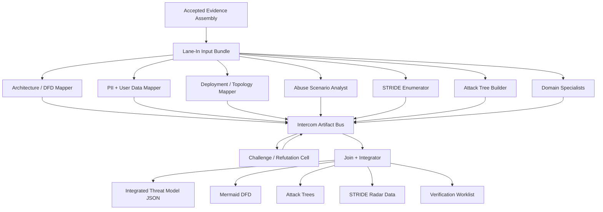

# ADR-0008: Threat Workbench Subworkflow

Status: Proposed

Date: 2026-09-20

## Context

The current `03-threat-model-dfd-stride` lane asks one worker to build a DFD, trust-boundary list,
data-flow table, Mermaid diagram, and STRIDE hypothesis list. That is too narrow for the direction
of the review system. The threat model needs to account for system architecture, PII and user data,
deployment context, abuse scenarios, attack trees, persona disagreement, and ranked STRIDE pressure
without turning unsupported hypotheses into findings.

The design-parity backlog already blocks threat-model implementation on G01. The open decision is
whether `03-threat-model-dfd-stride` remains a single DFD/STRIDE prompt or becomes a composed
workbench that consumes pregather intelligence, fans out to structured personas, exchanges typed
intercom artifacts, and joins into a canonical threat model.

## Decision

Adopt `03-threat-model-dfd-stride` as a **threat workbench subworkflow**:

```text
accepted pregather + component map + evidence index
        |
        v
lane-in: threat-workbench input bundle
        |
        v
fanout: specialized workbench cells
        |
        v
intercom: questions, assumptions, challenges, proposed graph edits
        |
        v
join: integrated model, diagrams, rankings, worklists
```

The outer lifecycle still exposes one `03-threat-model-dfd-stride` job. Internally, the job is a
pool-enabled workbench with typed persona workcells and a `wait_all` join. The workbench output is a
canonical threat model, not a set of independent persona reports.

## Canonical Model

The canonical threat model contains layered but linked graph records:

- architecture elements: actors, processes, stores, queues, services, clients, systems, support
  workflows, control planes;
- data-flow edges: source, destination, protocol, auth context, data classes, trust-boundary
  crossings, evidence citations;
- data inventory: PII, credentials, secrets, user-generated content, telemetry, logs, regulated
  data, retention/export/delete hints;
- deployment zones: public ingress, private service zones, admin/control-plane zones, build/release
  zones, mobile/client zones, third-party systems;
- abuse scenarios: attacker objective, actor/capability, target asset, harm, preconditions,
  missing controls, evidence;
- attack trees: objective, OR/AND nodes, prerequisites, evidence confidence, unresolved leaves;
- STRIDE hypotheses: element or flow, STRIDE category, threat statement, evidence, confidence,
  proof obligations, downstream owner;
- assumptions and gaps: unresolved architecture, data, deployment, abuse, or evidence questions.

DFD remains the backbone. STRIDE is a required enumeration pass over modeled elements and flows.
Privacy/data-flow modeling, abuse scenarios, and attack trees are first-class overlays tied back to
the DFD graph. They are not separate free-form essays.

## Workbench Phases

### 1. Lane-In

The lane-in task freezes the threat-workbench input bundle. It consumes accepted upstream evidence
only, records source/attempt hashes, and refuses stale or mixed-generation inputs.

Required where available:

- `02-evidence-assembly` intel manifest;
- `01-component-characterization` component-purpose map;
- accepted evidence index pointer;
- repository partition and project discovery;
- doc, API, test, operations, and runbook intelligence;
- IaC, Kubernetes, Dockerfile, deployment, and topology evidence;
- SBOM/SCA/license/lifecycle evidence;
- secrets/key inventory summaries after redaction;
- mobile/native/binary applicability and intelligence;
- build/configure/native artifacts when accepted;
- prior accepted lane outputs only when running reconciliation.

The bundle must distinguish raw evidence, derived intelligence, persona output, and lane output.

### 2. Fanout

Fanout launches selected workbench cells. Selection is evidence-driven and budget-aware. The default
standard pool is:

- architecture/DFD mapper;
- PII and user-data flow mapper;
- deployment and topology mapper;
- abuse-scenario analyst;
- STRIDE enumerator;
- attack-tree builder;
- domain specialist cells selected by target traits;
- challenge/refutation cell;
- integration cell.

Each cell has a persona record, required inputs, allowed evidence, output schema, proof obligations,
and hard `must_not` boundaries.

### 3. Intercom

Intercom is structured artifact exchange, not private chat. Cells communicate through these records:

- `questions[]`
- `assumptions[]`
- `proposed_model_edits[]`
- `proposed_threats[]`
- `proposed_attack_tree_nodes[]`
- `challenges[]`
- `coverage_gaps[]`
- `responses[]`

Every intercom record has author, target, topic, cited evidence, status, and resolution. The join
must preserve unresolved disagreements rather than silently flattening them.

### 4. Join And Report

The join validates every expected cell reached a terminal state, merges compatible graph edits,
deduplicates threats, records dissent, and publishes the canonical workbench output.

Required outputs:

- `integrated-threat-model.json`
- `threat-workbench-summary.md`
- `dfd.mmd`
- `attack-trees.mmd`
- `stride-radar-data.json`
- `ranked-threat-scenarios.json`
- `verification-worklist.json`
- `assumptions-and-gaps.json`
- `intercom-transcript.jsonl`

The Markdown report includes Mermaid diagrams and a ranked STRIDE/abuse summary. The radar/spider
chart data is explicitly visualization input; ranking is not count-only.

## Persona Workcells

Initial workbench personas are defined in
`docs/proposals/threat-workbench/personas.proposal.yaml`.

The core stance is composable interoperability:

```text
workcell = persona + domain + allowed evidence + output contract + proof obligations
```

A persona may be imaginative, but its output must be structured and evidence-cited. Verifier and
challenger cells must be stricter and less narrative-driven than discovery cells.

## Intel Contract

Input-source routing is defined in
`docs/proposals/threat-workbench/input-sources.proposal.yaml`.

The workbench may consume raw and derived inputs, but must label them:

- `raw`: original source/config/doc/test/tool artifact;
- `derived`: normalized intelligence, summaries, inventories, search records, scanner outputs;
- `accepted_lane`: accepted outputs from earlier lifecycle jobs;
- `persona`: workbench cell output;
- `reference`: curated standards or taxonomy material.

Derived intelligence can seed model elements and hypotheses. It cannot by itself verify runtime
behavior, exploitability, severity, standards compliance, or malicious intent.

## Ranking

Threat ranking uses a typed score, not a raw STRIDE count:

- impact and affected asset/data class;
- PII/user-data/credential sensitivity;
- trust-boundary crossing;
- attacker capability and preconditions;
- deployment exposure, with declared-vs-observed clearly separated;
- evidence confidence;
- exploit-chain support;
- abuse/business harm;
- unresolved assumption penalty.

Spider/radar charts may show STRIDE concentration by component, boundary, or data class. The report
must label them as prioritization aids, not final severity.

## Claim Limits

The workbench may publish:

- modeled architecture and data-flow facts;
- assumptions and coverage gaps;
- candidate threats and abuse scenarios;
- attack-tree hypotheses;
- verification work items;
- unresolved decision risks.

It may not publish:

- verified vulnerabilities;
- final severity;
- confirmed runtime exposure;
- compliance pass/fail;
- malicious intent;
- remediation status.

Downstream refutation, independent verification, scoring, and synthesis own those promotions.

## Mermaid Overview



## Alternatives Considered

Keeping one DFD/STRIDE prompt was rejected because it cannot reliably cover PII, abuse, attack
trees, domain-specific architecture, and challenge/reconciliation without becoming vague.

Making abuse cases or attack trees separate lifecycle lanes was rejected for the initial design
because they need the same canonical architecture/data graph and should join before downstream
verification work is routed.

Allowing free-form persona chat was rejected because the process needs durable, auditable artifacts.

## Consequences

This decision depends on persona dispatch, pool expansion, wait-all rendezvous, typed merge, and
contract validation. Until those foundations exist, the ADR remains a design gate and task packet,
not an implementation claim.

The workbench will produce more artifacts than the current lane, but those artifacts are directly
useful to OWASP applicability, deployment hardening, red-team, verification, fuzz triage, scoring,
and synthesis.

## Non-goals

This ADR does not implement workers, schemas, registry records, graph nodes, live runtime
inspection, standards source pinning, OWASP/DISA decisions, dynamic testing, or verified finding
promotion.

