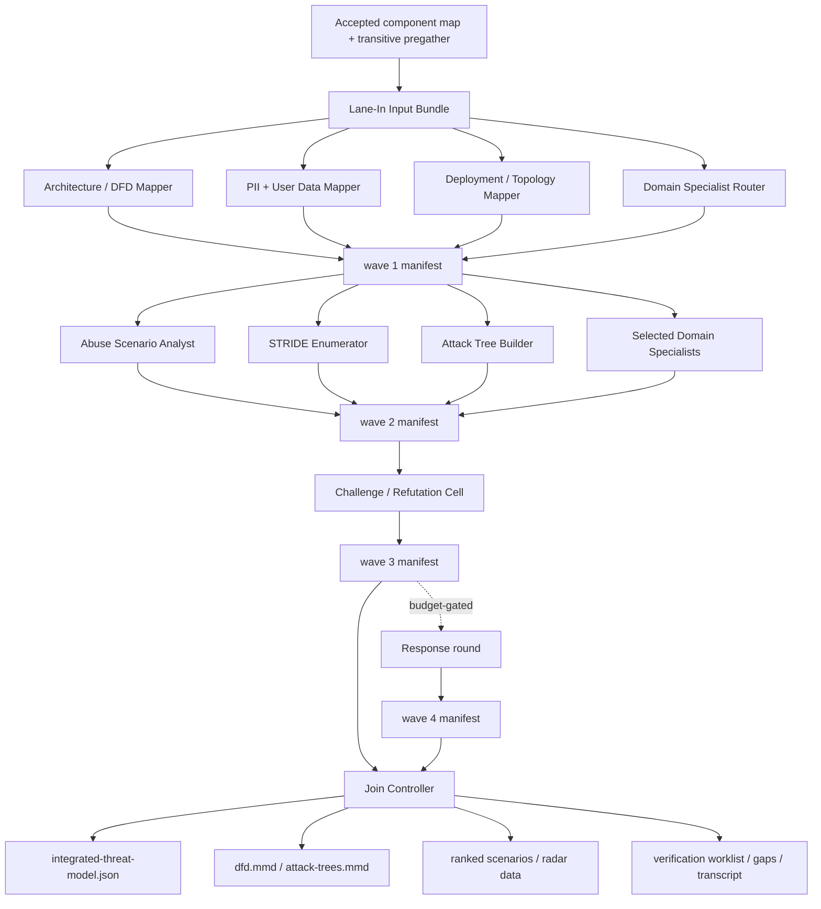

# ADR-0008: Threat Workbench Subworkflow

Status: Accepted 2026-09-20 (see Decisions). This closes the G01 design gate only. No worker,
schema, registry record, graph edge, or readiness claim follows from this document; S02 remains
blocked on its prerequisites.

Date: 2026-09-20 (drafted); 2026-09-20 (review refinement and gate decisions, see Revision Notes)

Backlog: `TODO.md` G01 (`HUMAN_GATE`, now decided), S02 (`BLOCKED(G01, F03, B14, M01)` — M01
added by Decision 5). Companion packet: `docs/proposals/threat-workbench/`.

## Decisions

Recorded 2026-09-20 from the user's answers to the seven gates below.

| Gate | Decision |
|---|---|
| 1 Architecture | **Option C.** Fan-out of personas and roles that work concurrently and exchange information through typed artifacts, joined into one canonical model. |
| 2 Approval | **A1, mechanical acceptance.** T08 lane validator plus the common contract validator accept the attempt; all five consumers proceed. Disagreements travel as `unresolved-dissent` records and `contested` verification items. No per-run human gate. |
| 3 Wave 4 | **Ship it, budget-gated.** One response round; omitted under `probe`, recorded as a coverage gap. |
| 4 Persona IDs | **Bare IDs**, matching the existing registry. Applies to `03/07/08/09`. |
| 5 M01 sources | **M01 must land first.** Secrets, IaC/Kubernetes/Dockerfile SAST, container inventory, SBOM/SCA/license/lifecycle and mobile SAST get graph nodes and contracts before S02 is implemented. Their bundle entries become real producers at that point; trait-based applicability still decides whether a given run needs them. |
| 6 Budgets | **Set now:** concurrent persona cells `probe` 1, `standard` 2, `deep` 3. Enforced through the B15 persona/LLM pool, never a local constant; B15 may revise with measurement. |
| 7 Static only | **Confirmed.** `OBSERVED_EXPOSURE`, live cloud state and dynamic testing are out of scope; live-state needs are emitted as follow-up requests only. |

## Context

The current `03-threat-model-dfd-stride` lane asks one worker to build a DFD, trust-boundary list,
data-flow table, Mermaid diagram, and STRIDE hypothesis list. That is too narrow for the direction
of the review system. The threat model needs to account for system architecture, PII and user data,
deployment context, abuse scenarios, attack trees, persona disagreement, and ranked STRIDE pressure
without turning unsupported hypotheses into findings.

`docs/design-parity-completion-plan.md` Workstream G1 lists five open decisions: primary artifact
shape; required DFD schema; representation of intent versus static versus test versus binary versus
observed evidence; applicability, completeness and rescope; and approval authority plus the handling
of disagreement. `TODO.md` G01 requires options, tradeoffs, a recommendation, explicit questions, a
golden/mutation fixture plan, and no worker or readiness claim. This ADR is that packet.

### Where the lane actually sits in the graph

`job-graph.json` gives `03-threat-model-dfd-stride` exactly one declared dependency:
`01-component-characterization` (contract `component-map`, `allowed_skip_reasons: []`).
`01-component-characterization` itself requires `02-evidence-assembly` (contract `pregather`), which
is the join of every pregather/intelligence job. So the workbench runs **after the full pregather
barrier**, not "immediately after intake" as `docs/design-v3.md` §5.3 describes L6A. The graph is
authoritative; §5.3/§22.8 of design-v3 are stale on this point and a follow-up task records that.
L6B (reconciliation against verified evidence) is an unbuilt lane and is out of scope here.

Five consumers depend on `03-threat-model-dfd-stride`, all `required`, none permitting a skip:
`04-asvs-masvs`, `07-red-team-adversarial`, `10-synthesis-report`, `12-scoring-prioritization`,
`13-fuzz-target-triage`. `15-deployment-hardening` is **not** a consumer and is downstream of `07`;
it must never be an input to the workbench or the graph acquires a cycle.

Today the node is a `blocked_op` emitting `WORKER_NOT_IMPLEMENTED`, has no output contract file, no
result schema, no registry composition, no validator, no assigned resource pool, and no
qualification. Every adapter kind the workbench needs — `persona`, `pool_coordinator`,
`join_controller` — is an explicitly unsupported `worker_kind` in `worker_adapters.py`.

## Options

**Option A — keep one DFD/STRIDE prompt.** Lowest cost; fits the current single-persona adapter
path once B14 exists. Cannot reliably cover PII, abuse, attack trees, domain-specific architecture,
or challenge/reconciliation without becoming vague. Fails G1 decision 1 and 5 on its own.

**Option B — separate lifecycle lanes** for privacy modeling, abuse cases, and attack trees. Clean
ownership, but each needs the same canonical architecture/data graph, and downstream verification
routing must wait for all of them anyway. Multiplies graph nodes, contracts and consumer edges.

**Option C — composed workbench inside one lifecycle job (recommended).** The outer lifecycle still
exposes one `03-threat-model-dfd-stride` job with one output contract. Internally it is a
pool-enabled subworkflow: lane-in, staged persona fanout, structured intercom, `wait_all` join. DFD
is the canonical substrate; privacy, deployment, abuse, attack-tree and STRIDE content are typed
overlays keyed to DFD element/flow IDs. Costs: depends on B14, C01–C03 and B15; more artifacts;
more budget per run.

Free-form persona chat was rejected under every option: the process needs durable, auditable
artifacts.

## Decision

Option C is adopted (Decision 1). The remainder of this document describes it.

```text
accepted component map (+ transitive pregather, evidence index)
        |
        v
lane-in: threat-workbench input bundle (frozen, hashed, class-labelled)
        |
        v
wave 1  fanout: architecture / data / deployment modelers (+ selector)
        |  wait_all
        v
wave 2  fanout: STRIDE enumerator, abuse analyst, attack-tree builder, domain specialists
        |  wait_all
        v
wave 3  challenge / refutation cell
        |  wait_all
        v
wave 4  (budget-gated, at most one round) responses from challenged cells
        |  wait_all
        v
join: integrated model, diagrams, rankings, worklists, dissent, coverage
```

### Why waves

`design-v3.md` §5.5 decided that rendezvous is `wait_all` only; there is no streaming or
early-exit mode, and C02 builds exactly that. A cell therefore cannot "talk" to a running peer.
Communication is realised as **staged fanout**: every cell writes its intercom records at its own
terminal state, and the next wave reads them from the frozen wave manifest. This is what makes the
workbench "pooled and communicative" without hidden state: the only channel between cells is a
hashed, append-only artifact produced by a terminal attempt.

Wave 4 exists so that a challenge can receive an answer from its author. It is bounded to one round
and is skipped (recorded as a coverage gap, not a `SKIPPED` status) under the `probe` budget class.
It ships in the initial implementation (Decision 3).

Concurrency inside a wave is bounded by the B15 persona/LLM pool using the budget-class defaults in
Decision 6 (`probe` 1, `standard` 2, `deep` 3 concurrent cells). The runner never hard-codes a
concurrency constant.

## Canonical Model

The canonical threat model, `integrated-threat-model.json`, contains layered but linked graph
records. Every record has a stable ID, an `evidence_class`, at least one citation, and a
`confidence`. Overlays reference DFD IDs; they never restate architecture.

- **architecture elements**: `element_id`, kind (`actor`, `process`, `store`, `queue`, `service`,
  `client`, `external_system`, `support_workflow`, `control_plane`), owning component ID from
  `component-map`, deployment zone ID, identities/tenancy hints, citations;
- **data-flow edges**: `flow_id`, source and destination element IDs, protocol, auth context, data
  class IDs, trust-boundary IDs crossed, direction, citations;
- **trust boundaries**: `boundary_id`, kind, reason, citations;
- **data inventory**: `data_class_id`, category (`pii`, `credential`, `secret`, `user_content`,
  `telemetry`, `log`, `regulated`, `payment`, `location`, `device_id`, `other`), sensitivity label,
  retention/export/delete hints, stores and flows that carry it, citations;
- **deployment zones**: `zone_id`, kind (`public_ingress`, `private_service`, `admin_control_plane`,
  `build_release`, `client_device`, `third_party`), exposure label — exactly one of
  `DECLARED_EXPOSURE` or `OBSERVED_EXPOSURE` (the latter is never producible from this workbench
  and is present in the schema only so the validator can reject it), citations;
- **abuse scenarios**: `scenario_id`, attacker objective, actor/capability, target element/data
  class IDs, harm, preconditions, missing controls, citations;
- **attack trees**: `tree_id`, objective, nodes (`AND`/`OR`/leaf) with prerequisites, per-leaf
  `leaf_support` — exactly one of `evidence`, `assumption`, `unresolved` — and linked
  verification items;
- **STRIDE hypotheses**: `threat_id`, target element or flow ID, STRIDE category, threat statement,
  citations, confidence, proof obligations, `minimum_verification` type, downstream owner lane;
- **assumptions and gaps**: `assumption_id`/`gap_id`, topic, affected record IDs, status,
  originating cell, intercom record ID;
- **coverage**: per expected cell — selected/omitted reason, terminal status, instance ID, prompt
  and model identity hashes;
- **dissent**: unresolved challenge/response pairs carried verbatim by ID.

### Evidence representation (G1 decision 3)

Every citation carries `source_class` (`raw`, `derived`, `accepted_lane`, `persona`, `reference`),
a run-relative path, a content hash, and where applicable a line range. An `02-evidence-index` hit
is a locator: a citation that names only an index record and no dereferenced source is invalid
(`design-v3.md` §22.4). Every record's `evidence_class` is one of `DIRECT_EVIDENCE`,
`STRONG_INFERENCE`, `WEAK_INFERENCE`, `FOLLOW_ON_REQUIRED` (`design-v3.md` §10), and confidence is
capped by it. Documented intent, static source/IaC, test evidence, binary evidence and observed
runtime state are carried as distinct citation `source_class`/`producer` pairs; the model never
merges them into one unlabeled fact.

### Applicability, completeness and rescope (G1 decision 4)

- Every component in the accepted `component-map` marked live and in scope must be represented by
  at least one element or listed in `coverage.unmodeled_components` with a reason.
- Every flow crossing a trust boundary must carry at least one STRIDE assessment or an explicit
  `unresolved` gap record. This is the completeness invariant the validator enforces.
- Unknown flows are recorded as elements with `kind` known and flows with `confidence: low` plus a
  gap, never omitted.
- Rescope triggers emitted by the join: a component with no evidence at all; a data class of
  category `pii`, `credential`, `secret`, `payment` or `regulated` with no owning store; a
  trust-boundary crossing with `evidence_class: FOLLOW_ON_REQUIRED`; any `OBSERVED_EXPOSURE`
  demand; a domain trait selected with no available specialist cell. Rescope triggers are records
  in `assumptions-and-gaps.json`; they are not a status.

## Workbench Phases

### 1. Lane-In

The lane-in step freezes the threat-workbench input bundle. It consumes accepted upstream evidence
only, records producer job ID, attempt ID and artifact hashes, and refuses stale or
mixed-generation inputs (the `02-evidence-assembly` join policy is the precedent:
`all-required-terminal-accepted`, `same_source_snapshot`, `failure_is_not_skip`).

Source routing is defined in `docs/proposals/threat-workbench/input-sources.proposal.yaml`. Each
source there is labelled with its graph availability:

- `declared_edge`: a dependency `03-threat-model-dfd-stride` already declares (`component-map`);
- `transitive`: reachable through `02-evidence-assembly`; the bundle may read it, and T10 records
  whether to promote it to a declared edge;
- `m01_gated`: secrets, IaC/Kubernetes/Dockerfile SAST, container inventory, SBOM/SCA/license,
  lifecycle and mobile SAST have **no graph node** until the M01 decision batch declares them. Per
  Decision 5, M01 lands before S02 is implemented; T03 then replaces the placeholder producers
  with the declared node IDs. Whether a given run needs one of these families is decided by target
  trait; a trait-applicable family whose producer did not run is a coverage gap, never fabricated
  content. Until M01 lands, no runtime record may name these producers.

The bundle distinguishes `raw`, `derived`, `accepted_lane`, `persona` and `reference` classes and
carries the redaction receipt of the secrets/key inventory when one exists.

### 2. Fanout

Fanout launches selected workcells per wave. Selection is evidence-driven and budget-aware. The
standard pool and its wave assignment:

| Wave | Workcell | Always / trait-selected |
|---|---|---|
| 1 | `domain-specialist-router` | always |
| 1 | `architecture-dfd-mapper` | always |
| 1 | `pii-user-data-mapper` | always |
| 1 | `deployment-topology-mapper` | always when any deployment evidence exists; else recorded omitted |
| 2 | `stride-enumerator` | always |
| 2 | `abuse-scenario-analyst` | always |
| 2 | `attack-tree-builder` | always |
| 2 | `supply-chain-specialist` | trait: third-party components or SBOM/SCA evidence |
| 2 | `agent-tool-boundary-specialist` | trait: LLM/agent/MCP/tool-use components |
| 2 | `native-parser-input-specialist` | trait: native/parser/wire-format components |
| 2 | `mobile-client-specialist` | trait: Android/iOS client components |
| 2 | `cloud-control-plane-specialist` | trait: Kubernetes/cloud control-plane manifests |
| 3 | `challenge-refutation-cell` | always |
| 4 | responses from challenged wave-1/2 cells | budget-gated, one round |
| join | `integrator-join` | always (`join_controller` kind, not a persona) |

Each workcell is a **composition** — persona + role + domain + tooling profile + cell output
contract — recorded in `docs/proposals/threat-workbench/workcells.proposal.yaml`, with required
inputs, allowed evidence, output records, proof obligations and hard `must_not` boundaries.
Personas conform to `schemas/persona.schema.json` (`appsec-review/persona/0.1`); the previous draft's
single flat "persona" record collapsed persona, role and tooling profile and matched no tracked
schema.

Cell invocation is a B14 persona request: fixed outer lane prompt, selected persona prompt, exact
readable input paths, private writable output root, budget, recorded model identity, prohibited
claims. A cell cannot read another cell's private root; it reads only the frozen previous-wave
manifest.

### 3. Intercom

Intercom is structured artifact exchange, not private chat. Records:

`question`, `assumption`, `proposed_model_edit`, `proposed_threat`, `proposed_attack_tree_node`,
`challenge`, `coverage_gap`, `response`.

Every record carries: `record_id`, `record_type`, `author_workcell_id`, `author_instance_id`,
`wave`, `target` (a workcell ID or `integrator`), `topic`, `subject_ids` (model record IDs it
concerns), `citations[]`, `status` (`open`, `answered`, `accepted`, `rejected`, `withdrawn`,
`unresolved`), `resolution` (free text plus `resolves_record_id`, a backward pointer to the
earlier record this one resolves; status is frozen at write time and resolution is derived by the
sweep), `content_hash`.

Rules:

- The transcript `intercom-transcript.jsonl` is append-only; a record is never edited, only
  followed by another record that references it.
- A `challenge` must name the challenged `record_id` and cite counterevidence or the missing
  evidence it demands.
- A `response` may only be authored by the workcell that authored the challenged record, in wave 4.
- Every `open` record at join time becomes `unresolved` and is copied by ID into
  `assumptions-and-gaps.json`. The join never resolves a disagreement by choosing a side.
- Records are data. A record that contains instructions to a reader is flagged
  `INJECTION_SUSPECTED` in the transcript and its content is quarantined from the summary.

### 4. Join And Report

The join (`integrator-join`, worker kind `join_controller`) runs only after the wave manifest shows
every expected instance terminal. It merges compatible graph edits by deterministic rules (C03
typed merge: persona claims, deterministic tool evidence and coverage receipts are merged
separately and never flattened), deduplicates threats by (target ID, STRIDE category, mechanism),
preserves dissent, computes rankings and coverage, generates diagrams **from the JSON**, and
publishes.

Output contract (proposal; the contract file itself is a T03 deliverable):

- `result_schema.artifact`: `integrated-threat-model.json` against
  `schemas/integrated-threat-model.schema.json` — the **one** structured result the common
  validator checks, per the opted-in contract rule.
- `required_files`: `integrated-threat-model.json`, `threat-workbench-summary.md`, `dfd.mmd`,
  `attack-trees.mmd`, `stride-radar-data.json`, `ranked-threat-scenarios.json`,
  `verification-worklist.json`, `assumptions-and-gaps.json`, `intercom-transcript.jsonl`,
  `workcell-manifest.json`, `status.json`.
- The other JSON files are projections of the result artifact. The workbench validator (T08)
  checks that every ID in a projection resolves in `integrated-threat-model.json`; the common
  validator only hashes them.

Diagram rules: `dfd.mmd` node IDs are element IDs, edge labels carry flow IDs; `attack-trees.mmd`
node IDs are tree node IDs. A hand edit to a `.mmd` file changes nothing downstream because the
generator is deterministic and the validator regenerates and compares. Mermaid is a view.

### Job-level terminal status

The workbench publishes one envelope. Mapping:

| Situation | Job status |
|---|---|
| all selected cells `OK`; no open intercom records | `OK` |
| any selected cell `OK_WITH_GAPS`/`UNRESOLVED`, or open intercom records, or omitted trait cell | `OK_WITH_GAPS` |
| join ran but completeness invariant fails (an in-scope boundary crossing has neither assessment nor gap) | `UNRESOLVED` |
| lane-in preflight failure (stale/mixed inputs, missing required source) | `BLOCKED` |
| any required (always-selected) cell `FAILED`/`BLOCKED`, or join failure | `FAILED` |
| interrupt | `CANCELED` |

`SKIPPED` is never a workbench job status: all five consumer edges declare
`allowed_skip_reasons: []`. Cell-level omission by the selector is a coverage record, not a status.

## Intel Contract

The workbench may consume raw and derived inputs, but must label them:

- `raw`: original source/config/doc/test/tool artifact;
- `derived`: normalized intelligence, summaries, inventories, search records, scanner outputs;
- `accepted_lane`: accepted outputs from earlier lifecycle jobs;
- `persona`: workbench cell output;
- `reference`: curated standards or taxonomy material.

Derived intelligence can seed model elements and hypotheses. It cannot by itself verify runtime
behavior, exploitability, severity, standards compliance, or malicious intent. Standards mappings
(CWE, CRE, STRIDE definitions) require a `reference` citation to `02-standards-source-ingest`
output; CIS control numbers are never recalled from model memory (`design-v3.md` §5.4).

## Ranking

`ranked-threat-scenarios.json` carries a `prioritization_score` with a visible per-factor
breakdown; it is not a severity:

- impact and affected asset/data class;
- PII/user-data/credential sensitivity;
- trust-boundary crossing;
- attacker capability and preconditions;
- deployment exposure, `DECLARED_EXPOSURE` only (an `OBSERVED_EXPOSURE` factor is always zero here);
- evidence confidence, capped by `evidence_class`;
- exploit-chain support (attack-tree leaves with `leaf_support: evidence`);
- abuse/business harm;
- unresolved-assumption penalty.

`stride-radar-data.json` gives STRIDE concentration by component, boundary, or data class and is
labelled `"purpose": "visualization_input"`. The Markdown summary states that the radar and the
score are prioritization aids, not severity, and that `12-scoring-prioritization` owns scoring.

## Claim Limits

Allowed assertions (proposed `claim_class_id: threat_model_candidates`):
`modeled-architecture`, `modeled-data-flow`, `declared-exposure`, `candidate-threat`,
`candidate-abuse-scenario`, `attack-tree-hypothesis`, `verification-work-item`, `assumption`,
`coverage-gap`, `unresolved-dissent`.

Forbidden: verified vulnerabilities, final severity, confirmed runtime exposure, compliance
pass/fail, malicious intent, remediation status.

The tracked `schemas/output-contract.schema.json` `forbidden_promotions` enum is closed to
`finding`, `severity`, `runtime-state`. The remaining three prohibitions are enforced in this
proposal by (a) the result schema having no field that can carry them and (b) T08 validator
negative tests. Extending the enum is a shared-surface change recorded as follow-up F02, not
assumed here.

Downstream refutation (`08`), independent verification (`09`), scoring (`12`) and synthesis (`10`)
own promotions. The challenger cell must be a different persona and, where B14 records it, a
different model family from the cell it challenges; no cell verifies its own claim (`design-v3.md`
§5.1, C04).

## Approval and Disagreement (G1 decision 5)

Options considered for who approves the model before consumers use it:

- **A1 — mechanical acceptance.** The T08 validator plus the common contract validator accept the
  attempt; consumers proceed. Fastest; disagreements travel as `unresolved-dissent` records.
- **A2 — supplied human decision gate.** A `supplied_human_decision` attempt must accept the
  workbench output before `10-synthesis-report` consumes it; `04/07/12/13` may proceed on
  mechanical acceptance.
- **A3 — human gate for everything.** Blocks all five consumers until a human accepts.

**Decided: A1** (Decision 2). Acceptance is mechanical. Disagreements produce **both** an
unresolved-risk record and, where the challenged record is a threat, a targeted verification item
flagged `contested`. Neither side is dropped; `08-blue-team-refutation` and
`09-independent-verification` are where contested items are settled. A human may still reject an
accepted attempt by forcing a new run; that is the existing rerun path, not a lane gate.

## Human Gates (all decided 2026-09-20; see Decisions)

1. Option C (composed workbench) versus A or B. — **C.**
2. Approval model A1/A2/A3. — **A1.**
3. Ship wave 4 (one response round) in the initial implementation? — **Yes, budget-gated.**
4. Persona ID convention (`design-v3.md` §5.5 open item). — **Bare IDs.**
5. M01-gated source families: optional-with-gap for first qualification, or M01 first? — **M01
   first.**
6. Budget classes for concurrent cells. — **`probe` 1, `standard` 2, `deep` 3.**
7. `OBSERVED_EXPOSURE`, live cloud state and dynamic testing out of scope. — **Confirmed.**

## Golden and Mutation Fixture Plan

Golden fixtures (small, checked in under the T09 owner's paths), one per family required by the
completion plan: web API with PII store; monorepo with shared library; multi-tenant service with
tenancy in identities; queue/event pipeline; native client with a parser boundary; mobile client
plus backend; cloud control-plane manifests. Each golden fixture pins the integrated model, both
`.mmd` files, radar data, ranked scenarios and the worklist.

Mutations, each expected to fail for exactly one named reason: missing flow across a boundary;
wrong trust boundary; secret value in a citation; unsupported `OBSERVED_EXPOSURE`; attack-tree leaf
marked `evidence` with no citation; STRIDE hypothesis without a target ID; challenge silently
dropped from the transcript; `.mmd` node not resolving to a model ID; failed cell absent from
coverage; index-only citation with no dereferenced source; consumer-visible `SKIPPED`.

## Mermaid Overview



## Reusable Abstractions For The OWASP Workbench (ADR-0009)

Carry these unchanged rather than re-deriving them: the five input classes and per-source claim
limits; the `declared_edge`/`transitive`/`m01_gated` availability labels; workcell-as-composition
records; wave-staged `wait_all` fanout with a frozen manifest as the only inter-cell channel; the
intercom record shape and append-only transcript; the one-result-artifact contract rule with
projections validated by a lane validator; the job-status mapping table; the "challenger is a
different persona/model" rule. ADR-0009 differs in output (control-status matrix, not candidate
threats) and consumes this workbench's accepted output through `04-asvs-masvs`'s existing edge.

## Consequences

Implementation depends on B11 (permission capabilities), B14 (persona adapter), B15 (persona/LLM
pool), C01 (pool schema and expansion), C02 (`wait_all`), C03 (typed merge), F03
(`01-component-characterization` worker) and, per Decision 5, M01 (vendor-prepass graph nodes).
Until those exist, this ADR is an accepted design and task packet, not an implementation claim.
The current three-step executor cap cannot run the standard pool; cell concurrency is bounded by
B15 using the Decision 6 defaults.

The workbench produces more artifacts than the current lane, but those artifacts are directly
useful to OWASP applicability, red-team, verification, fuzz triage, scoring, and synthesis.

## Non-goals

This ADR does not implement workers, schemas, registry records, graph nodes or edges, live runtime
inspection, standards source pinning, OWASP/DISA decisions, dynamic testing, L6B reconciliation, or
verified finding promotion. It does not decide M01.

## Revision Notes

2026-09-20 review refinement: restated as options + recommendation + explicit human gates per G01;
recorded the real graph position, consumers and the `15-deployment-hardening` cycle hazard; added
the wave model to make intercom feasible under `wait_all`-only rendezvous; added `UNRESOLVED` and
the job-status mapping; reduced the contract to one result artifact plus projections; aligned claim
limits with the closed `forbidden_promotions` enum and recorded the enum extension as a follow-up;
replaced the flat persona record with schema-conformant compositions; added the agent/tool,
native/parser, mobile, cloud control-plane and supply-chain specialist cells from the persona pool
proposal's L3 integration note; added completeness/rescope rules, approval options and the fixture
plan; marked M01-gated sources.

2026-09-20 gate decisions: all seven gates answered (see Decisions); status moved to Accepted;
approval changed from the recommended A2 to A1; M01 added as an S02 prerequisite; budget-class
concurrency defaults recorded.
