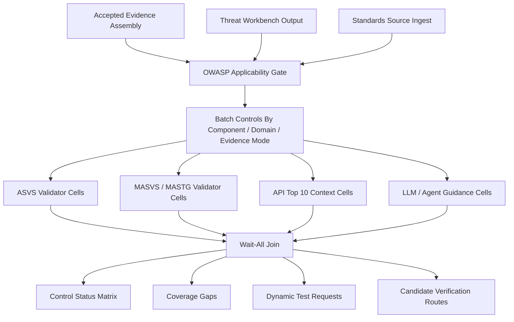

# ADR-0009: OWASP Control Workbench

Status: Proposed

Date: 2026-09-20

## Context

The current `04-asvs-masvs` prompt asks the process to map components to applicable ASVS/MASVS
controls and assess targeted controls. Existing registry records already name
`04-owasp-validation-worklist` and an `owasp-validator` persona, but the design gate remains open:
which OWASP sources are authoritative, how applicability is decided, how controls are batched, and
how validator personas should assess evidence without turning checklist gaps into findings.

The threat workbench pattern applies here too, but the output is different. Threat modeling creates
candidate threats and verification work. OWASP control review creates applicability decisions,
per-control statuses, evidence gaps, and follow-up test requests.

## Decision

Adopt `04-asvs-masvs` as an **OWASP control workbench**:

```text
accepted intel + component tags + threat model
        |
        v
applicability gate: select standards, profiles, controls, components
        |
        v
batch controls by component/domain/evidence mode
        |
        v
dispatch OWASP validator workcells
        |
        v
join: control-status matrix, gaps, dynamic-test requests, candidate verification routes
```

`04-owasp-validation-worklist` builds assignable control work items. `04-asvs-masvs` consumes the
worklist and publishes an evidence-backed control-status model. Neither job publishes verified
vulnerabilities or final severity.

## Supported OWASP Families

Initial supported families are proposal-only until standards source ingestion pins exact versions
and license/source hashes:

- OWASP ASVS for web/API/server application controls;
- OWASP MASVS and MASTG for mobile clients;
- OWASP API Security Top 10 as risk-category/context guidance, not a replacement for ASVS;
- OWASP LLM/agent guidance only for components classified as LLM/agent/tool-use systems;
- OpenCRE crosswalks where curated reference data exists.

Every control, test, or crosswalk record must include source, version/ref, hash, license/usage
metadata, and extraction provenance before it can drive a validator work item.

## Applicability Model

Applicability is decided from accepted intel:

- component-purpose map and component tag cloud;
- threat-workbench output when available;
- API collection intelligence;
- doc/product/architecture intelligence;
- QA/test intelligence;
- source SAST and evidence-index retrieval;
- mobile/native/binary applicability;
- deployment/IaC/container evidence where relevant;
- standards source records.

Applicability statuses:

- `applicable`
- `not_applicable`
- `conditional`
- `cannot_determine`
- `out_of_scope`

`not_applicable` requires evidence. `cannot_determine` becomes a gap, not a silent skip.

## Batching

Controls are batched into work items by:

- standard family and version;
- component or component group;
- domain, such as auth/session, access control, input validation, crypto, API, mobile storage,
  mobile network, privacy, logging, or LLM/tool-use;
- evidence mode: static source, static config, doc intent, test evidence, scanner lead, dynamic
  required, human decision required;
- required persona/tooling profile.

This prevents “run all of OWASP against everything” and keeps validator prompts bounded.

## Workcell Pattern

Each OWASP workcell receives:

- a small worklist slice;
- exact control/test/reference records;
- allowed evidence sources;
- required citations;
- prohibited claims;
- expected status output.

Validator personas answer:

- Is the control applicable?
- What evidence would satisfy it?
- What evidence was checked?
- What status is supported?
- What cannot be verified statically?
- What downstream verification or dynamic test is needed?

They do not perform open-ended vulnerability discovery.

## Control Statuses

Per-control statuses:

- `satisfied`
- `partially_satisfied`
- `not_satisfied`
- `not_applicable`
- `cannot_verify`
- `dynamic_test_required`
- `human_decision_required`

`satisfied` requires direct evidence covering the control. Documentation alone can satisfy only
documentation/process controls; otherwise it is documented intent. Scanner absence is never proof of
satisfaction. A failed or missing control is a standards gap or candidate verification route, not a
verified finding.

## Claim Limits

The OWASP control workbench may publish:

- applicability decisions;
- worklists;
- per-control statuses;
- evidence and counterevidence citations;
- gaps and dynamic-test requests;
- candidate routes to red-team, verification, or synthesis.

It may not publish:

- verified vulnerabilities;
- exploitability;
- final severity;
- runtime exposure;
- compliance certification;
- remediation status.

## Outputs

Required proposal outputs:

- `owasp-applicability-model.json`
- `owasp-validation-worklist.json`
- `owasp-control-status-matrix.json`
- `owasp-dynamic-test-requests.json`
- `owasp-coverage-gaps.json`
- `owasp-workbench-summary.md`

Optional reporting outputs:

- OWASP family/chapter coverage table;
- component-to-control heatmap data;
- evidence-mode distribution;
- unresolved-control backlog.

## Mermaid Overview



## Alternatives Considered

Running full ASVS/MASVS against every component was rejected because it creates noise and false
confidence.

Using OWASP labels only as finding tags was rejected because it misses checklist coverage and
applicability.

Letting validator personas infer standards from memory was rejected. Standards records must be
retrieved or curated with lineage.

## Consequences

This design depends on standards source ingestion, component tags, threat-workbench output where
available, persona dispatch, wait-all joins, and typed merges. Until those foundations exist, this
ADR is a decision packet, not an implementation claim.

The same pattern can later be reused for DISA/NSA/CIS: decide applicability from intel, batch
similar checks, dispatch strict validator personas with tools/evidence, and join into status
matrices without overclaiming.

## Non-goals

This ADR does not implement standards ingestion, schemas, workers, registry updates, graph changes,
validators, live dynamic tests, or compliance certification.

