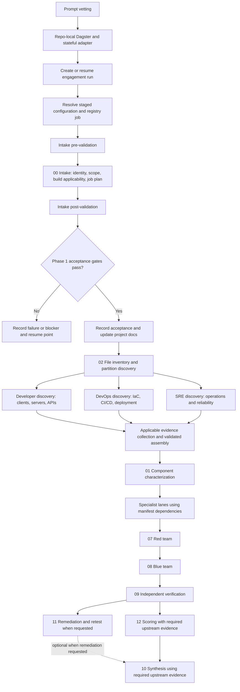
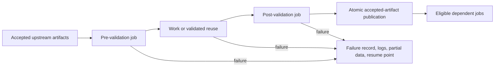

# Engagement job flow

The [full Dagster graph](full-review-workflow.mmd) now registers 41 lifecycle and registry
jobs. Missing workers fail explicitly. The first additional runnable integration is
[build discovery](build-discovery-integration.md), selected with `--job build_discovery`.

The [parallel collection plan](parallel-intelligence.md) separates source-only scans and consumers
from build-gated IR, binary/CFG and test evidence, then joins their validated results before review.

The executable [Dagster workflow](dagster-workflow.md) adds a persistent run queue and parallel
preparation around the accepted intake contract. Its [runtime graph](dagster-workflow.mmd) is
separate from the lifecycle graph below: preparing discovery handoffs does not execute discovery.

Status: [Phase 1 intake ACCEPTED, A01-A16 PASS](phase-1-acceptance.md);
build discovery and source evidence retrieval are runnable; other downstream collection workers remain planned.
The authoritative machine graph is [job-graph.json](../appsec-review-process/job-graph.json).
Its generated, checked Mermaid rendering is [phase-1-job-graph.mmd](phase-1-job-graph.mmd).
Run `python -B appsec-review-process/phase1.py graph --check` to detect drift. Lane order is
validated separately against `process-manifest.json`; the grouped overview below is explanatory.
Phase 1 acceptance is an implementation qualification, not a permission request per engagement.

The first acceptance gate is an implementation qualification gate, not a demand for user approval
on every engagement. After Phase 1 is accepted, normal engagements use intake post-validation and
the recorded runtime contract. Specialist dependencies include 03/04/05/06/13/15 as declared in the
manifest; the grouped box is not an assertion that all those lanes can run simultaneously.
Remediation is an explicit optional graph edge, disabled when not requested; `not-requested` is
its only permitted skip reason. Once enabled, a missing or failed remediation result blocks the
consumer. This supplements the manifest's required synthesis prerequisites without reordering lanes.

Every work box, including each downstream discovery or collection job, expands to:

Validators are explicit visible steps/jobs and do not recursively create validation jobs for
themselves. Same-run retries create immutable attempts; fresh runs have separate data roots.
See [run data contract](run-data-and-job-execution.md) and
[implementation/acceptance prompt](../appsec-review-process/phase-1-implementation-prompt.md).

## Source retrieval branch

`evidence_index` now gathers source plus accepted intake/build-discovery outputs, stores immutable
SHA-256 snapshots and ssdeep signatures, and publishes SQLite FTS5 text chunks. It is an explicit
required input to the intelligence rendezvous. See [evidence retrieval](evidence-retrieval.md)
and the [full workflow Mermaid](full-review-workflow.mmd). No native artifact is assumed to exist
before its build producer succeeds.
