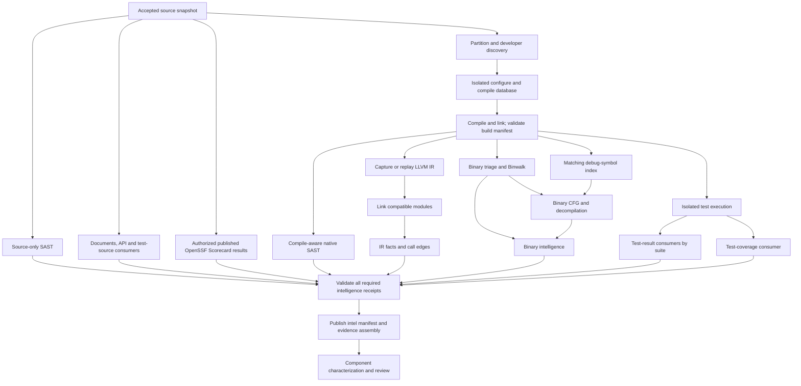

# Parallel build and intelligence collection

The machine graph now declares 51 lifecycle/registry jobs. Source evidence indexing is runnable
([retrieval guide](evidence-retrieval.md)), as is explicitly authorized published OpenSSF Scorecard
JSON2 ingestion ([job guide](ossf-scorecard-job.md)); the native/scanner collection workers remain
explicitly blocked until implemented and qualified. Dagster can schedule the dependency graph;
registration alone does not establish tool readiness or authorize a successful evidence receipt.

## Existing capabilities

| Capability | Existing implementation | Integration limit |
|---|---|---|
| Compile database and native SAST | `pipeline/pregather.sh`, `run_native_sast.py` | Legacy runner; needs run-owned Dagster adapter and validated generated inputs |
| LLVM IR capture | `images/audit-native/scripts/compile_feasibility_gate.py --emit-ir` | Compiler replay with `-g -O0`; not automatic capture of the original build |
| Module linking and IR facts | `images/audit-native/scripts/link_ir.py`, `images/audit-native/ir-facts/` | Preserve TU coverage and compatible LLVM versions; separate product/test modules |
| Binary triage and symbols | `images/audit-binary-analysis/analyze-binary.sh` | File/sections/imports/disassembly, Binwalk, DWARF and symbol tools exist; wrapper suppresses many errors |
| CFG and decompilation | `angr-summary.py`, optional Ghidra/RetDec calls in binary wrapper | angr currently emits bounded function/call summaries, not a complete serialized CFG; Ghidra needs a structured export script |
| Documents/API/test source | Existing registry ingestion templates | Workers and consumers still need implementation |
| Open-source project posture | `02-ossf-scorecard` published-results worker | Public cached JSON2 only; not a live scan and not a finding verdict |

`build_execution.py` is configure-only work: producing a compile database does not prove that
compilation or linking succeeded. Preserve that work and add a distinct successful-build receipt.
LLVM bitcode is captured by an instrumented compiler or explicit compile-database replay; a debug
binary by itself does not supply the original LLVM IR.

## Dependency flow

Source SAST, document/API ingestion, operational-document ingestion, standards ingestion and
test-source inventory depend only on accepted intake. They can overlap partition discovery and
the build; they do not wait for reverse engineering. Compile-aware SAST waits for generated inputs
and the validated build manifest, but has no dependency on IR or binary analysis.

IR capture follows build success in this first integration so generated headers and source are
available. If an instrumented build captures IR during compilation, the capture job validates and
publishes those outputs instead of recompiling. Otherwise it records that compiler replay was used,
including any flags/compiler differences and per-TU failures. Never equate replay coverage with a
faithful representation of the release binary.

## Build variants and symbols

Record source/configuration fingerprints, platform, compiler and image digest, exact flags,
optimization level, build variant, compile database, generated inputs, binary hashes and symbol
identities. Keep Debug, RelWithDebInfo and Release evidence in separate immutable attempts.
Prefer a variant with debug information for source mapping; retain release-specific analysis when
the question concerns shipped behavior. Debug and release results must not be silently combined.

Match DWARF/build IDs and PDB GUID/age to their binaries. A missing symbol file is an explicit
`no-debug-symbols` receipt; static binary triage and CFG work can continue with reduced attribution.
A mismatched symbol file, tool crash or failed build is a failure, not a not-applicable skip.
Keep Binwalk signature inspection separate from extraction and target execution; extraction needs
bounded paths, sizes and time, and dynamic analysis requires its own isolated job.

## Rendezvous contract

`02-evidence-assembly` is the barrier for every required applicable collection branch. It must:

1. Validate artifact schemas, hashes, producer attempt IDs, source freshness and build lineage.
2. Require an accepted result or an explicitly permitted, evidenced not-applicable receipt for
   each required branch. A missing result, crashed tool or failed build cannot count as a skip.
3. Preserve successful independent branches when another fails; recover only invalid/missing work.
4. Keep coverage gaps and unavailable optional evidence visible. Missing coverage instrumentation
   is not zero coverage; missing tests are not passed tests.
5. Atomically publish `intel-manifest.json` only after the join passes. Downstream review cannot
   consume a mixture of stale builds, mismatched symbols or incompatible source snapshots.

Every tool adapter needs separate stdout/stderr, command/image/version records, bounded execution,
tool-specific exit-code interpretation, pre/post checks and immutable output under
`runs/<run_id>/data/jobs/<job>/<scope>/attempts/<attempt_id>/`. The old binary wrapper's `|| true`
and merged streams cannot serve as its acceptance contract. Once a per-tool adapter is qualified
and its callers are updated, the legacy script is deleted outright; no wrapper or shim is kept
(`AGENTS.md`, "Script migration").

## Qualification and remaining work

The dependency expansion was checked on Windows and Linux with seven graph tests each, and against
the loaded Dagster repository. Evidence belongs to run `20260919T134844Z-8035cf`. These checks verify
ordering, independence and failure/skip gates; no native build, scanner or RE worker was executed.

Next implement the isolated configure/build receipts and collection adapters, then run Freeciv21
through build, IR, binary intelligence and source SAST concurrently. Include a debug-symbol-present
case, a stripped/no-symbol case, failed build, failed tool, stale binary, mismatched symbol file,
TU coverage gaps, restart/cancellation and one-branch failure/recovery. The final join must remain
unaccepted until all required receipts pass. Dispatching `full_review` today deliberately fails at
unimplemented workers.
