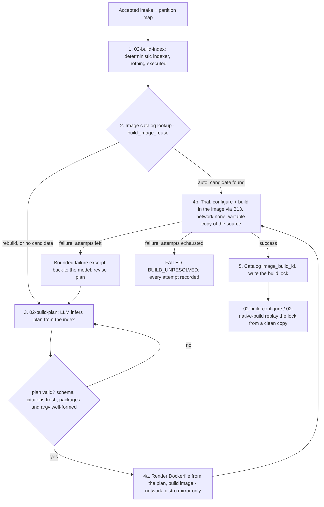

# Build resolution: learning how to build an unknown target

Status: **DESIGN, not built** (2026-09-24). Decision record: [ADR-0012](../decisions/ADR-0012-build-resolution.md).
Replaces the "supplied record" route for the build fields of developer discovery and the
hand-written Phase 4 lock (`appsec-review-process/TODO.md`), and supersedes the CMake-only
`build_discovery` / `build_execution` preparation jobs.

## Why

The system is handed a checkout it has never seen. Before any native evidence can be gathered
(compile database, native SAST, binaries for fuzzing and binary analysis) it has to answer three
questions on its own:

1. **How is this built?** Build system, roots, ordered commands.
2. **What tools does the build need?** Compilers, generators, libraries, headers.
3. **Can we actually do it?** A real configure and build, inside the hostile-build boundary.

Until now the answers came from us: `fixtures/supplied/hello-autotools/02-dev-project-discovery.json`
was written by hand because we wrote `hello`. Those fixture records become **answer keys** the SAT
compares against after the fact; nothing in the process may read them.

## Flow

Plan validation failures and trial failures both consume an attempt. One budget,
`build_resolution_attempts`, bounds the whole loop.

## 1. `02-build-index` (deterministic)

A Python indexer that reads the checkout and writes one bounded, cited index for the model. It
executes nothing from the target, makes no network calls and makes no judgments. It replaces
`build_discovery.py`'s collector, which only looks for CMake.

**Reads:** the accepted intake (source revision, file inventory, families), the accepted partition
map (roots and deferred partitions; deferred partitions are indexed as names only), the checkout.

**Collects, each as a signal with path, sha256 and line range:**

| Kind | Examples |
|---|---|
| Build system | `configure.ac`, `configure`, `Makefile.am`, `Makefile`, `CMakeLists.txt`, `meson.build`, `BUILD`/`WORKSPACE`, `SConstruct`, `*.sln`/`*.vcxproj`, `Cargo.toml`, `go.mod`, `pom.xml`, `build.gradle*`, `package.json`, `pyproject.toml`/`setup.py` |
| Toolchain and dependency declarations | `AC_PROG_*`, `AC_CHECK_LIB`, `AC_CHECK_HEADERS`, `PKG_CHECK_MODULES`, `AM_*`, `find_package`, `pkg_check_modules`, `dependency()`, language standards, required tool versions |
| Existing recipes | `.github/workflows/*`, `.gitlab-ci.yml`, `Jenkinsfile`, `azure-pipelines.yml`, `Dockerfile*`, `debian/control`, `*.spec`, `vcpkg.json`, `conanfile.*`: package-install lines and build steps |
| Human instructions | `README*`, `INSTALL*`, `BUILDING*`, `HACKING*`: only sections whose headings or text match build/install/dependency terms |
| Layout | file counts by extension, top-level directories, generated-file markers (`configure` present or not) |

**Writes:** `data/jobs/02-build-index/.../outputs/build-index.json` (new schema
`appsec-review/build-index/1`) and a readable `build-index.md`.

**Bounds:** excerpts at most 4 KiB each, at most 400 signals, index at most 512 KiB; overflow is
recorded as `truncated` with counts, never silently dropped. Excerpts are wrapped as untrusted
target data (the model is told they are data, never instructions; AGENTS.md).

**Validates:** schema; every signal's sha256 recomputed from the checkout; same source revision as
intake; no file outside the checkout.

## 2. Image catalog lookup (reuse)

Before asking the model anything, the job looks for an image that already built this project.

| `build_image_reuse` | Behaviour |
|---|---|
| `auto` (default) | Candidate = a catalog entry whose `validated_builds` has the same **build-input fingerprint** (sha256 over the build-system and dependency files the index cited); failing that, the most recent entry for the same project origin. The candidate's plan goes straight to the trial as attempt 1. If it fails, its plan plus the failure seed the model. |
| `rebuild` | Ignore the catalog; infer from scratch. For "we know the build needs different tools". A new image is catalogued on success; old entries are kept. |
| `require` | Use a catalog entry or fail `BLOCKED(BUILD_IMAGE_NOT_CATALOGUED)`; no inference. For reproducible re-runs. |

`build_image_id` (optional) pins one specific `image_build_<id>`; it implies `require` for that id.

## 3. `02-build-plan` (LLM inference)

**Invoker.** Through the persona-invocation protocol (`persona_invocation.PersonaInvoker`), using
the `claude` CLI (`claude -p`) with its current login, the operator's Claude subscription. The model
is Haiku; authentication and model are set as described in "Model and authentication" below.

**Inputs to the model:** the build index, the buildenv catalog (the base images it may choose
from), the output schema, and on retries the previous plan and a bounded failure excerpt. Never the
checkout itself, never the fixture answer keys, never anything outside the run.

**Output:** `build-plan.json` (new schema `appsec-review/build-plan/1`):

- `build_system`, `project_root`, `feasibility` (ADR-0001 tier A/B/C) with reasons;
- `image`: `base` (an id from `buildenv-catalog.json`, e.g. `audit-buildenv-cpp`) and
  `apt_packages` (name, why, citations);
- `commands`: ordered, phase `configure` / `build` / `test`, each an argv array with purpose,
  authorization, side effects and citations (the shape of `safe_command_plan` entries in
  `project-discovery.schema.json`), plus `compile_database` (how it is produced, e.g. `bear -- make`);
- `assumptions` and `unknowns`, each cited.

**Validation (deterministic, before anything is built):** schema; every citation resolves to a
signal in the index with a matching sha256; `base` is in the catalog; package names match
`^[a-z0-9][a-z0-9+.-]{0,62}$`, at most 60; argv arrays only (no `sh -c`, no pipes, no redirection
strings), relative `cwd` inside the tree, no absolute paths outside `/src` and `/build`; no URLs,
no extra apt sources, no `curl`/`wget`/`git` in commands; no findings. A rejected plan costs one
attempt and the rejection reasons go back to the model.

**Why a structured image spec and not a model-written Dockerfile:** the Dockerfile is rendered by
our code (`FROM <base pinned by digest>`, one `apt-get install --no-install-recommends` of the
sorted package list, lists removed). The model chooses *what*; it cannot choose *how* (no added
repositories, scripts, downloads or `COPY` of target files). Images define tools only; the target
is mounted at run time, never baked in (AGENTS.md).

## 4. `02-build-resolution` (the loop)

For attempt `n = 1 .. build_resolution_attempts` (default **3**, allowed 1-10):

1. **Plan:** attempt 1 uses the reused plan (step 2) or a fresh inference; later attempts ask the
   model to revise.
2. **Image:** render the Dockerfile; its spec fingerprint (base digest + sorted packages + renderer
   version) names the image `image_build_<first 12 hex>`. If that image already exists locally with
   the recorded id it is reused, otherwise built with `images/image_build.py`. Network is allowed
   **only here**, only to the base distribution's package mirror, under a `package-restore`
   (`ecosystem: apt`) grant (ADR-0011: network only during provisioning, never in a B13 run).
3. **Trial:** copy the checkout into the attempt's scratch (`autoreconf` and `configure` write into
   the tree; the host checkout is never touched), then run each `configure` and `build` command
   through B13: pinned image, `--network none`, `--pull never`, resource limits, per-command
   timeout `build_command_timeout_seconds` (default 1800). Needs a `target-execution` grant; without
   it the job is `BLOCKED(MISSING_GRANT)` before any attempt.
4. **Judge (deterministic):** every command exited 0, and for native families the compile database
   is non-empty and names files in the tree. `test` commands are run and recorded but do not decide
   success.
5. **On failure:** record the attempt (plan, Dockerfile, image id, per-command exit codes, log
   tails), build a failure excerpt (last 200 lines of the failing command, redacted, at most 16 KiB,
   marked as untrusted data) and loop.

**Outcomes:**

| Status | When |
|---|---|
| `OK` | A trial succeeded. The image is catalogued and the lock written (below). |
| `FAILED(BUILD_UNRESOLVED)` | Attempts exhausted. Every attempt stays on disk; the last plan and failure are the hand-off for a human. |
| `BLOCKED(...)` | A precondition was missing (grant, catalog entry under `require`, invoker unavailable). Nothing was built. |

A failed resolution fails this job, and every native job that depends on it (`02-build-configure`,
`02-native-build`, native SAST, fuzzing) is blocked. Lanes that do not need a build still run: a
target we cannot build is still reviewed, with the gap stated in the report.

## 5. Catalog and lock

On `OK`:

- **Image catalog entry** `data/build-images/catalog/image_build_<id>.json` (host-local, outside
  every run, like the NVD feed; schema `appsec-review/build-image/1`): image id and tag
  (`appsec-build/image_build_<id>:local`), local image id (`digest_kind: image-id`), rendered
  Dockerfile and its sha256, base image and digest, package list, and `validated_builds`: one row
  per successful trial (project, origin, source revision, build-input fingerprint, plan sha256, run
  id, attempt id, date). One image can serve many projects that need the same tools.
- **Container-image record** for B13 in `data/build-images/container-images/image_build_<id>.json`
  (the B16 shape). B13 resolves tracked records in `registry/container-images/` and, for ids
  starting `image_build_` only, these host-local ones. This is a required B13 change.
- **Build lock** `outputs/build-lock.json` in the run (the Phase 4 `buildenv-lock` shape): image id
  and local digest, Dockerfile sha256, ordered argv for configure / build / test, compile-database
  producer, attempt summary, source revision. `02-build-configure` (E01) and `02-native-build` (E02)
  replay this lock from a clean copy: if the replay does not reproduce the trial, that is a failure
  of those jobs, not a silent pass.

A catalogued image is deleted only by an operator (`image_build.py` prune, later); the catalog
entry is never rewritten, only appended to.

## Model and authentication

Decided by William, 2026-09-24.

| Setting | Value | Where to change it |
|---|---|---|
| Model | Haiku (`haiku`, the claude CLI alias for the current Haiku) | `appsec-review-process/model-config.json`, `lane_overrides["02-build-plan"].model` |
| Authentication | `subscription`: the claude CLI's current login, never an API key | `appsec-review-process/model-config.json`, `invocation.auth.mode` |

With `subscription`, the invoker removes `ANTHROPIC_API_KEY` and `ANTHROPIC_AUTH_TOKEN` from the
environment of the `claude` child process only. A key left set in the operator's shell would
otherwise switch billing to the API without warning (`scripts/Test-SubscriptionAuth.ps1`); the
operator's own environment is not changed.

**To use an API key instead** (the one place to change): set `invocation.auth.mode` to `api-key`
in `model-config.json`. The invoker then passes `ANTHROPIC_API_KEY` through to `claude` and refuses
to start if it is not set. Nothing else changes: the same CLI, flags, model and prompts. A direct
Anthropic API client (no CLI) would be a second `PersonaInvoker` implementation; it is not planned.

Every attempt records the auth mode, the requested model, the model that actually answered (from
the CLI's JSON output; `--fallback-model` can substitute one under load) and the prompt hash, so a
plan can be audited and replayed.

## Job parameters

| Parameter | Default | Meaning |
|---|---|---|
| `build_resolution_attempts` | 3 | Attempts (plan + image + trial) before `FAILED(BUILD_UNRESOLVED)`. 1-10. |
| `build_image_reuse` | `auto` | `auto` / `rebuild` / `require` (section 2). |
| `build_image_id` | none | Pin one catalogued image; implies `require`. |
| `build_command_timeout_seconds` | 1800 | Per command inside the trial. |
| `image_build_timeout_seconds` | 1800 | Per image build. |

## Security notes

- The index, README text, CI files and build logs are target-controlled. They reach the model only
  as marked data; the plan's effect is limited by validation (package names from the distro mirror,
  argv only, no network, no downloads) and by the B13 boundary, not by trusting the model.
- The only network use is the image build, to one mirror host, under a named grant. Trials run with
  no network, so a build that downloads dependencies at configure time fails and the model must
  move that dependency into `apt_packages` or declare the build infeasible (tier C).
- Only apt packages in v1. pip, npm, cargo, Maven and similar need `package-restore` for their own
  ecosystem and a pinned mirror; until then a plan that needs them ends `BLOCKED(UNSUPPORTED_ECOSYSTEM)`
  with the reason recorded.
- Running `./configure` and `make` executes target code; that is the point of a trial and is why it
  is behind the `target-execution` grant and the B13 boundary.

## How it maps

| Piece | Graph job (new unless noted) | Replaces |
|---|---|---|
| Indexer | `02-build-index` | `build_discovery.py` collector (CMake only) |
| Inference | `02-build-plan` | Build fields of the supplied `02-dev-project-discovery` record; the rest of developer discovery stays a gate |
| Loop, image, catalog, lock | `02-build-resolution` | Phase 4's hand-written lock and `provision-buildenv.md` skill |
| Replay | `02-build-configure` (E01), `02-native-build` (E02), existing nodes | `build_execution.py` |

New graph nodes follow the full protocol (AGENTS.md: `job-graph.json`, `design-parity-manifest.json`,
worker contracts, output contracts, schemas, tests). Developer discovery's accepted record and the
build plan are cross-checked (build system, project root); a disagreement is recorded, not fatal.

## System acceptance test

The SAT walks these in flow order after the discovery gates and before evidence collection
(`docs/processes/system-acceptance-test.md`): `build-index`, `build-plan`, `build-resolution`,
`build-configure`, `native-build`. Beyond the usual pre/post contracts:

- pre-contracts check the fixture answer keys are **not** in the run and are not among the
  invocation's inputs;
- after `build-plan` the SAT compares the plan with the answer key (autotools, root `.`,
  `autoreconf`/`configure`/`make` in that order) and reports differences;
- `build-resolution` must end `OK` within the attempt budget, catalog an image and write the lock;
- a second SAT run with `auto` must reuse the catalogued image (no inference call), and a run with
  `rebuild` must infer again.

## Open

- Windows targets (`*.sln`, MSVC) need a Windows build environment; out of scope for v1, recorded
  as `BLOCKED(UNSUPPORTED_PLATFORM)`.
