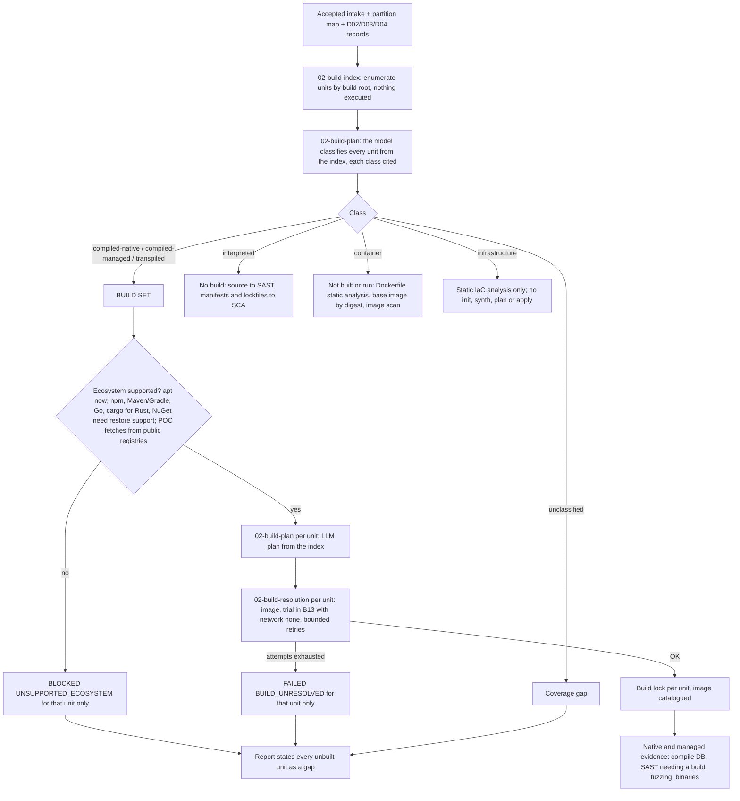

# Build unit classification: what gets built, and how

Status: **DESIGN, not built** (2026-09-25; decisions below, all settled). Extends [build resolution](build-resolution.md) /
[ADR-0012](../decisions/ADR-0012-build-resolution.md), which assumes a single native project.

## Why

A target is rarely one native project. It is a mix of compiled code, transpiled code, code that runs
in an interpreter, container definitions and cloud infrastructure. Only some of it has to be built to
produce evidence, and building executes target code, so we build **only the pieces that need a
build**, and treat everything else statically.

## Unit and class

A **unit** is one build root: the directory of a defining manifest (`configure.ac`, `CMakeLists.txt`,
`package.json`, `pyproject.toml`, `go.mod`, `Cargo.toml`, `pom.xml`, `build.gradle*`, `*.csproj`,
`composer.json`, `Gemfile`, a `Dockerfile`, a Terraform root, a Helm chart, ...). A monorepo has many.
Each unit gets exactly one **class**:

| Class | Examples | Build? | What we do with it |
|---|---|---|---|
| `compiled-native` | C, C++, Rust, Go, Swift, Obj-C, Fortran; native extensions inside interpreted packages (`binding.gyp`, Python `ext_modules`/Cython `.pyx`/`maturin`, PHP `config.m4`, Ruby `extconf.rb`) | **yes** | compile database, native SAST, binaries for fuzzing and binary analysis |
| `compiled-managed` | Java, Kotlin, Scala (JVM); C#, F# (.NET) | **yes** | bytecode/assemblies for SAST that needs a build, dependency resolution, binary analysis |
| `transpiled` | TypeScript, TSX/JSX via Babel, CoffeeScript, Elm, Kotlin/JS; a bundler step (webpack, vite, esbuild) over JS | **yes (transpile)** | type-check, emitted JS and source maps, bundle contents |
| `interpreted` | Python, PHP, Ruby, plain JavaScript/Node, Perl, Lua, shell | no | source goes straight to SAST; manifests and lockfiles to SCA |
| `container` | `Dockerfile`, `Containerfile`, compose `build:` | no | the repository's Dockerfile is never built or run: Dockerfile static analysis and a scan of its pinned base image; the code it would compile is built as its own unit in our rendered image |
| `infrastructure` | Terraform/OpenTofu, CloudFormation, Bicep/ARM, Helm, Kubernetes manifests, Ansible; infra-as-program (CDK, Pulumi) | never applied | static IaC analysis only; CDK/Pulumi are not synthesized |
| `unclassified` | anything the model cannot place with evidence | no | coverage gap, named with its path |

A unit can hold more than one class (a Python package with a C extension). It is then split: the
extension is a `compiled-native` unit rooted at the package, and the Python code stays `interpreted`.

## Flow

A unit that cannot be built blocks only the jobs that need **that** unit's build. Every other unit,
and every lane that needs no build, continues.

## Rust units

A Rust unit is a Cargo workspace or package root (`Cargo.toml`, with `Cargo.lock` when present); a
workspace is one unit, and its member crates are listed inside it. Class `compiled-native`.

- **Dependencies:** crates come from crates.io (POC; `package-restore` grants for its hosts) during provisioning only, checked against `Cargo.lock` checksums; the
  trial runs `cargo build --locked --offline` against that restored set, never fetching. A unit with no
  `Cargo.lock` gets one generated during provisioning, recorded as a gap (the resolved versions are ours,
  not the repository's).
- **Build scripts and proc macros execute code at build time** (`build.rs`, `proc-macro = true`
  crates, including those of dependencies). That is the same exposure as `./configure` and is covered
  by the same `target-execution` grant and B13 boundary; the index lists every `build.rs` so the plan
  and the report can name them.
- **Native dependencies:** `-sys` crates and the `cc`/`cmake`/`pkg-config` build helpers need C
  toolchains and libraries; the plan adds them as apt packages, as for any native unit.
- **Toolchain:** `rust-toolchain.toml` / `rust-toolchain` pins the compiler; the image carries that
  toolchain, or the plan records the mismatch. Nightly-only features are recorded, not silently
  switched to stable.
- **Success and evidence:** every `cargo build` exits 0 with the declared features; the build lock
  records features, target triple and profile. Evidence is `cargo metadata` (the crate graph for SCA),
  the built binaries (fuzzing with `cargo fuzz` targets when declared, binary analysis), and
  `unsafe`/FFI locations for native review. Rust has no compile database; `rust-project.json` or
  `cargo metadata` stands in where a tool needs the build graph.

## Where classification happens

**The model classifies every unit** (William, 2026-09-25). `02-build-index` stays deterministic: it
enumerates the candidate units (build roots) and collects their cited signals (manifests, markers,
extension counts, build-system and toolchain declarations), but assigns no class. `02-build-classify`'s
persona call (its own job since ADR-0012 Revision 2; it reads the checkout as well as the index and
records where the index is wrong) then gives every unit exactly one class, with citations to checkout
files and the index signals it rests on, and splits a
mixed unit (a Python package with a C extension) into its parts. A class with no resolvable citation
is rejected, as for every other claim, and a unit the model cannot place is `unclassified` with a
coverage gap. D02/D03 keep proposing per-project commands; the plan cross-checks them and records any
disagreement, as ADR-0012 already does for build system and project root.

Intake's `families` table today maps `.js` and `.jsx` to `typescript`, so extensions alone cannot tell
plain JavaScript (`interpreted`) from TypeScript or bundled JS (`transpiled`). The index must collect
the signals that do (`tsconfig.json`, a `typescript` or `@babel/*` dependency, a bundler config) so the
model can cite them.

## Decisions

Decided by William, 2026-09-25:

- **Transpiled units are in the build set** and go through the same resolution loop as compiled
  units (transpile and type-check in the trial).
- **Ecosystems after apt: all of them, in this order** -- npm (unlocks TypeScript and Node native
  addons), then Maven/Gradle, then cargo (Rust) and Go modules, then NuGet. Each is a `package-restore`
  grant for its registry host(s) plus restore support in the loop; until a unit's ecosystem has one,
  that unit is `BLOCKED(UNSUPPORTED_ECOSYSTEM)`.
- **A unit is one build root**: the directory of a defining manifest; a monorepo has many, and a
  mixed package is split by class.
- **The model classifies every unit** (see "Where classification happens").
- **Repository Dockerfiles are not built** (William, 2026-09-25, final; an interim note that
  day had the build lane building them). The build lane builds only our own rendered images, in
  which it compiles the code units. A repository's Dockerfile gets static analysis and a scan of its
  pinned base image. D03's `docker build` plan entry stays discovery context, not a build step.
  Nothing is ever run: no `docker run` or `compose up`, in discovery or in the build lane.
- **Running built targets is out of scope for now** (dynamic testing, fuzzing): see the last section
  of `appsec-review-process/TODO.md`.
- **Cloud infrastructure: static only.** IaC scanners over the files; no `terraform init`/`validate`,
  no `cdk synth` or `pulumi preview`, never `plan`/`apply`.

- **Dependency source for the POC: the public registries**, with TLS certificate verification and
  lockfile hash verification (registry-published checksums where the repository pins none, recorded as
  weaker). A local caching proxy is deferred: it is an external service outside this project.
  Tracked in `appsec-review-process/TODO.md` Phase 5f.

## Open

- Mixed-class splitting rules need test fixtures: the polyglot fixture addendum
  (`appsec-review-process/TODO.md`) is the natural place.
- Windows/MSVC stays out of scope (`BLOCKED(UNSUPPORTED_PLATFORM)`), as in ADR-0012.
