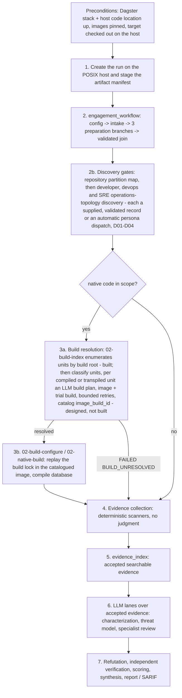

# Starting an engagement -- process flow and requirements

Status: **DRAFT for the 2026-09 architecture discussion.** Updated 2026-09-23 for ADR-0011 (host-owned
code location) and the discovery gates; the step-by-step bring-up on the `hello-autotools` fixture is
tracked in [flow-bringup.md](flow-bringup.md). The detailed process up to Dagster's acceptance of the engagement is modelled
in BPMN: [bpmn/pre-submission.bpmn](bpmn/pre-submission.bpmn); a readable companion with the models and their exposition is the Google Doc [AppSecReview - Process.doc](https://docs.google.com/document/d/1OwuRBMoLLoPOL79JlSDUvhUdzgdG_hNDbidD9PHlteI/edit). Describes what exists today, marks
what is designed but unbuilt, and lists the decisions the discussion must settle. Once agreed it
becomes the normative "how an engagement starts" doc and the diary parts move to `docs/TODO/`.

An *engagement* is one review of one target revision under one business goal, scope, budget and
permission set. Everything it produces is owned by one run id under
`appsec-review-process/runs/<run_id>/` (`docs/dagster/run-data-and-job-execution.md`).

## 1. Flow

Built today: 1, 2, 2b, 5 and the `critical_findings_sarif` publisher, all run-owned and validated.
Step 3a (build resolution: how to build an unknown target, with what tools, and whether it can be
done at all) is designed in [build-resolution.md](build-resolution.md) (ADR-0012), extended per unit
by [build-unit-classification.md](build-unit-classification.md). Its first job, the deterministic
`02-build-index`, is built (2026-09-25; SAT stage 10); `02-build-plan` and `02-build-resolution` are not.
Step 3b is built only partially: `build_execution` configures a single CMake root from the older
`build_discovery` branch, through the `buildenv-common` wrapper. It refuses other build systems (the
`hello-autotools` fixture among them), does not consume step 2b's developer project discovery, and
does not go through the B13 pinned-container adapter. The lifecycle configure worker that does
(`02-build-configure`, batch E01) is planned: B13 into service, then the C++ build environment, then E01.
Step 2b's four gates (partition, developer, devops and SRE operations-topology discovery) accept
supplied, schema- and freshness-validated records (`discovery_gate.py`) by default, and all four can
also perform the analysis themselves (automatic persona dispatch, D01-D04; SAT stages 6-9 all
automatic since SAT `20260925T170552Z`). The first gate, `02-repository-partition-discovery` (D01,
2026-09-24), was first: a run opted into automatic
dispatch (`discovery_gate.set_dispatch_mode`, a per-run opt-in file, no change to this gate's
external `run()` signature) dispatches a real, tools-off persona invocation
(`claude_cli_invoker.ClaudeCliInvoker`) against the staged checkout instead of expecting a supplied
file -- the supplied-record path stays available as the default and as an explicit, separately
tested alternative. The second gate, `02-dev-project-discovery` (D02, live-confirmed 2026-09-25), has the same opt-in: its persona reads the target plus the accepted partition map and itself
decides how the project is built (languages, buildenv image, the ordered safe command plan), keeping
this job's existing accepted-record shape. The third gate, `02-devops-project-discovery` (D03,
2026-09-25), has the same opt-in through the same shared code path, with its own task prompt. The
fourth, `02-sre-operations-topology` (D04, live-confirmed 2026-09-25), uses the same path
with its own schema and claim builder. SRE topology chains after the accepted devops record instead
of the partition map directly (2026-09-24): in automatic mode its persona receives both the accepted
devops record and the partition map as scope, and maps the declared services, ports and dependencies
of what devops discovery found.
Step 4 runs only through the legacy `pipeline/engagement_job.*` path into `scratch/` and is then
imported into the run; its run-owned replacement (the `02-*` graph nodes) is declared but 45 of the
51 graph jobs have no worker. Steps 6-7 exist as the tracked prompt harness (`appsec-review-process/
<lane>/`) dispatched by hand-off files, not as graph workers.

## 2. What the operator must supply (step 1)

`stage_artifacts.py` is the intake contract. Everything else is derived.

| Input | Flag | Required | Notes |
|---|---|---|---|
| Run id | `--run-id` | yes | From `run_process.py --start`, run on the POSIX host (Linux, or WSL on Windows) that runs the code location, so the run is POSIX-owned (ADR-0011). Previously created inside the code-server container. |
| Project name | `--project` | yes | Short id; names the run's directories. |
| Target path | `--target` | yes | A **host** path to the target checkout, resolved on the host (e.g. `fixtures/targets/hello-autotools`). Since ADR-0011 no `compose.yaml` mount or edit is needed per target. |
| Business goal | `--business-goal` | yes | One sentence; the decision the review must inform. Lanes report against it. |
| Target platforms | `--platform` (repeat) | yes | Describes the target (`Linux`, `Windows`, `Android`, ...), not the execution OS. |
| Budget class | `--budget` | default `probe` | `probe` / `standard` / `full` (`appsec-review-process/budget-policy.md`). |
| Scope | `--include` / `--exclude` (repeat) | no | Path globs; intake records the classification and never silently narrows scope. |
| Permissions | `--permission` (repeat) | default `read-source` | Default deny. `read-source` allows only the trusted static inventory worker; target execution, network, dynamic testing, ptrace, credentials, package restore and target mutation are separate capabilities (`docs/adapters/permission-capabilities.md`) granted by a named human. |
| Execution environment | `--execution-environment` | default `local-read-only` | Use `dagster-read-only-linux` for Dagster runs. |
| Compile database | `--compile-db` | no | Only when a trusted one already exists; otherwise `build_discovery`/`build_execution` produce it. |
| Legacy evidence | `--engagement-output` + `--import-legacy` | no | Hash-recorded import of a `scratch/<project>-engagement` tree into `data/imports/<import_id>/`. |

Not supplied by the operator and deliberately so: tool versions (pinned in images), scanner
selection (the graph), model identity (adapter config), and anything read from the target.

## 3. What each step requires and produces

Per-job inputs and outputs, and their rollup per process model, are in the generated
[job and artifact catalog](job-catalog.md).

| Step | Job | Requires | Produces (accepted pointer) | Gate to next |
|---|---|---|---|---|
| 1 | `run_process.py --start`, `stage_artifacts.py` | Running stack and host code location; target checkout on the host | `inputs/artifact-manifest.json` | Manifest validates. |
| 2 | `engagement_workflow` (`launch_job.py --run-id <id> --wait`) | Manifest; `engagement_run_id` tag | `data/jobs/00-intake/whole/accepted.json`: source revision + dirty/untracked fingerprints, language/workspace/build/deployment families, native compile/link-recipe plan, specialist routing; `data/workflows/engagement/accepted.json` after the join | Workflow `OK`. `QUEUED`/`STARTED` are not completion. Intake passing says nothing about native build coverage. |
| 2b | `repository_partition_discovery`, then `dev_project_discovery`, `devops_project_discovery` and `sre_operations_topology` | Accepted intake; a supplied `supplied/result.json` per gate (fixtures: `fixtures/supply_record.py`), **or** this run opted the gate into automatic dispatch (`discovery_gate.set_dispatch_mode`; all four gates support it); dev and devops discovery each also need the accepted partition map at the same source revision; sre topology needs the accepted devops record at the same source revision | `data/jobs/02-repository-partition-discovery/` (partition map, persona routing, review scope), `data/jobs/02-dev-project-discovery/accepted.json`, `data/jobs/02-devops-project-discovery/accepted.json` (project, manifests, build image, safe command plan) and `data/jobs/02-sre-operations-topology/accepted.json` (services, ports, dependencies, coverage gaps) | Without a supplied record (and no automatic-dispatch opt-in) a gate fails with an actionable hand-off (`handoff.md`), never a silent pass. Citations must match the target's current file hashes. |
| 3a | `02-build-index` (built), `02-build-plan`, `02-build-resolution` (designed, [build-resolution.md](build-resolution.md)) | Accepted intake, partition map and discovery records; `target-execution` and `package-restore` grants (apt now; other ecosystems per TODO Phase 5f); `build_resolution_attempts` (3, per unit; no cap on units), `build_image_reuse` (`auto`) | Cited build index with candidate units; per-unit classification and validated plans; per-attempt image, logs and exit codes; `image_build_<id>` catalogued and a per-unit `build-lock.json` entry for each resolved unit | Per unit `OK`, `FAILED(BUILD_UNRESOLVED)` or `BLOCKED`; job `OK`, `OK_WITH_GAPS`, `UNRESOLVED`, `BLOCKED` or `SKIPPED`. A failed unit blocks only its own native jobs; the engagement continues. Repository Dockerfiles are never built; nothing built is run (ADR-0012 revision 1). |
| 3b | `build_discovery` then `build_execution` (today; replaced by 3a + E01/E02) | Accepted intake; native families present; no current `build-discovery.md` for this exact target | Cited build requirements and command arrays (no execution); then one sandboxed configure inside the hostile-build boundary (`docs/architecture/design-v3.md` §2.2) and `compile_commands.json` when produced | Feasibility gate (ADR-0001 Tier A/B/C) recorded; a missing compile database blocks native lanes, not the engagement. |
| 4 | today: `pipeline/engagement_job.sh` / `.ps1` outside Dagster; target: `02-*` nodes | Target checkout; images; (today) manual import afterwards | Static prepass, native pregather, `assemble`, `correlate`, `deep_confirm`, retrieval plan, `job-status.json` with explicit degraded status | Every tool records exit/duration/log; a tool that did not run is a coverage gap, never "clean". |
| 5 | `evidence_index` | Accepted intake (+ imports) | `data/jobs/02-evidence-index/whole/accepted.json`; bounded CLI / read-only MCP retrieval (`docs/evidence/evidence-retrieval.md`) | Index is a locator, never evidence authority. |
| 6 | lane hand-offs (`create_handoff.py`) | Accepted evidence; persona/registry composition; budget | Lane outputs under the run; component-purpose map first (`01`), then `03`.. per `process-manifest.json` | Each lane states read / covered / excluded / next. |
| 7 | `07` -> `08` -> `09` -> `12` -> `10`; `critical_findings_sarif` | Verified claims only | Report inputs; accepted SARIF | High/Critical needs lane `09`; nothing promotes a tool hit to a finding. |

## 4. Preconditions (environment)

- Docker with the Dagster stack (`orchestrator/dagster/compose.yaml`: PostgreSQL,
  webserver, daemon) healthy, plus the host code location (`orchestrator/dagster/code-location.sh start`, then
  `code-location.sh reload`; ADR-0011); `python orchestrator/dagster/setup.py` after image/dependency changes.
- Every tool image pinned by digest; digests are recorded in every manifest (`images/*/README.md`).
- The target checked out on the host at a known revision (fixtures: `fixtures/populate-targets.sh`, which pins
  and verifies the commit). No `compose.yaml` change per target since ADR-0011.
- Linux or WSL2 with sources on the Linux filesystem for anything heavy (the Windows/UNC path is
  validated but materially slower for `ir-facts` and CodeQL).
- No network for workers unless a `fixed-network-destination` capability is granted.

## 5. Decisions the discussion must settle

1. **One evidence path.** Step 4 is the fork: the legacy pipeline (broad, proven, `scratch/`-owned,
   imported after the fact) versus the run-owned `02-*` nodes (declared, contracts and validators
   merged, workers unbuilt: M03/D09 READY, M04/M05 blocked). Do we (a) build the nodes and retire
   `engagement_job.*` step by step (the ADR-0010 plan), or (b) wrap the legacy runner as one
   pinned-container job now to get run ownership immediately and split later?
2. **Where "start" ends.** Is an engagement "started" after step 2 (intake accepted), after step 5
   (evidence indexed), or after `01-component-characterization`? This decides what `full_review`
   must run before any LLM lane and what the go/no-go report contains.
3. **Operator surface.** Today (since ADR-0011): one shell on the host, no compose edit per target, but still a
   chain of commands (create, stage, submit per job, supply discovery records). Target:
   one `review_cli.py start` that creates, stages and submits, with the target declared in a
   tracked engagement file?
4. **Permission grants.** Who issues them, where the grant record lives per run, and whether `probe`
   budget implies `read-source` only.
5. **Windows host.** Keep it as a validated-but-slower path, or Linux-only for orchestration with
   Windows targets reached through mounts? Partly settled by ADR-0011 in practice: on a Windows host the
   code location and all operator commands run in WSL (Docker Desktop, WSL 2 NAT; see the ADR's addendum),
   with runs POSIX-owned. Open: native-Windows targets that need a Windows build environment.
6. **What intake must prove before native work.** Whether `build_discovery` is mandatory for every
   native family or only when no trusted compile database is supplied.

Sources: `docs/dagster/dagster-launching.md`, `docs/dagster/run-data-and-job-execution.md`,
`docs/dagster/operations.md`, `docs/build-discovery/build-discovery-integration.md`,
`appsec-review-process/00-intake-recovery/config.md`, `pipeline/README.md`,
`appsec-review-process/job-graph.json` (3 of 51 jobs have workers: `00-intake`,
`02-ossf-scorecard`, `02-evidence-index`; plus 4 supplied-result gates: partition, developer,
devops and SRE operations-topology discovery).
