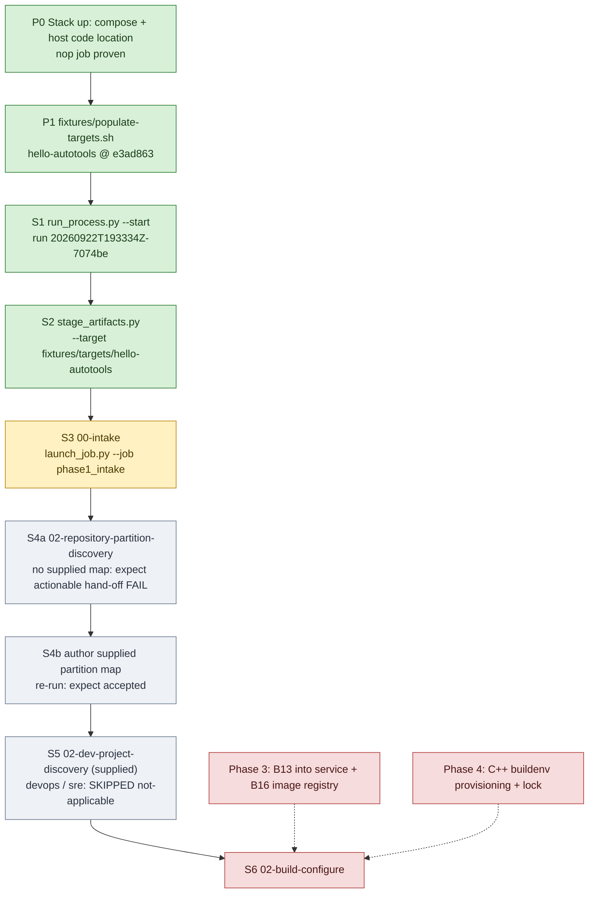

# Engagement flow bring-up on `hello-autotools` (working tracker)

Status: **living tracker**, updated as each step is run. We bring the engagement flow up in
process-flow order on the `hello-autotools` fixture, using the ADR-0011 split: Dagster
(webserver, daemon, postgres) in Docker Desktop, and the code location plus every operator command
as host processes in WSL (`Ubuntu-24.04`, clone at `~/projects/appsec-review`). The flow and
requirements themselves are in [engagement-start.md](engagement-start.md); the phase plan is in
`appsec-review-process/TODO.md` ("Step 4 plan").

## Flow and status

Legend: green done, yellow next, grey to do, red blocked on another phase.

## Steps

All commands run in WSL from `~/projects/appsec-review` with the code location running
(`orchestrator/dagster/code-location.sh start`). `PY` is the code location's venv:
`PY=~/.venvs/appsec-review-dagster/bin/python`.

| Step | Who / what | Command | Expected result | Status |
|---|---|---|---|---|
| P0 | stack + host code location | `docker compose -f orchestrator/dagster/compose.yaml up -d`; `orchestrator/dagster/code-location.sh start` | `code-location.sh check` succeeds; `nop` runs | DONE 2026-09-22 (runs ac01458f, 3ea3b999) |
| P1 | fixture target | `fixtures/populate-targets.sh` | `hello-autotools` at `e3ad863` | DONE 2026-09-22 |
| S1 | security engineer: create the engagement | `$PY -B appsec-review-process/run_process.py --start` | JSON with `run_id`; `appsec-review-process/runs/<run_id>/` exists | DONE 2026-09-22: `20260922T193334Z-7074be` |
| S2 | security engineer: stage inputs | `$PY -B appsec-review-process/stage_artifacts.py --run-id <run_id> --project hello-autotools --target fixtures/targets/hello-autotools --business-goal "..." --platform Linux --budget probe --execution-environment dagster-read-only-linux` | `inputs/artifact-manifest.json` validates; `executor_platform` = `posix` | DONE 2026-09-22 |
| S3 | Dagster: `00-intake` | `$PY -B appsec-review-process/launch_job.py --run-id <run_id> --job phase1_intake --wait` | `SUCCESS`; `data/jobs/00-intake/whole/accepted.json` | NEXT |
| S4a | Dagster: partition discovery gate | `launch_job.py --run-id <run_id> --job repository_partition_discovery --wait` | fails with an actionable hand-off (no silent success) | |
| S4b | author supplied `repository-partition-map` | (to write: one component, one native family, autotools route) | gate accepts it | |
| S5 | dev-project discovery; devops/sre skip | (via `engagement_workflow` / `full_review` graph) | dev accepted; devops + sre `SKIPPED(not-applicable-no-matching-inputs)` with receipts | |
| S6 | `02-build-configure` | -- | needs B13 (Phase 3) and the C++ buildenv (Phase 4) | BLOCKED |

## What each step does

Plain-language exposition, kept beside the table so the flow documents itself as we bring it up.
Each entry says what the step is for, what it produces, and what changed under ADR-0011.

**P0 -- Stack and code location.** Dagster's webserver, daemon and PostgreSQL run in Docker Desktop
and only orchestrate: they hold the queue, state and history, and never run review work
themselves. The code location (`code-location.sh start`) is the host process the ops actually run
in, so jobs get the host's own Docker without a Docker socket mounted into any container. The
trivial `nop` job proved the whole path: submitted from the UI or CLI, queued by the daemon, and
executed by a run worker on the host.

**P1 -- Fixture target.** `fixtures/populate-targets.sh` clones `hello-autotools` at its pinned
commit into `fixtures/targets/`. It is cloned in, never committed, just as a real engagement target
would arrive. The script refuses to touch a clone with the wrong origin or local changes.

**S1 -- Create the engagement (`run_process.py --start`).** This is the first command the security
engineer runs. It creates the engagement's run ID and its folder under
`appsec-review-process/runs/<run_id>/`, and every later step keys off that ID. It used to run
inside the code-server container; it now runs on the host, in WSL.

**S2 -- Stage the inputs (`stage_artifacts.py`).** This is where the engineer states what is being
reviewed and why: target path, project name, business goal, target platforms, budget, scope and
permissions (default `read-source` only). It writes `inputs/artifact-manifest.json`, the intake
contract; everything later is derived from it. It also records the platform the run belongs to
(`posix` here), and a run can't later be restaged from a different platform. Under ADR-0011
`--target` is a plain host path (`fixtures/targets/hello-autotools`); it used to be a read-only
mount path inside the container, which needed a `compose.yaml` edit for every new target.
The staging output also lists "Expected before pregather" notes (`job-status.json`,
`llm/retrieval-plan.json`, ...). They are informational: outputs of the legacy evidence pipeline
that don't exist yet because nothing has run; not errors.

**S3 -- Intake (`00-intake`, `launch_job.py --job phase1_intake`).** This is the first Dagster job.
It checks that the configuration is valid, then records the target's exact source revision and any
uncommitted changes, what languages and build systems it uses, the native build plan, and which
specialist reviews it should be routed to. The result is accepted in
`data/jobs/00-intake/whole/accepted.json`. `launch_job.py` only submits and monitors; the work runs
in the host code location. Passing intake says nothing yet about whether the native build works.

**S4a -- Partition-discovery gate, nothing supplied.** `02-repository-partition-discovery` is a
validated hand-off gate, not analysis (`discovery_gate.py`). It either accepts a schema-valid
repository-partition map supplied out of band, or fails with an actionable hand-off that says what
is missing. Running it first with nothing supplied proves it fails clearly rather than passing
silently as a no-op.

**S4b -- Supply the partition map.** We write the fixture's partition map (one component, one
native family, an autotools build route) and re-run the gate, which should now accept it. This is
Phase 5 work, pulled forward because discovery doesn't need Docker.

**S5 -- Project discovery.** The three branches fanning out from the partition map: developer
project discovery takes a supplied record the same way; DevOps and SRE discovery should end
`SKIPPED(not-applicable-no-matching-inputs)` with receipts, because the fixture has no deployment
or operations inputs.

**S6 -- Build configure (`02-build-configure`).** The first step that runs the target's own build
(`autoreconf -fi`, `./configure`). It must go through B13, the pinned-container adapter and the one
piece of code allowed to run `docker run`, inside the C++ build-environment image. That is why it
waits on Phase 3 (B13 into service) and Phase 4 (buildenv provisioning).

## Log

- 2026-09-22 -- P0/P1 done. Networking under WSL 2 NAT required the distro-IP mapping
  (ADR-0011 addendum). First operator script identified: `run_process.py --start` (S1), now a host
  command, no longer `docker compose exec code-server`.
- 2026-09-22 -- S1 and S2 done on the host for the first time: run `20260922T193334Z-7074be`
  created and staged from WSL with the code-location venv, target
  `fixtures/targets/hello-autotools`, budget `probe`, permissions default `read-source`.
  `launch_job.py`'s platform-check message updated (it still told operators to use the
  code-server). S3 next.
