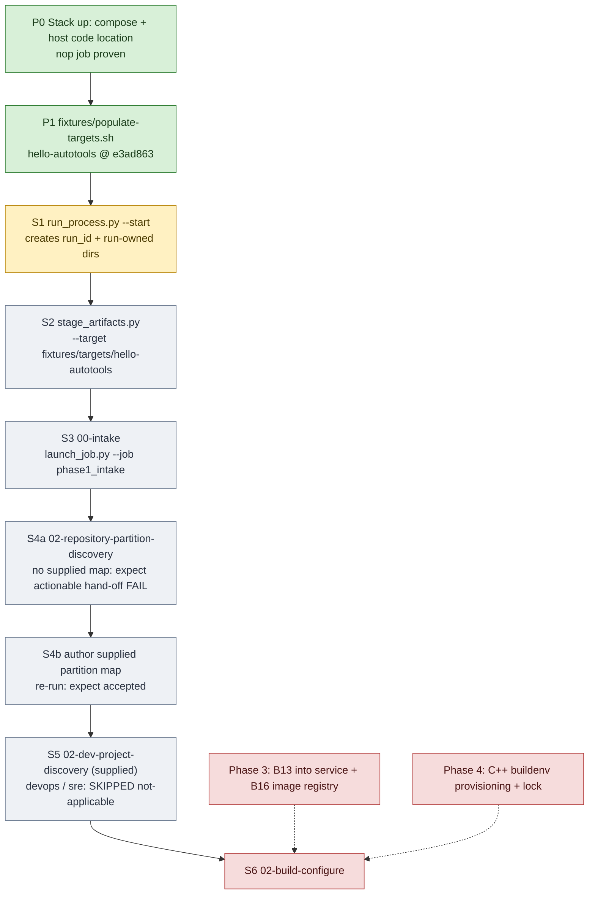

# Engagement flow bring-up on `hello-autotools` (working tracker)

Status: **living tracker**, updated as each step is run. We bring the engagement flow up in
process-flow order on the `hello-autotools` fixture, using the ADR-0011 split: Dagster
(webserver, daemon, postgres) in Docker Desktop, and the code location plus every operator command
as host processes in WSL (`Ubuntu-24.04`, clone at `~/projects/appsec-review`). The flow and
requirements themselves are in [engagement-start.md](engagement-start.md); the phase plan is in
`appsec-review-process/TODO.md` ("Step 4 plan").

## Flow and status

Legend: green done, yellow next, grey to do, red blocked on another phase.

## Steps

All commands run in WSL from `~/projects/appsec-review` with the code location running
(`orchestrator/dagster/code-location.sh start`). `PY` is the code location's venv:
`PY=~/.venvs/appsec-review-dagster/bin/python`.

| Step | Who / what | Command | Expected result | Status |
|---|---|---|---|---|
| P0 | stack + host code location | `docker compose -f orchestrator/dagster/compose.yaml up -d`; `orchestrator/dagster/code-location.sh start` | `code-location.sh check` succeeds; `nop` runs | DONE 2026-09-22 (runs ac01458f, 3ea3b999) |
| P1 | fixture target | `fixtures/populate-targets.sh` | `hello-autotools` at `e3ad863` | DONE 2026-09-22 |
| S1 | security engineer: create the engagement | `$PY -B appsec-review-process/run_process.py --start` | JSON with `run_id`; `appsec-review-process/runs/<run_id>/` exists | NEXT |
| S2 | security engineer: stage inputs | `$PY -B appsec-review-process/stage_artifacts.py --run-id <run_id> --project hello-autotools --target fixtures/targets/hello-autotools --business-goal "..." --platform Linux --budget probe --execution-environment dagster-read-only-linux` | `inputs/artifact-manifest.json` validates; `executor_platform` = `posix` | |
| S3 | Dagster: `00-intake` | `$PY -B appsec-review-process/launch_job.py --run-id <run_id> --job phase1_intake --wait` | `SUCCESS`; `data/jobs/00-intake/whole/accepted.json` | |
| S4a | Dagster: partition discovery gate | `launch_job.py --run-id <run_id> --job repository_partition_discovery --wait` | fails with an actionable hand-off (no silent success) | |
| S4b | author supplied `repository-partition-map` | (to write: one component, one native family, autotools route) | gate accepts it | |
| S5 | dev-project discovery; devops/sre skip | (via `engagement_workflow` / `full_review` graph) | dev accepted; devops + sre `SKIPPED(not-applicable-no-matching-inputs)` with receipts | |
| S6 | `02-build-configure` | -- | needs B13 (Phase 3) and the C++ buildenv (Phase 4) | BLOCKED |

## Log

- 2026-09-22 -- P0/P1 done. Networking under WSL 2 NAT required the distro-IP mapping
  (ADR-0011 addendum). First operator script identified: `run_process.py --start` (S1), now a host
  command, no longer `docker compose exec code-server`.
