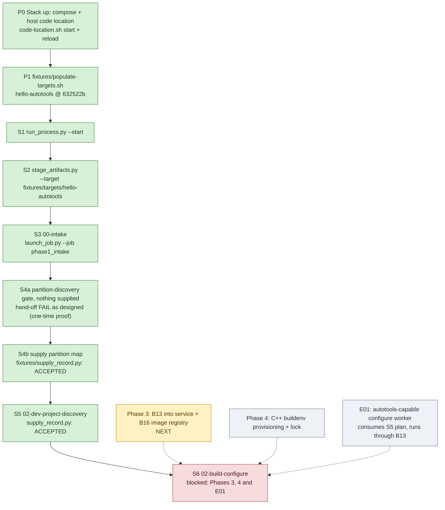
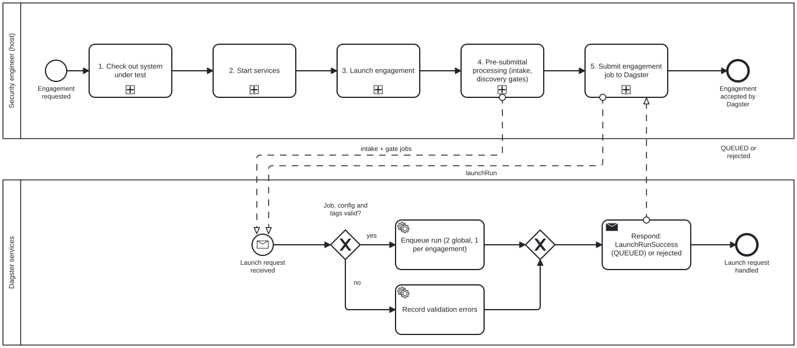

# Engagement flow bring-up on `hello-autotools` (working tracker)

Status: **living tracker**, updated as each step is run. We bring the engagement flow up in
process-flow order on the `hello-autotools` fixture, using the ADR-0011 split: Dagster
(webserver, daemon, postgres) in Docker Desktop, and the code location plus every operator command
as host processes in WSL (`Ubuntu-24.04`, clone at `~/projects/appsec-review`). The flow and
requirements themselves are in [engagement-start.md](engagement-start.md); the phase plan is in
`appsec-review-process/TODO.md` ("Step 4 plan").

**Keeping the docs current (standing rule).** Every change to the process (a script, gate, step, or
their order) updates, in the same change: the BPMN model [bpmn/pre-submission.bpmn](bpmn/pre-submission.bpmn)
and its renders (`bpmn/render/`, `bpmn/render/print/`); the Mermaid charts and their renders
(`render/`); this tracker's status and "What each step does" exposition; the job and artifact
catalog [job-catalog.md](job-catalog.md) (sources in `catalog/`, regenerate with
`python3 docs/processes/job_catalog.py`; `--check` fails when it is stale); and the Google Doc
[AppSecReview - Process.doc](https://docs.google.com/document/d/1OwuRBMoLLoPOL79JlSDUvhUdzgdG_hNDbidD9PHlteI/edit), which mirrors these files for reading outside the repository.

## Flow and status



Legend: green done, yellow next, grey to do, red blocked on another phase. Dotted arrows are
prerequisites from outside the step sequence.

**Reference run:** `20260923T163246Z-71cd68`, fixture `632522b` -- S1-S3, S4b and S5 all accepted in
one command chain (below). S4a is a one-time negative proof, run on an earlier run; the log below
keeps the history of earlier runs and fixture revisions.

## Pre-submission process (BPMN)

The end-to-end process up to the point where Dagster accepts the engagement, as a BPMN 2.0 model:
[`bpmn/pre-submission.bpmn`](bpmn/pre-submission.bpmn) (opens in bpmn.io / Camunda Modeler;
renders in [`bpmn/render/`](bpmn/render/)).



Two pools: the **security engineer** on the POSIX host, and **Dagster services**, which receive
launch requests and answer with `QUEUED` or a rejection. The engineer's process is five collapsed
subprocesses, each with its own diagram:

1. [**Check out the system under test**](bpmn/render/pre-submission-1-checkout.svg): clone or
   verify at the pinned commit; refuse a non-clone, a wrong origin, local changes or a HEAD mismatch
   rather than repair them.
2. [**Start services**](bpmn/render/pre-submission-2-services.svg): Docker engine check with the
   recovery loop, first-time `setup.py`, `compose up` and wait for 3 healthy services, code location
   start, WSL IP re-sync, gRPC check, `reload` until the location is `LOADED`.
3. [**Launch the engagement**](bpmn/render/pre-submission-3-engagement.svg): define goal, platforms,
   budget, scope and permissions (a named human grants anything beyond `read-source`), create the
   run, stage the manifest; staging blocks wrong-platform and legacy runs.
4. [**Pre-submittal processing**](bpmn/render/pre-submission-4-pre-submittal.svg): intake, then the
   partition and developer-discovery gates, each with its hand-off loop (produce the record, supply
   it, relaunch) until accepted.
5. [**Submit to Dagster**](bpmn/render/pre-submission-5-submit.svg): `launch_job.py`'s checks
   (POSIX-staged run, registered job, unchanged request), the duplicate-submission guard (find by
   tags, reattach), durable intent, `launchRun`, then `QUEUED` or `REJECTED`.

The model ends at **accepted** (`QUEUED`), not completed. What Dagster does with the engagement job
after that (fan-out into lanes and queues) is the next diagram. Two gaps the model makes visible:
the engagement job submitted in step 5 is not yet fully runnable (`full_review` stops at the first
unimplemented worker), and step 4's hand-off loops are manual today (fixture records are tracked;
real targets need an analyst or agent).

## Steps

All commands run in WSL from `~/projects/appsec-review` with the code location running
(`orchestrator/dagster/code-location.sh start`, then `code-location.sh reload`). `PY` is the code location's venv:
`PY=~/.venvs/appsec-review-dagster/bin/python`.

| Step | Who / what | Command | Expected result | Status |
|---|---|---|---|---|
| P0 | stack + host code location | `docker compose -f orchestrator/dagster/compose.yaml up -d`; `orchestrator/dagster/code-location.sh start`, then `code-location.sh reload` after every (re)start | `code-location.sh check` succeeds; `nop` runs | DONE 2026-09-22 (runs ac01458f, 3ea3b999) |
| P1 | fixture target | `fixtures/populate-targets.sh` | `hello-autotools` at `632522b` | DONE 2026-09-22 (re-pinned `e3ad863` -> `8f4b54c` -> `632522b`) |
| S1 | security engineer: create the engagement | `$PY -B appsec-review-process/run_process.py --start` | JSON with `run_id`; `appsec-review-process/runs/<run_id>/` exists | DONE: reference run `20260923T163246Z-71cd68` |
| S2 | security engineer: stage inputs | `$PY -B appsec-review-process/stage_artifacts.py --run-id <run_id> --project hello-autotools --target fixtures/targets/hello-autotools --business-goal "..." --platform Linux --budget probe --execution-environment dagster-read-only-linux` | `inputs/artifact-manifest.json` validates; `executor_platform` = `posix` | DONE: reference run |
| S3 | Dagster: `00-intake` | `$PY -B appsec-review-process/launch_job.py --run-id <run_id> --job phase1_intake --wait` | `SUCCESS`; `data/jobs/00-intake/whole/accepted.json` | DONE: reference run, Dagster `ded064e3` |
| S4a | Dagster: partition discovery gate | `launch_job.py --run-id <run_id> --job repository_partition_discovery --wait` | `FAILURE`, `HANDOFF_ISSUED`; `data/jobs/02-repository-partition-discovery/handoff.md` + `handoff.json` name the expected `supplied/result.json` and its schema | DONE 2026-09-22 (one-time proof): run `20260922T193334Z-7074be`, Dagster `9565c126` |
| S4b | supply the partition map | `$PY -B fixtures/supply_record.py --run-id <run_id> --job 02-repository-partition-discovery`, then `launch_job.py --run-id <run_id> --job repository_partition_discovery --wait` | `SUCCESS`; accepted `repository-partition-map.json` under the job's `attempts/` | DONE: reference run, Dagster `278df830` |
| S5 | dev-project discovery | `$PY -B fixtures/supply_record.py --run-id <run_id> --job 02-dev-project-discovery`, then `launch_job.py --run-id <run_id> --job dev_project_discovery --wait` | `SUCCESS`; `data/jobs/02-dev-project-discovery/accepted.json` | DONE: reference run, Dagster `68d20d4a` |
| S6 | `02-build-configure` | -- | needs B13 (Phase 3), the C++ buildenv (Phase 4) and an autotools-capable configure worker (E01) | BLOCKED |

## Run it end to end

**Scripted: the system acceptance test.** `scripts/system-acceptance-test.sh --through <stage>` runs
this flow from a fresh clone of the fixture, one checked stage at a time, and records evidence per
stage ([system-acceptance-test.md](system-acceptance-test.md)). It is replacing the chain below
stage by stage; `--list` shows which stages are built. Start the code location first, in its own
terminal.

**By hand**, the equivalent chain as far as the SAT does not yet reach:

What the security engineer runs today, as one chain that stops at the first failure and captures
the new run ID itself (never paste a `RUN=<placeholder>` line: if bash rejects it, `$RUN` silently
keeps an older run). This produced the reference run.

```bash
cd ~/projects/appsec-review
PY=~/.venvs/appsec-review-dagster/bin/python
fixtures/populate-targets.sh \
&& RUN=$($PY -B appsec-review-process/run_process.py --start | $PY -c 'import json,sys; print(json.load(sys.stdin)["run_id"])') \
&& echo "RUN=$RUN" \
&& $PY -B appsec-review-process/stage_artifacts.py --run-id $RUN --project hello-autotools \
     --target fixtures/targets/hello-autotools --business-goal "Bring-up: prove intake and discovery on the fixture" \
     --platform Linux --budget probe --execution-environment dagster-read-only-linux \
&& $PY -B appsec-review-process/launch_job.py --run-id $RUN --job phase1_intake --wait \
&& $PY -B fixtures/supply_record.py --run-id $RUN --job 02-repository-partition-discovery \
&& $PY -B appsec-review-process/launch_job.py --run-id $RUN --job repository_partition_discovery --wait \
&& $PY -B fixtures/supply_record.py --run-id $RUN --job 02-dev-project-discovery \
&& $PY -B appsec-review-process/launch_job.py --run-id $RUN --job dev_project_discovery --wait
```

## What each step does

Plain-language exposition, kept beside the table so the flow documents itself as we bring it up.
Each entry says what the step is for, what it produces, and what changed under ADR-0011.

**P0 -- Stack and code location.** Dagster's webserver, daemon and PostgreSQL run in Docker Desktop
and only orchestrate: they hold the queue, state and history, and never run review work
themselves. The code location (`code-location.sh start`) is the host process the ops actually run
in, so jobs get the host's own Docker without a Docker socket mounted into any container. The
trivial `nop` job proved the whole path: submitted from the UI or CLI, queued by the daemon, and
executed by a run worker on the host.
After every start or restart of the code location, run `code-location.sh reload`: the webserver
launches jobs from the job list it loaded earlier, so until it reloads, a newly added job is
rejected with `PipelineNotFoundError` even though the code location already serves it.
`reload` also loads changed job code into the running code location (`dagster code-server
start` re-imports `definitions.py`), so pulling a job change needs `reload`, not a restart.

**P1 -- Fixture target.** `fixtures/populate-targets.sh` clones `hello-autotools` at its pinned
commit into `fixtures/targets/`. The pin is `632522b`: the fixture's `main` with the seeded-defect list removed and the
defect-identifying comments stripped from `src/` (comment-only; object code byte-identical). The
original list and comments are on the fixture's `with-vulnerabilities-doc` branch (`e3ad863`), the
answer key for scoring results afterwards. It is cloned in, never committed, just as a real engagement target
would arrive. The script refuses to touch a clone with the wrong origin or local changes.

**S1 -- Create the engagement (`run_process.py --start`).** This is the first command the security
engineer runs. It creates the engagement's run ID and its folder under
`appsec-review-process/runs/<run_id>/`, and every later step keys off that ID. It used to run
inside the code-server container; it now runs on the host, in WSL.

**S2 -- Stage the inputs (`stage_artifacts.py`).** This is where the engineer states what is being
reviewed and why: target path, project name, business goal, target platforms, budget, scope and
permissions (default `read-source` only). It writes `inputs/artifact-manifest.json`, the intake
contract; everything later is derived from it. It also records the platform the run belongs to
(`posix` here), and a run can't later be restaged from a different platform. Under ADR-0011
`--target` is a plain host path (`fixtures/targets/hello-autotools`); it used to be a read-only
mount path inside the container, which needed a `compose.yaml` edit for every new target.
The staging output also lists "Expected before pregather" notes (`job-status.json`,
`llm/retrieval-plan.json`, ...). They are informational: outputs of the legacy evidence pipeline
that don't exist yet because nothing has run; not errors.

**S3 -- Intake (`00-intake`, `launch_job.py --job phase1_intake`).** This is the first Dagster job.
It checks that the configuration is valid, then records the target's exact source revision and any
uncommitted changes, what languages and build systems it uses, the native build plan, and which
specialist reviews it should be routed to. The result is accepted in
`data/jobs/00-intake/whole/accepted.json`. `launch_job.py` only submits and monitors; the work runs
in the host code location. Passing intake says nothing yet about whether the native build works.

**S4a -- Partition-discovery gate, nothing supplied.** `02-repository-partition-discovery` is a
validated hand-off gate, not analysis (`discovery_gate.py`). It either accepts a schema-valid
repository-partition map supplied out of band, or fails with an actionable hand-off that says what
is missing. Running it first with nothing supplied proves it fails clearly rather than passing
silently as a no-op.
Concretely, it writes `handoff.md` (for a person) and `handoff.json` (for a machine) under
`data/jobs/02-repository-partition-discovery/`, naming the exact file it expects,
`supplied/result.json`, and its schema, `schemas/repository-partition-map.schema.json`. This
analysis needs judgment about the target's actual code (partition boundaries, routing rationale,
confidence), so the gate refuses to make it up.

**S4b -- Supply the partition map.** The partition map is the analysis the gate refused to invent:
it divides the repository into parts, says what kind of code each part is, which reviewer persona
it routes to, how the parts relate, and what is in or out of review scope, citing the files that
justify each call. For the fixture it is a tracked file,
`fixtures/supplied/hello-autotools/02-repository-partition-discovery.json`, written against
`632522b`, with five partitions: `app` (`src/`, the C++ CLI), `vendored-cjson` (linked third-party
library), `build` (autotools files and the Dockerfile), `tests` (the `make check` smoke test) and
`docs`. Every citation carries the SHA-256 of the cited file, so the gate can tell if the target
changed since the analysis was written.

`docs` is deliberately `deferred`, meaning excluded from review. The seeded-defect list
(`docs/VULNERABILITIES.md`) was removed from the fixture's `main` and kept on its
`with-vulnerabilities-doc` branch, but `README.md`, the other `docs/*.md` and cJSON's `VENDORED.md`
still describe the defects. If review lanes
could read them, the fixture would measure recall of its own documentation instead of detection.
They are kept for scoring the results afterwards. Whether a `deferred` partition actually stops
later lanes from reading those files is not yet verified; to check when the lanes run.

`fixtures/supply_record.py` installs the record at the path the hand-off names. It refuses if the
staged target is not at the record's exact commit or has local changes, and never overwrites a
different supplied file, since a supplied result is evidence. This is Phase 5 work, pulled forward
because discovery doesn't need Docker.

**S5 -- Developer project discovery (`dev_project_discovery`).** Where the partition map says
*what parts exist*, project discovery says *how to build them*: the project root, languages,
build manifests, lockfiles, candidate build-environment image, and a safe command plan in which
every command states its purpose, argv, authorization and side effects. For the fixture it is
`fixtures/supplied/hello-autotools/02-dev-project-discovery.json`: one project at the repo root
(C++ and C), manifests `configure.ac` and `Makefile.am`, no lockfile (the only dependency is the
vendored cJSON source), image `audit-buildenv-cpp:local`, and four commands (`autoreconf -fi`,
`./configure`, `make`, `make check`). All four are marked `script-execution-required`, because each
runs repository-controlled code (m4 macros, the configure script, make recipes, the tests), and
none needs network. This record is what `02-build-configure` (S6) consumes.

It is the same supplied-result gate as S4, but it previously checked only the schema. It now also
requires an accepted partition map for the run at the same source revision (the graph's declared
dependency), and applies the partition gate's content checks: normalized paths, fresh citation
hashes, no secret-like values, no finding/severity language. Until now it could only run inside
`full_review`, which fans out to every unimplemented node; the standalone `dev_project_discovery`
job runs just this gate.

DevOps and SRE discovery (`02-devops-project-discovery`, `02-sre-operations-topology`) were planned
here as `SKIPPED(not-applicable-no-matching-inputs)` with receipts. In the code they are generic
`WORKER_NOT_IMPLEMENTED` placeholders, and the only node that consumes them (and accepts that skip
reason) is `02-evidence-assembly`. Their skip receipts therefore move to Phase 10, where assembly
needs them; nothing on the path to S6 depends on them.

**S6 -- Build configure (`02-build-configure`).** The first step that runs the target's own build
(`autoreconf -fi`, `./configure`). It must go through B13, the pinned-container adapter and the one
piece of code allowed to run `docker run`, inside the C++ build-environment image. That is why it
waits on Phase 3 (B13 into service) and Phase 4 (buildenv provisioning).

It also needs a new worker. The op wired to this node today (`build_configure_work`) calls
`build_execution.py`, which configures only a single CMake root, reads the older `build_discovery`
branch rather than S5's project discovery, and runs through the `buildenv-common` wrapper rather
than B13. On the autotools fixture it would stop with "only a single unambiguous CMake root is
supported". The configure worker planned as batch E01 replays S5's command plan (`autoreconf -fi`,
`./configure`) through B13 in `audit-buildenv-cpp`; that is what S6 actually runs.

## Log

- 2026-09-22 -- P0/P1 done. Networking under WSL 2 NAT required the distro-IP mapping
  (ADR-0011 addendum). First operator script identified: `run_process.py --start` (S1), now a host
  command, no longer `docker compose exec code-server`.
- 2026-09-22 -- S1 and S2 done on the host for the first time: run `20260922T193334Z-7074be`
  created and staged from WSL with the code-location venv, target
  `fixtures/targets/hello-autotools`, budget `probe`, permissions default `read-source`.
  `launch_job.py`'s platform-check message updated (it still told operators to use the
  code-server). S3 next.
- 2026-09-22 -- S3 done: `phase1_intake` for run `20260922T193334Z-7074be` SUCCESS (Dagster run
  `4984e285`, launch `03587dc6`), submitted from WSL, executed in the host code location. First real
  review job end to end under ADR-0011. S4a next.
- 2026-09-22 -- S4a done as designed: `repository_partition_discovery` FAILED with
  `HANDOFF_ISSUED` (Dagster run `9565c126`) and wrote `handoff.md`/`handoff.json` naming
  `supplied/result.json` and its schema. Its text wrongly said the job ran "inside `full_review`"
  and to re-run `full_review`; `discovery_gate.py` now names whichever job reached the gate. Wrote
  the fixture's partition map; it passes the schema, path, persona, citation-freshness (19
  citations), secret and claim-promotion validators against a clean clone at `e3ad863`. Added
  `fixtures/supply_record.py`. S4b next.
- 2026-09-22 -- Fixture answer key moved off `main`: branch `with-vulnerabilities-doc` pushed at
  `e3ad863` (doc intact); `main` is now `8f4b54c` with `docs/VULNERABILITIES.md` removed.
  `populate-targets.sh` re-pinned and the partition map regenerated against `8f4b54c` (all
  validators pass). Run `20260922T193334Z-7074be` was staged and intake-accepted at `e3ad863`, so
  it no longer matches the pinned fixture: S1-S3 repeat on a new run, then S4a/S4b.
  **Open:** the seeded defects are still named in `src/` comments (VULN ids, CWE numbers,
  "Intentional seeded defect"), and `src/` is in review scope; removing the doc alone does not
  remove the answer key from what the lanes read.
- 2026-09-22 -- S1-S4b done on a fresh run `20260922T195024Z-c8f720` at `8f4b54c`: intake SUCCESS
  (Dagster `ac3b334f`), partition map supplied by `fixtures/supply_record.py`, and
  `repository_partition_discovery` **SUCCESS** (Dagster `b8441de2`); the attempt holds
  `repository-partition-map.json`, `repository-partition-summary.md`, `result.json`. First discovery
  node accepted. (An earlier paste ran the chain against the old run because a `RUN=<placeholder>`
  line failed; harmless, superseded.)
- 2026-09-22 -- Answer-key leak in `src/` closed: fixture `main` -> `632522b` strips the VULN/CWE/
  attack/CVE-reachability comments (9 files, comments only; all translation units compile to
  byte-identical objects before/after). Pin and partition map moved to `632522b` (rehashed
  `src/main.cpp`, `src/jsonreport.cpp`; validators pass). Run `c8f720` stays as the S4 proof at
  `8f4b54c`; S5 starts on a new run at `632522b`. `tests/run.sh` still says, generically, that the
  fixture has seeded defects (no locations); left as is.
- 2026-09-22 -- S5 prepared. Developer discovery only ran inside `full_review`; added the
  standalone `dev_project_discovery` job (definitions, launcher, sensors, design-parity manifest).
  Hardened its gate: requires an accepted partition map at the same revision, plus path, citation
  freshness, secret and claim-promotion checks (sandbox: pass + 5 rejection cases). Wrote the
  fixture's project-discovery record at `632522b` (validators pass, 9 citations). DevOps/SRE skip
  receipts moved to Phase 10 (only `02-evidence-assembly` consumes them). Also fixed a regression
  from P0: the `nop` job had broken the design-parity check (now exempt like
  `orchestration_smoke`). Tests: pool assignments, resource pools, Dagster, worker adoption (62) pass.
- 2026-09-23 -- S5 done: fresh run `20260923T163246Z-71cd68` at `632522b` ran the whole chain from
  one command (intake, partition discovery, dev discovery); `dev_project_discovery` SUCCESS
  (Dagster `68d20d4a`) through the hardened gate. Two launches were first rejected with
  `PipelineNotFoundError`: the webserver still held the job list from before the code location was
  restarted. Added `code-location.sh reload` (and a reminder on `start`). The discovery chain on the
  path to `02-build-configure` is complete; S6 needs Phase 3 (B13 into service) and Phase 4 (C++
  buildenv provisioning), which come next.
- 2026-09-23 -- Tracker consolidated: status column now cites the reference run
  (`20260923T163246Z-71cd68`, `632522b`) instead of the mix of earlier runs and fixture revisions;
  added the end-to-end command chain. `engagement-start.md` corrected for ADR-0011 (host-created
  runs, host target paths, no compose edit, host code location) and the two discovery gates.
- 2026-09-23 -- Operator docs migrated to ADR-0011: `docs/dagster/dagster-launching.md` and
  `operations.md` (host commands with the code-location venv, host `--target`, start/reload, the two
  discovery jobs, source protection now by worker behavior rather than read-only mounts),
  `orchestrator/dagster/README.md` (native-Linux prerequisites incl. host `libfuzzy2`/`git`, host
  `chown`, host unit-suite command) and `00-intake-recovery/config.md`. `code-location.sh start`
  now warns if `git` or `libfuzzy.so.2` is missing on the host. Still unmigrated and marked as such:
  `qualify_phase1.py`, `qualify_dagster.py`, `test_phase1.py`.
- 2026-09-23 -- Qualification scripts migrated to ADR-0011. `code-location.sh run ARGS` runs the
  venv python in the jobs' own environment (DAGSTER_HOME/Postgres, run root, definitions).
  `qualify_dagster.py`: definitions from `APPSEC_DEFINITIONS_DIR`, `--target/--project/--platform`
  (default: the hello-autotools fixture) instead of `/targets/freeciv21`. `qualify_phase1.py`:
  tests-linux, dagster, restart-check and runtime steps go through `code-location.sh run`; expects 3
  healthy services and adds a `code-location-check` after the compose restart; host target run uses
  the same target options. `test_phase1.py` needed no change (40 tests pass on the host).
  Sandbox: `--check-contracts` PASS; `qualify_dagster.py` PASS (intake, validated reuse, fresh-run
  isolation, failure propagation) and `--resume-check` PASS against a SQLite instance and the
  fixture at `632522b`. The full `qualify_phase1.py` (it restarts the compose stack) is to be run
  on hal5000.
- 2026-09-23 -- Qualification on hal5000 (run `20260923T172004Z-136043`): every step passed,
  including the compose restart; blockers were A01 (no prompt-vetting on a fresh run, expected) and
  A02. A02 failed only on the check that another project's stack (`lra-ingestion-harness`) was
  stopped and unchanged. Rule set by William: **this project only starts, stops and reports on its
  own containers.** Removed that check from `qualify_phase1.py` and `qualify_workflow.py` and the
  docs that described it; A02's report entry now lists its remaining checks. `qualify_workflow.py`
  also migrated off the code-server (fixture runs via `code-location.sh run`, `--target` defaulting
  to the fixture). Along the way: qualifier fails fast if the Docker engine stops answering;
  `code-location.sh reload` retries while the webserver starts.
- 2026-09-23 -- Qualification migration confirmed on hal5000: `qualify_phase1.py` on run
  `20260923T172004Z-136043` (batch `q-8604c203`) -- every step exit 0, including the compose
  restart; **only A01 blocks** (no prompt-vetting record on this fresh run; unrelated to ADR-0011).
  Phase 2's code-server removal is complete. Remaining Phase 2 items (persistent code location on
  Windows, systemd example, native-Linux bind) do not block Phase 3.
- 2026-09-23 -- Code location switched from `dagster api grpc` to `dagster code-server start`
  (William's call), so `code-location.sh reload` reloads changed job code in place; `api grpc` could
  not and logged "Reloading definitions ... not currently supported". Verified in a sandbox: a job
  added to `definitions.py` appeared after `reload_code` without a restart, and the warning was gone.
  ADR-0011 amended.
- 2026-09-23 -- A01 explained and made re-attestable. The 2026-09-19 prompt review covered the spec
  at `7c26b5d` (hash `87e4d61f...`); since then only two reference-path lines changed in the docs
  reorg (`2ded09f`, `bbc9fb5`), giving `273676ad...`. Added `attest_prompt.py`: shows the diff since
  the reviewed revision and writes `prompt-vetting.json` only with a named approval and a reason; it
  never rehashes blindly (sandbox: diff-only, wrong-prior-hash, missing-approver, write and re-run
  cases all behave).
- 2026-09-23 -- **Phase 1 ACCEPTED under ADR-0011**: `qualify_phase1.py` on run
  `20260923T172004Z-136043` (batch `q-ee054f49`), all gates A01-A16 pass, no blockers. A01 via
  `attest_prompt.py`: William approved the two-line reference-path diff since the reviewed spec
  (`7c26b5d`), carrying the 2026-09-19 review forward to the current hash `273676ad...`. Phase 2's
  code-server removal is fully qualified; remaining Phase 2 items (persistent code location on
  Windows, systemd example, native-Linux bind) do not block Phase 3.
- 2026-09-23 -- Rendered every Mermaid diagram in the process docs (flow-bringup, engagement-start,
  dagster-launching, dagster-workflow.mmd) with mermaid-cli: all four parse and lay out as intended.
  Review against the code found: (1) engagement-start presented step 3 (configure) as built for any
  native target, but `build_execution.py` handles only a single CMake root from `build_discovery`,
  not S5's plan, and not through B13 -- so S6 also needs the E01 configure worker; added to the
  chart, table and S6 text; (2) `dagster-workflow.mmd` still said partition discovery "remains
  planned"; (3) `->` inside chart labels rendered as a broken "- >"; replaced.
- 2026-09-23 -- Pre-submission BPMN model added (`docs/processes/bpmn/pre-submission.bpmn`): overview
  collaboration (engineer + Dagster pools) and five drill-down subprocesses, from system-under-test
  checkout to Dagster acceptance; intake and discovery gates modelled as pre-submittal (William's
  call). Validated with bpmn-moddle and rendered with bpmn-js (0 warnings each); renders committed
  under `bpmn/render/`.
- 2026-09-23 -- Google Doc [AppSecReview - Process.doc](https://docs.google.com/document/d/1OwuRBMoLLoPOL79JlSDUvhUdzgdG_hNDbidD9PHlteI/edit) created from these docs
  (system arrangement, engagement flow, pre-submission BPMN with drill-downs, fixture bring-up, Dagster
  workflow, open items); images are the committed renders at `b9d84be`. Standing rule added: every
  process change updates the BPMN, Mermaid, renders, this exposition and the Google Doc together.
- 2026-09-23 -- Job and artifact catalog added: [job-catalog.md](job-catalog.md), generated by
  `job_catalog.py` from the job graph, design-parity manifest, registry templates, output contracts and
  lane configs, plus hand-maintained `catalog/steps.json`, `artifacts.json` and `models.json` for the
  operator steps, human tasks and standalone Dagster jobs. It rolls consumed and produced artifacts up
  per process model (pre-submission BPMN, engagement flow, this bring-up, `engagement_workflow`,
  lifecycle graph) and has an appendix entry per step and per lifecycle job (51) plus an artifact
  glossary. `--check` also verifies every BPMN task is covered by a step; `tests/test_job_catalog.py`
  runs it with the unit suite.
- 2026-09-23 -- Google Doc "AppSecReview - Process.doc" re-created with the catalog: section 7 (jobs
  and artifacts rolled up per process model) and Appendices A-C (steps, lifecycle jobs, artifact
  glossary), compact forms of `job-catalog.md`. The Drive connector cannot edit a Doc in place, so it
  is a new Doc (links updated); the previous one is in the Drive trash.
- 2026-09-23 -- System acceptance test started: [system-acceptance-test.md](system-acceptance-test.md),
  `scripts/system-acceptance-test.sh` (+ `.ps1` for Windows via WSL). Staged from a fresh clone of the
  fixture to SARIF and report; stage 1 `sut-checkout` is built (deletes a clean existing clone,
  re-clones at the pin, checks HEAD, cleanliness, origin, no answer key); the other 14 stages stop the
  SAT with `NOT_IMPLEMENTED` until each is built. The fixture checkout in the Windows clone was deleted.
- 2026-09-23 -- SAT stage 1 `sut-checkout` passed in WSL (SAT `20260923T200400Z`: `632522b`, tree
  `57b620b`, 24 files, clean, no answer key). Stage 2 `services` built: Docker engine, `.env` code
  location address vs this WSL boot, `compose up -d` and health, the webserver's resolution of
  `host.docker.internal`, gRPC check, reload `LOADED`, required jobs loaded, required daemons healthy.
  On `--resume`, the checkout is re-verified instead of trusted.
- 2026-09-23 -- Docker wedge root cause: a native Docker CE (`docker.service`, enabled) ran in the
  distro alongside Docker Desktop's WSL integration; both claim `/var/run/docker.sock` (500 on
  `/version`). The stack (image, postgres and storage volumes) was on Docker Desktop, as ADR-0011
  intends; the native service was disabled (`systemctl disable --now docker.service docker.socket
  containerd.service`). SAT `services` now fails if both are active, records the engine
  (`docker info` OperatingSystem), and checks the IPv4 answers for `host.docker.internal` (Desktop
  also adds an IPv6 host-gateway entry, which the first live run tripped over).
- 2026-09-23 -- SAT from the top passed through `services` (SAT `20260923T204446Z`: fresh clone at
  `632522b`, Docker Desktop 29.8.0, services healthy, code location LOADED). Stage 3 `run-create`
  built: `run_process.py --start` in the code location's environment; checks the run id, folders,
  `run-status.json` (READY, first lane `00-intake-recovery`), a single `RUN_CREATED` event, and that
  the manifest is still the unfilled template; the run id is kept in `sat.json`.
- 2026-09-23 -- SAT stage 3 `run-create` passed in WSL (SAT `20260923T204446Z`, run
  `20260923T204734Z-483b29`). Stage 4 `stage-inputs` built (fixed SAT engagement, manifest checked
  field by field). Docs for the single-engine requirement: ADR-0011 addendum 2026-09-23,
  `orchestrator/dagster/README.md` prerequisites, `docs/dagster/operations.md` recovery; catalog
  steps `docker-check`/`docker-recover` updated. "Run it end to end" now leads with the SAT.
- 2026-09-24 -- SAT stage 4 `stage-inputs` passed in WSL (SAT `20260923T204446Z`, run
  `20260923T204734Z-483b29`). Stage 5 `intake` built: `launch_job.py --job phase1_intake --wait`,
  then the accepted pointer, attempt hashes, `intake.json` contents (pin, staged values, file count,
  no findings, build not executed), manifest and events, and an unchanged checkout. Checked against
  a real intake output: families `autotools`, `cpp`, `deployment` (the Dockerfile), so intake also
  marks DevOps and SRE discovery `required` -- revisit the planned skip receipts for those two.
- 2026-09-24 -- SAT stage 5 `intake` passed in WSL (Dagster `dbcacaee`, attempt
  `20260924T135038Z-9e3a134f56cb`). Stage 6 `partition-discovery` built: the gate first with nothing
  supplied (must FAIL with `handoff.md`/`handoff.json` and accept nothing, the old S4a proof, now on
  the same run), then `supply_record.py`, then the gate again (must SUCCEED); the accepted map is
  checked by `discovery_gate.validate` and independently (revision, partitions, `docs` deferred,
  all 19 citation hashes re-computed from the checkout).
- 2026-09-24 -- SAT stage 6 `partition-discovery` passed in WSL (hand-off Dagster `94258f31`,
  accepted Dagster `f9724591`, 19 citations fresh). Stage 7 `dev-project-discovery` built on the same
  pattern (hand-off proof, supply, accept); since this older gate records no output hashes, the SAT
  compares the accepted output with the supplied file and the fixture record, and records that gap.
